<div align="center">

**[简体中文](./README.md) · [English](./README.en.md)**

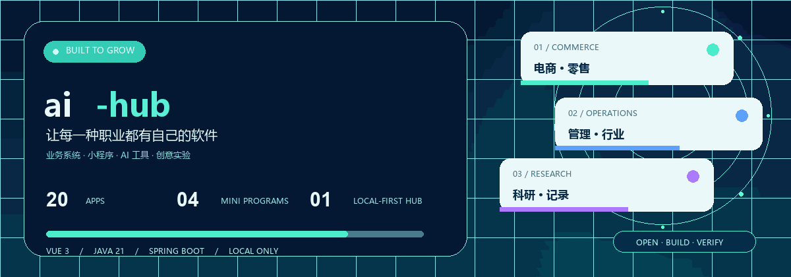

### Turn a real need into software you can see and run.

**84 independent runnable projects** &nbsp;·&nbsp; **4 WeChat mini-program builds** &nbsp;·&nbsp; **Vue 3 + Java 21** &nbsp;·&nbsp; **Local-first**

[Explore the ecosystem](#-ai-hub-ecosystem-matrix) · [Get started](#-quick-start) · [All projects](#-project-universe) · [Screenshots](#-real-screenshots) · [Architecture](#-architecture)

</div>

> **ai-hub is a growing collection of business software projects.** Explore selected workflows, lightweight record desks for many professions, mini-programs and creative utilities. Pick one directory, run it, inspect the actual pages and adapt it to a concrete need. **Software for every profession is a vision, not a claim of complete industry coverage today.**

## ✨ Pick an entry point

<table>
<tr>
<td width="25%" align="center"><a href="./shop/README.md"></a><br/><b>01 · Commerce</b><br/><sub>shop · catalog / cart / orders</sub></td>
<td width="25%" align="center"><a href="./manage/README.md">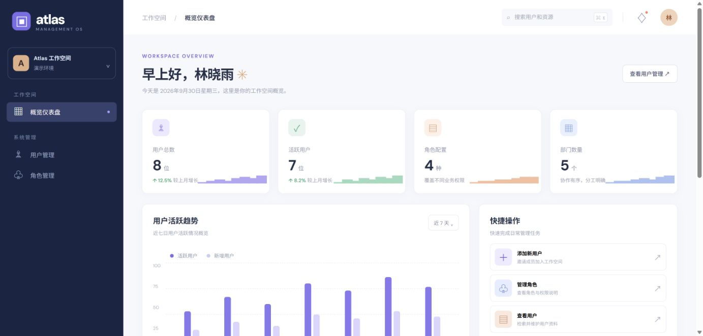</a><br/><b>02 · Operations</b><br/><sub>manage · dashboard / users / roles</sub></td>
<td width="25%" align="center"><a href="./labbook/README.md">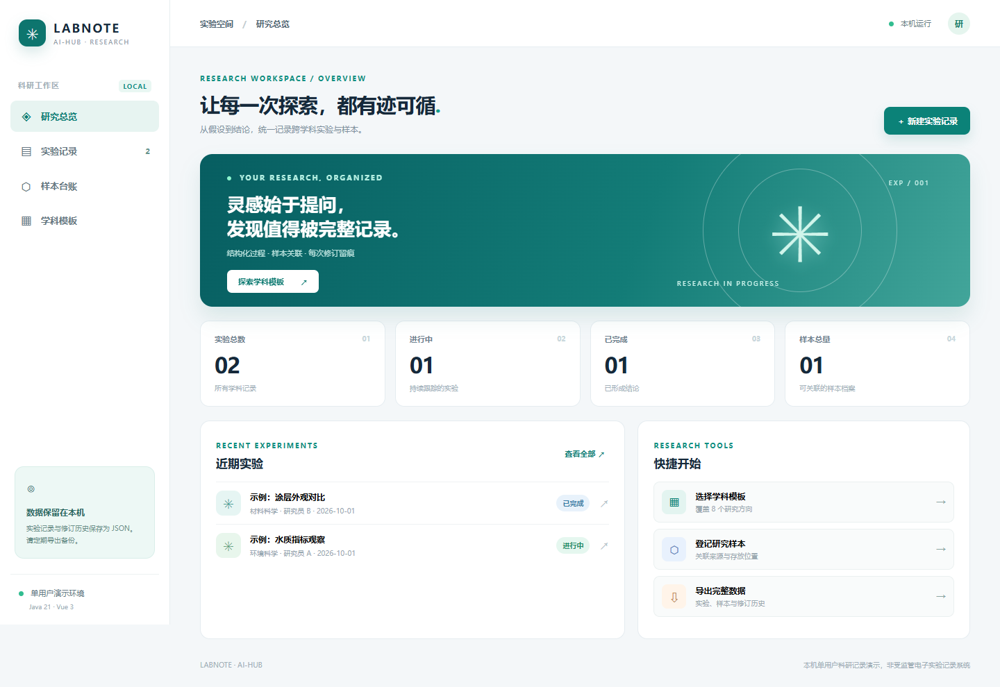</a><br/><b>03 · Research</b><br/><sub>labbook · experiments / revisions</sub></td>
<td width="25%" align="center"><a href="./scenic/README.md">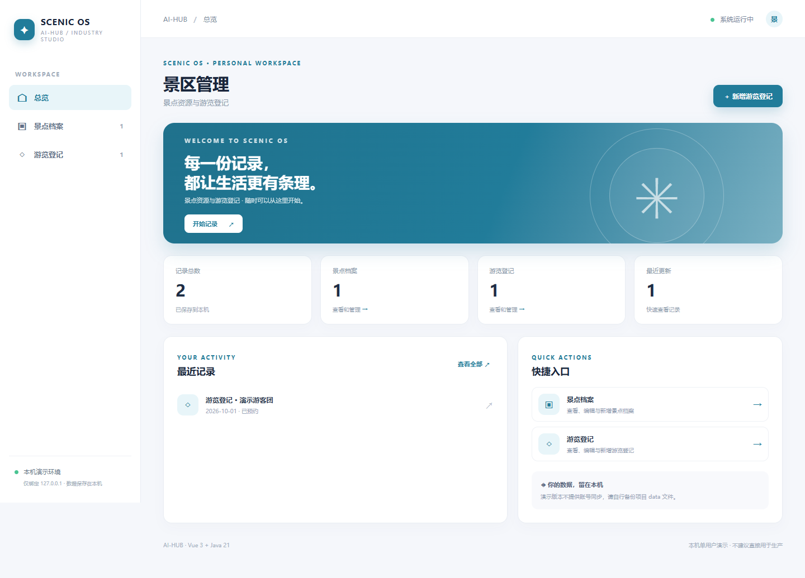</a><br/><b>04 · Sector demos</b><br/><sub>scenic · attractions / visitor records</sub></td>
</tr>
</table>

<div align="center"><sub>These are screenshots from running projects, not mockups. Click any image for its project guide and more screenshots.</sub></div>

## 🧩 ai-hub ecosystem matrix

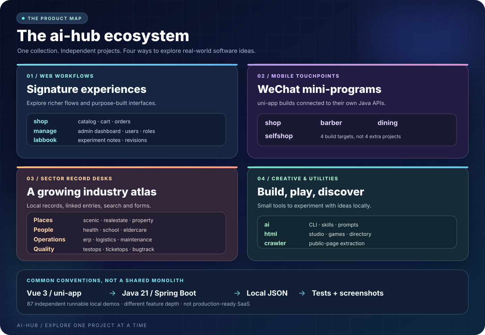

| Layer | Projects / entry points | What to explore | Current scope |
| :--- | :--- | :--- | :--- |
| **Workflow applications** | [shop](./shop/README.md) · [manage](./manage/README.md) · [labbook](./labbook/README.md) | Storefront purchase flow, administration dashboard and experiment records | Feature depth varies; these are not complete production products |
| **Mobile touchpoints** | [shop](./shop/README.md) · [barber](./barber/README.md) · [dining](./dining/README.md) · [selfshop](./selfshop/README.md) | Four uni-app WeChat mini-program builds, each with its project's Java API | The **4 build targets are included within the 84 projects**, not additional systems |
| **Sector record desks** | [scenic](./scenic/README.md) · [realestate](./realestate/README.md) · [health](./health/README.md) · [erp](./erp/README.md) · [more sectors ↓](#-project-universe) | Industry records, related entries, search and forms | Mostly single-user local demos; no real ticketing, diagnosis, closing or regulatory workflows |
| **Creative utilities** | [ai](./ai/README.md) · [html](./html/README.md) · [crawler](./crawler/README.md) | CLI / skill workspace, HTML mini-games and directory demo, public-page crawling | Local utilities and demos, not a hosted AI platform or large-scale crawler |

**Shared delivery conventions, not a shared monolith:** Each project owns its directory, port and data file. Vue 3 pages are built and served by a Java 21 / Spring Boot application, with test scripts and actual screenshots. [See the architecture](#-architecture) · [Read the limits](#-validation-and-limits)

<details>
<summary><b>Expand the animated sector constellation</b></summary>
<br/>
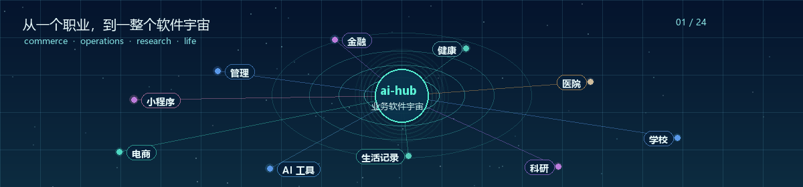
</details>

> 💬 **Need something for your profession?** Add QQ **3174667330** to discuss custom development. Bring your use case, number of users and essential workflows. These runnable projects are starting points; a production deployment needs further design, implementation and acceptance testing.

## ⚡ Quick start

You need **Java 21, Maven, Node.js 20.19+/22.12+ and npm**. The first run downloads dependencies, builds the frontend, executes backend tests, packages the application and starts the service.

| Windows PowerShell | macOS / Linux |
| :--- | :--- |
| `./shop/run.ps1` | `./shop/run.sh` |

Open `http://127.0.0.1:8081`. Replace `shop` with any project directory below, then use its listed port. Press **Ctrl+C** to stop. To try a new sector, run `./cms/run.ps1` or `./cms/run.sh` and open `http://127.0.0.1:8114`. You can also start with [labbook](./labbook/README.md) on port `8097`.

**These are local, single-user demos. Do not expose them directly to the public internet.**

## 🪐 Project universe

Each link opens that project's README with its startup notes and screenshots. Some linked project READMEs are currently in Chinese; use the English catalog and direct screenshot index below to browse the whole collection.

| Area | Project | What you can try locally | Port |
| :--- | :--- | :--- | :--- |
| **Commerce & services** | [shop · Storefront](./shop/README.md) | Desktop and WeChat mini-program; product search, details, cart, stock checks, checkout | `8081` |
|  | [barber · Barber booking](./barber/README.md) | Mini-program services, stylists, time slots, booking and cancellation | `8091` |
|  | [dining · Restaurant ordering](./dining/README.md) | Mini-program tables, dishes, basket, notes and orders | `8092` |
|  | [selfshop · Self-service shopping](./selfshop/README.md) | Mini-program search, scan entry, stock, bag and checkout | `8093` |
| **Business operations** | [manage · Admin console](./manage/README.md) | RuoYi-inspired dashboard, users, roles, menus, departments, logs and profile | `8082` |
|  | [crm · Customer relationships](./crm/README.md) | Customers, opportunities, follow-ups and stage changes | `8083` |
|  | [oa · Office workflow](./oa/README.md) | Leave and expense drafts, submission and approvals | `8084` |
|  | [finance · Finance workspace](./finance/README.md) | Accounts, transactions, risk notices and operating metrics | `8085` |
| **Industry workspaces** | [health · Health records](./health/README.md) | Member records, follow-up appointments and metric notices | `8086` |
|  | [wellness · Wellness](./wellness/README.md) | Members, plans, courses and check-ins | `8087` |
|  | [hospital · Hospital workspace](./hospital/README.md) | Patients, outpatient appointments, wards and order workspace | `8088` |
|  | [school · School](./school/README.md) | Students, courses, attendance and campus affairs | `8089` |
|  | [access · Access control](./access/README.md) | Doors, people, visitors and access events | `8090` |
| **Life & research** | [schedule · Schedule](./schedule/README.md) | Events, categories, completion status and upcoming plans | `8094` |
|  | [carcare · Vehicle care](./carcare/README.md) | Vehicles, mileage, maintenance, repairs and costs | `8095` |
|  | [parenting · Parenting journal](./parenting/README.md) | Growth profiles, daily notes and milestones | `8096` |
|  | [labbook · Research lab book](./labbook/README.md) | Eight discipline templates, experiments, samples, revisions and JSON export | `8097` |
| **AI & creativity** | [ai · AI workspace](./ai/README.md) | CLI toolbox, skill library, prompts and safe command preview | `8098` |
|  | [html · HTML studio](./html/README.md) | HTML/CSS/JS preview, templates, mini-games and fictional directory | `8099` |
|  | [crawler · Web crawler](./crawler/README.md) | Single public-page fetches, summaries, links and history | `8100` |
| **Supply chain & manufacturing** | [erp · Inventory records](./erp/README.md) | Product records, inbound/outbound movements, relations and search demo | `8101` |
|  | [manufacturing · Manufacturing records](./manufacturing/README.md) | Materials, production orders and progress notes demo | `8102` |
|  | [logistics · Logistics records](./logistics/README.md) | Vehicles, shipments and status notes demo | `8103` |
| **Property & agriculture** | [property · Property records](./property/README.md) | Units, repair requests and handling notes demo | `8104` |
|  | [agriculture · Agriculture records](./agriculture/README.md) | Plots and farm activity logs demo | `8105` |
|  | [construction · Construction records](./construction/README.md) | Projects and site logs demo | `8106` |
| **Service industries** | [hospitality · Hospitality records](./hospitality/README.md) | Rooms, bookings and room-status notes demo | `8107` |
|  | [hrm · HR records](./hrm/README.md) | Employees, leave requests and status notes demo | `8108` |
|  | [service · Support tickets](./service/README.md) | Customers, tickets and follow-up notes demo | `8109` |
|  | [energy · Energy records](./energy/README.md) | Monitoring assets, readings and inspection notes demo | `8110` |
|  | [legal · Legal records](./legal/README.md) | Clients, cases and next-action notes demo | `8111` |
|  | [culture · Culture & sports](./culture/README.md) | Venues, events and status notes demo | `8112` |
|  | [community · Community services](./community/README.md) | Programs, requests and handling notes demo | `8113` |
| **Content & trade** | [cms · Content records](./cms/README.md) | Sections and article records; local-only demo | `8114` |
|  | [wms · Warehouse records](./wms/README.md) | Bins and activity records; local-only demo | `8115` |
|  | [b2b · Wholesale procurement](./b2b/README.md) | Suppliers and purchase-order records; local-only demo | `8116` |
| **Care & local services** | [eldercare · Eldercare records](./eldercare/README.md) | Resident profiles and care notes; local-only demo | `8117` |
|  | [pharmacy · Pharmacy records](./pharmacy/README.md) | Medicine catalog and batch notes; local-only demo | `8118` |
|  | [insurance · Insurance records](./insurance/README.md) | Policy records and claim progress; local-only demo | `8119` |
|  | [rental · Rental records](./rental/README.md) | Assets and rental notes; local-only demo | `8120` |
|  | [homeservice · Home services](./homeservice/README.md) | Customers and visit tasks; local-only demo | `8121` |
| **Resources & environment** | [water · Water facilities](./water/README.md) | Stations and inspections; local-only demo | `8122` |
|  | [sanitation · Sanitation records](./sanitation/README.md) | Routes and collection logs; local-only demo | `8123` |
|  | [mining · Mining records](./mining/README.md) | Sites and shift logs; local-only demo | `8124` |
|  | [forestry · Forestry records](./forestry/README.md) | Parcels and patrol logs; local-only demo | `8125` |
|  | [fishery · Aquaculture records](./fishery/README.md) | Ponds and feeding logs; local-only demo | `8126` |
| **Infrastructure & civic** | [telecom · Telecom facilities](./telecom/README.md) | Sites and maintenance tasks; local-only demo | `8127` |
|  | [itops · IT operations](./itops/README.md) | Assets and incident notes; local-only demo | `8128` |
|  | [civic · Civic services](./civic/README.md) | Services and application records; local-only demo | `8129` |

## 🆕 35 more sector record desks

Attraction operations and real-estate viewings join travel, clinical, education, pet, retail, business, and supply-chain niches. Every new directory is an independently runnable **single-user local record demo**, not production software. Ticketing, capacity enforcement, property closing, medical diagnostics, parking billing, customs compliance, and real money movement are **not implemented**. The existing [property demo](./property/README.md) covers units and repair requests; [realestate](./realestate/README.md) covers listings and viewings.

<table>
<tr><td width="50%" align="center"><a href="./scenic/README.md"></a><br/><b>Scenic attractions · scenic</b></td><td width="50%" align="center"><a href="./realestate/README.md">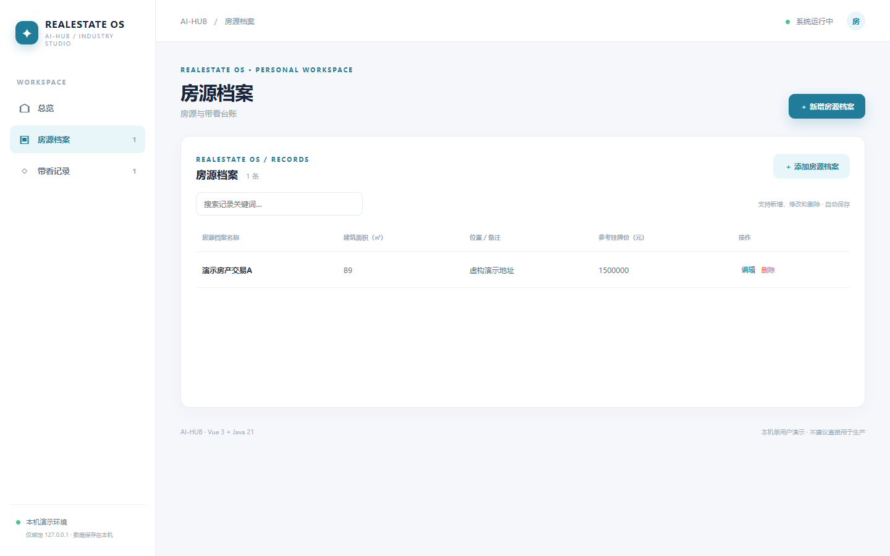</a><br/><b>Real estate · realestate</b></td></tr>
</table>

| **Travel, parks & attractions** | [parking · Parking](./parking/README.md) | parking areas & stays; local record demo | `8130` |
|  | [charging · EV charging](./charging/README.md) | stations & charging sessions; local record demo | `8131` |
|  | [parkops · Park operations](./parkops/README.md) | parks & inspections; local record demo | `8132` |
|  | [fleet · Fleet management](./fleet/README.md) | vehicles & trips; local record demo | `8133` |
|  | [scenic · Scenic attractions](./scenic/README.md) | spots & visit registrations; local record demo | `8134` |
| **Care & diagnostics records** | [clinic · Clinic](./clinic/README.md) | rooms & appointments; local record demo | `8135` |
|  | [dental · Dental practice](./dental/README.md) | chairs & visits; local record demo | `8136` |
|  | [aesthetics · Aesthetic services](./aesthetics/README.md) | services & consultations; local record demo | `8137` |
|  | [rehab · Rehabilitation](./rehab/README.md) | programs & training sessions; local record demo | `8138` |
|  | [lis · Lab sample registry](./lis/README.md) | assays & sample registrations; local record demo | `8139` |
| **Education & learning** | [kindergarten · Kindergarten](./kindergarten/README.md) | classes & activities; local record demo | `8140` |
|  | [training · Training center](./training/README.md) | courses & enrollments; local record demo | `8141` |
|  | [elearning · E-learning](./elearning/README.md) | courses & learning progress; local record demo | `8142` |
|  | [exam · Exam administration](./exam/README.md) | exams & registrations; local record demo | `8143` |
|  | [library · Library](./library/README.md) | books & loans; local record demo | `8144` |
| **Pet services** | [petcare · Pet care](./petcare/README.md) | pets & care logs; local record demo | `8145` |
|  | [petboarding · Pet boarding](./petboarding/README.md) | rooms & boarding stays; local record demo | `8146` |
|  | [petgrooming · Pet grooming](./petgrooming/README.md) | packages & appointments; local record demo | `8147` |
|  | [veterinary · Veterinary visits](./veterinary/README.md) | rooms & pet visits; local record demo | `8148` |
| **Retail & local services** | [pos · Point-of-sale records](./pos/README.md) | counters & receipt records; local record demo | `8149` |
|  | [loyalty · Loyalty](./loyalty/README.md) | tiers & member records; local record demo | `8150` |
|  | [laundry · Laundry](./laundry/README.md) | machines & laundry orders; local record demo | `8151` |
|  | [gym · Fitness club](./gym/README.md) | classes & bookings; local record demo | `8152` |
|  | [photography · Photography studio](./photography/README.md) | packages & shoots; local record demo | `8153` |
|  | [wedding · Wedding planning](./wedding/README.md) | plans & event dates; local record demo | `8154` |
| **Business operations** | [accounting · Accounting ledger](./accounting/README.md) | ledgers & entries; local record demo | `8155` |
|  | [contracts · Contract registry](./contracts/README.md) | templates & contracts; local record demo | `8156` |
|  | [projectops · Project operations](./projectops/README.md) | projects & milestones; local record demo | `8157` |
|  | [maintenance · Equipment maintenance](./maintenance/README.md) | assets & work orders; local record demo | `8158` |
|  | [qms · Quality inspection](./qms/README.md) | standards & check records; local record demo | `8159` |
| **Supply chain & real estate** | [coldchain · Cold chain](./coldchain/README.md) | containers & transports; local record demo | `8160` |
|  | [freshdelivery · Fresh delivery](./freshdelivery/README.md) | routes & deliveries; local record demo | `8161` |
|  | [crossborder · Cross-border shipments](./crossborder/README.md) | products & shipments; local record demo | `8162` |
|  | [returns · Returns](./returns/README.md) | products & return requests; local record demo | `8163` |
|  | [realestate · Real-estate listings](./realestate/README.md) | listings & viewings; local record demo | `8164` |

## Previous 16 sector record desks

The newest projects cover content and procurement (cms, wms, b2b); care and services (eldercare, pharmacy, insurance, rental, homeservice); resources (water, sanitation, mining, forestry, fishery); and infrastructure (telecom, itops, civic). Each provides two related record types, search and editing, a Java API, local JSON persistence, tests, and four captured pages. **They are record demos, not complete publishing, warehousing, medical, insurance or public-administration systems.**

<table>
<tr><td width="50%" align="center"><a href="./cms/README.md">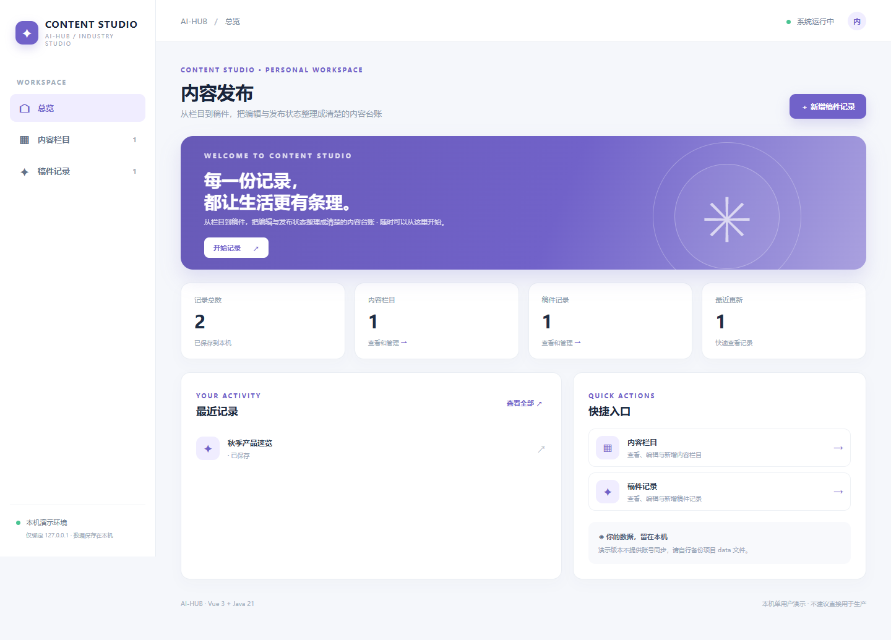</a><br/><b>Content · cms</b></td><td width="50%" align="center"><a href="./wms/README.md">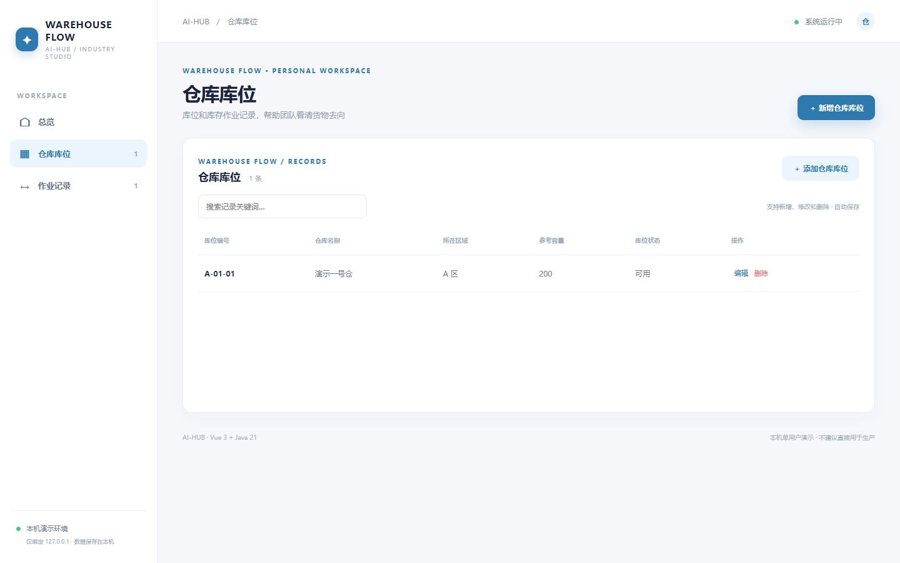</a><br/><b>Warehouse · wms</b></td></tr>
<tr><td width="50%" align="center"><a href="./eldercare/README.md">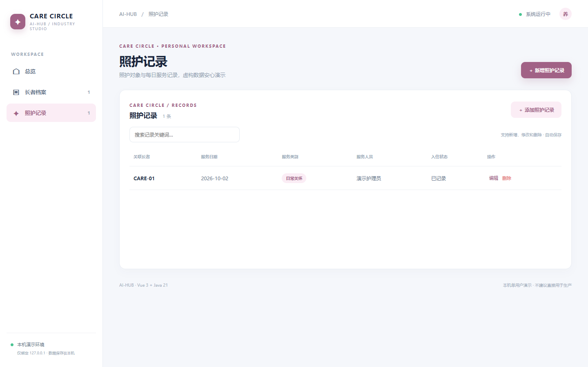</a><br/><b>Eldercare · eldercare</b></td><td width="50%" align="center"><a href="./civic/README.md">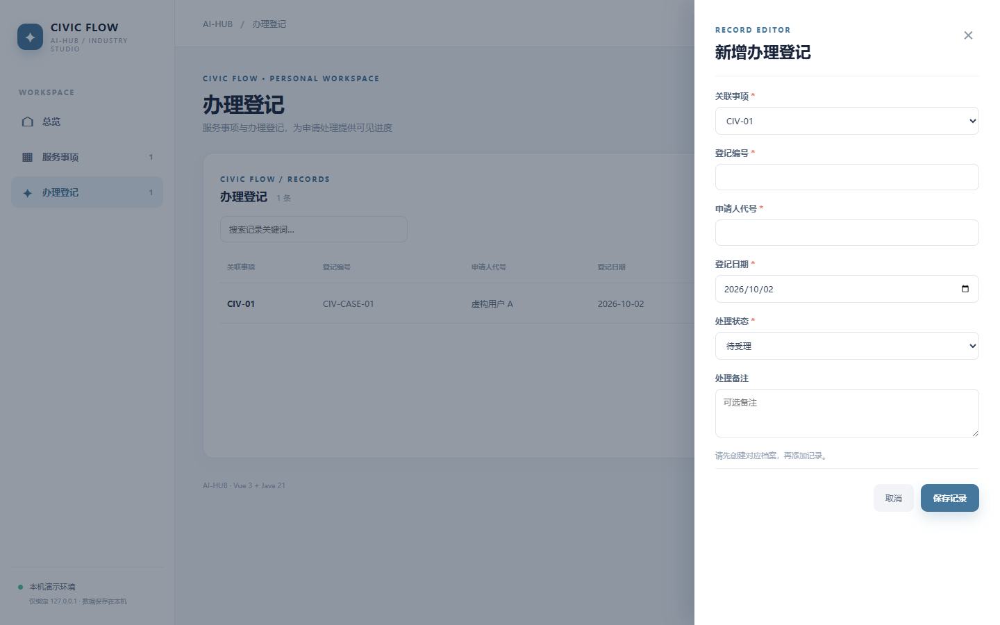</a><br/><b>Civic services · civic</b></td></tr>
</table>

## 🖼️ Real screenshots

These images were captured from running applications, not mockups. Click through to the individual project for details.

<table>
<tr><td width="50%" align="center"><a href="./shop/README.md"></a><br/><b>shop · desktop storefront</b></td><td width="50%" align="center"><a href="./manage/README.md"></a><br/><b>manage · admin dashboard</b></td></tr>
<tr><td width="50%" align="center"><a href="./labbook/README.md"></a><br/><b>labbook · research records</b></td><td width="50%" align="center"><a href="./barber/README.md">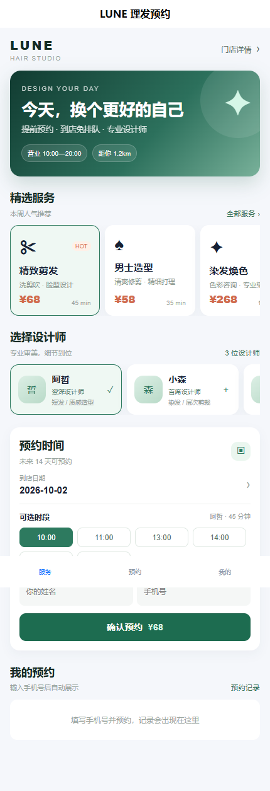</a><br/><b>barber · mini-program</b></td></tr>
</table>

<details>
<summary><b>Browse screenshots for all 84 projects</b></summary>

| Project | Local address | Actual screenshots |
| :--- | :--- | :--- |
| [shop](./shop/README.md) | http://127.0.0.1:8081 | [Desktop Home](./shop/screenshots/desktop-home.png) · [Desktop Catalog](./shop/screenshots/desktop-catalog.png) · [Desktop Detail](./shop/screenshots/desktop-detail.png) · [Desktop Cart](./shop/screenshots/desktop-cart.png) · [Desktop Checkout](./shop/screenshots/desktop-checkout.png) · [Miniprogram Home](./shop/screenshots/miniprogram-home.png) · [Miniprogram Detail](./shop/screenshots/miniprogram-detail.png) · [Miniprogram Cart](./shop/screenshots/miniprogram-cart.png) |
| [manage](./manage/README.md) | http://127.0.0.1:8082 | [Dashboard](./manage/screenshots/dashboard.png) · [Users](./manage/screenshots/users.png) · [Roles](./manage/screenshots/roles.png) · [Menus](./manage/screenshots/menus.png) · [Departments](./manage/screenshots/departments.png) · [Logs](./manage/screenshots/logs.png) · [Profile](./manage/screenshots/profile.png) |
| [crm](./crm/README.md) | http://127.0.0.1:8083 | [Pipeline](./crm/screenshots/pipeline.png) |
| [oa](./oa/README.md) | http://127.0.0.1:8084 | [Approvals](./oa/screenshots/approvals.png) |
| [finance](./finance/README.md) | http://127.0.0.1:8085 | [Overview](./finance/screenshots/overview.png) · [Primary records](./finance/screenshots/primary.png) · [Related records](./finance/screenshots/secondary.png) |
| [health](./health/README.md) | http://127.0.0.1:8086 | [Overview](./health/screenshots/overview.png) · [Primary records](./health/screenshots/primary.png) · [Related records](./health/screenshots/secondary.png) |
| [wellness](./wellness/README.md) | http://127.0.0.1:8087 | [Overview](./wellness/screenshots/overview.png) · [Primary records](./wellness/screenshots/primary.png) · [Related records](./wellness/screenshots/secondary.png) |
| [hospital](./hospital/README.md) | http://127.0.0.1:8088 | [Overview](./hospital/screenshots/overview.png) · [Primary records](./hospital/screenshots/primary.png) · [Related records](./hospital/screenshots/secondary.png) |
| [school](./school/README.md) | http://127.0.0.1:8089 | [Overview](./school/screenshots/overview.png) · [Primary records](./school/screenshots/primary.png) · [Related records](./school/screenshots/secondary.png) |
| [access](./access/README.md) | http://127.0.0.1:8090 | [Overview](./access/screenshots/overview.png) · [Primary records](./access/screenshots/primary.png) · [Related records](./access/screenshots/secondary.png) |
| [barber](./barber/README.md) | http://127.0.0.1:8091 | [Overview](./barber/screenshots/overview.png) · [Primary records](./barber/screenshots/primary.png) · [Related records](./barber/screenshots/secondary.png) |
| [dining](./dining/README.md) | http://127.0.0.1:8092 | [Overview](./dining/screenshots/overview.png) · [Primary records](./dining/screenshots/primary.png) · [Related records](./dining/screenshots/secondary.png) |
| [selfshop](./selfshop/README.md) | http://127.0.0.1:8093 | [Overview](./selfshop/screenshots/overview.png) · [Primary records](./selfshop/screenshots/primary.png) · [Related records](./selfshop/screenshots/secondary.png) |
| [schedule](./schedule/README.md) | http://127.0.0.1:8094 | [Overview](./schedule/screenshots/overview.png) · [Primary records](./schedule/screenshots/primary.png) · [Related records](./schedule/screenshots/secondary.png) |
| [carcare](./carcare/README.md) | http://127.0.0.1:8095 | [Overview](./carcare/screenshots/overview.png) · [Primary records](./carcare/screenshots/primary.png) · [Related records](./carcare/screenshots/secondary.png) |
| [parenting](./parenting/README.md) | http://127.0.0.1:8096 | [Overview](./parenting/screenshots/overview.png) · [Primary records](./parenting/screenshots/primary.png) · [Related records](./parenting/screenshots/secondary.png) |
| [labbook](./labbook/README.md) | http://127.0.0.1:8097 | [Overview](./labbook/screenshots/overview.png) · [Experiments](./labbook/screenshots/experiments.png) · [Samples](./labbook/screenshots/samples.png) · [Templates](./labbook/screenshots/templates.png) · [Detail](./labbook/screenshots/detail.png) · [Editor](./labbook/screenshots/editor.png) |
| [ai](./ai/README.md) | http://127.0.0.1:8098 | [Overview](./ai/screenshots/overview.png) · [Cli](./ai/screenshots/cli.png) · [Skills](./ai/screenshots/skills.png) · [Prompt](./ai/screenshots/prompt.png) · [Skill Detail](./ai/screenshots/skill-detail.png) |
| [html](./html/README.md) | http://127.0.0.1:8099 | [Studio](./html/screenshots/studio.png) · [Templates](./html/screenshots/templates.png) · [Games](./html/screenshots/games.png) · [Directory](./html/screenshots/directory.png) · [Directory Detail](./html/screenshots/directory-detail.png) |
| [crawler](./crawler/README.md) | http://127.0.0.1:8100 | [Overview](./crawler/screenshots/overview.png) · [Crawl](./crawler/screenshots/crawl.png) · [History](./crawler/screenshots/history.png) |
| [erp](./erp/README.md) | http://127.0.0.1:8101 | [Overview](./erp/screenshots/overview.png) · [Primary records](./erp/screenshots/primary.png) · [Related records](./erp/screenshots/secondary.png) · [Editor](./erp/screenshots/editor.png) |
| [manufacturing](./manufacturing/README.md) | http://127.0.0.1:8102 | [Overview](./manufacturing/screenshots/overview.png) · [Primary records](./manufacturing/screenshots/primary.png) · [Related records](./manufacturing/screenshots/secondary.png) · [Editor](./manufacturing/screenshots/editor.png) |
| [logistics](./logistics/README.md) | http://127.0.0.1:8103 | [Overview](./logistics/screenshots/overview.png) · [Primary records](./logistics/screenshots/primary.png) · [Related records](./logistics/screenshots/secondary.png) · [Editor](./logistics/screenshots/editor.png) |
| [property](./property/README.md) | http://127.0.0.1:8104 | [Overview](./property/screenshots/overview.png) · [Primary records](./property/screenshots/primary.png) · [Related records](./property/screenshots/secondary.png) · [Editor](./property/screenshots/editor.png) |
| [agriculture](./agriculture/README.md) | http://127.0.0.1:8105 | [Overview](./agriculture/screenshots/overview.png) · [Primary records](./agriculture/screenshots/primary.png) · [Related records](./agriculture/screenshots/secondary.png) · [Editor](./agriculture/screenshots/editor.png) |
| [construction](./construction/README.md) | http://127.0.0.1:8106 | [Overview](./construction/screenshots/overview.png) · [Primary records](./construction/screenshots/primary.png) · [Related records](./construction/screenshots/secondary.png) · [Editor](./construction/screenshots/editor.png) |
| [hospitality](./hospitality/README.md) | http://127.0.0.1:8107 | [Overview](./hospitality/screenshots/overview.png) · [Primary records](./hospitality/screenshots/primary.png) · [Related records](./hospitality/screenshots/secondary.png) · [Editor](./hospitality/screenshots/editor.png) |
| [hrm](./hrm/README.md) | http://127.0.0.1:8108 | [Overview](./hrm/screenshots/overview.png) · [Primary records](./hrm/screenshots/primary.png) · [Related records](./hrm/screenshots/secondary.png) · [Editor](./hrm/screenshots/editor.png) |
| [service](./service/README.md) | http://127.0.0.1:8109 | [Overview](./service/screenshots/overview.png) · [Primary records](./service/screenshots/primary.png) · [Related records](./service/screenshots/secondary.png) · [Editor](./service/screenshots/editor.png) |
| [energy](./energy/README.md) | http://127.0.0.1:8110 | [Overview](./energy/screenshots/overview.png) · [Primary records](./energy/screenshots/primary.png) · [Related records](./energy/screenshots/secondary.png) · [Editor](./energy/screenshots/editor.png) |
| [legal](./legal/README.md) | http://127.0.0.1:8111 | [Overview](./legal/screenshots/overview.png) · [Primary records](./legal/screenshots/primary.png) · [Related records](./legal/screenshots/secondary.png) · [Editor](./legal/screenshots/editor.png) |
| [culture](./culture/README.md) | http://127.0.0.1:8112 | [Overview](./culture/screenshots/overview.png) · [Primary records](./culture/screenshots/primary.png) · [Related records](./culture/screenshots/secondary.png) · [Editor](./culture/screenshots/editor.png) |
| [community](./community/README.md) | http://127.0.0.1:8113 | [Overview](./community/screenshots/overview.png) · [Primary records](./community/screenshots/primary.png) · [Related records](./community/screenshots/secondary.png) · [Editor](./community/screenshots/editor.png) |
| [cms](./cms/README.md) | http://127.0.0.1:8114 | [Overview](./cms/screenshots/overview.png) · [Primary records](./cms/screenshots/primary.png) · [Related records](./cms/screenshots/secondary.png) · [Editor](./cms/screenshots/editor.png) |
| [wms](./wms/README.md) | http://127.0.0.1:8115 | [Overview](./wms/screenshots/overview.png) · [Primary records](./wms/screenshots/primary.png) · [Related records](./wms/screenshots/secondary.png) · [Editor](./wms/screenshots/editor.png) |
| [b2b](./b2b/README.md) | http://127.0.0.1:8116 | [Overview](./b2b/screenshots/overview.png) · [Primary records](./b2b/screenshots/primary.png) · [Related records](./b2b/screenshots/secondary.png) · [Editor](./b2b/screenshots/editor.png) |
| [eldercare](./eldercare/README.md) | http://127.0.0.1:8117 | [Overview](./eldercare/screenshots/overview.png) · [Primary records](./eldercare/screenshots/primary.png) · [Related records](./eldercare/screenshots/secondary.png) · [Editor](./eldercare/screenshots/editor.png) |
| [pharmacy](./pharmacy/README.md) | http://127.0.0.1:8118 | [Overview](./pharmacy/screenshots/overview.png) · [Primary records](./pharmacy/screenshots/primary.png) · [Related records](./pharmacy/screenshots/secondary.png) · [Editor](./pharmacy/screenshots/editor.png) |
| [insurance](./insurance/README.md) | http://127.0.0.1:8119 | [Overview](./insurance/screenshots/overview.png) · [Primary records](./insurance/screenshots/primary.png) · [Related records](./insurance/screenshots/secondary.png) · [Editor](./insurance/screenshots/editor.png) |
| [rental](./rental/README.md) | http://127.0.0.1:8120 | [Overview](./rental/screenshots/overview.png) · [Primary records](./rental/screenshots/primary.png) · [Related records](./rental/screenshots/secondary.png) · [Editor](./rental/screenshots/editor.png) |
| [homeservice](./homeservice/README.md) | http://127.0.0.1:8121 | [Overview](./homeservice/screenshots/overview.png) · [Primary records](./homeservice/screenshots/primary.png) · [Related records](./homeservice/screenshots/secondary.png) · [Editor](./homeservice/screenshots/editor.png) |
| [water](./water/README.md) | http://127.0.0.1:8122 | [Overview](./water/screenshots/overview.png) · [Primary records](./water/screenshots/primary.png) · [Related records](./water/screenshots/secondary.png) · [Editor](./water/screenshots/editor.png) |
| [sanitation](./sanitation/README.md) | http://127.0.0.1:8123 | [Overview](./sanitation/screenshots/overview.png) · [Primary records](./sanitation/screenshots/primary.png) · [Related records](./sanitation/screenshots/secondary.png) · [Editor](./sanitation/screenshots/editor.png) |
| [mining](./mining/README.md) | http://127.0.0.1:8124 | [Overview](./mining/screenshots/overview.png) · [Primary records](./mining/screenshots/primary.png) · [Related records](./mining/screenshots/secondary.png) · [Editor](./mining/screenshots/editor.png) |
| [forestry](./forestry/README.md) | http://127.0.0.1:8125 | [Overview](./forestry/screenshots/overview.png) · [Primary records](./forestry/screenshots/primary.png) · [Related records](./forestry/screenshots/secondary.png) · [Editor](./forestry/screenshots/editor.png) |
| [fishery](./fishery/README.md) | http://127.0.0.1:8126 | [Overview](./fishery/screenshots/overview.png) · [Primary records](./fishery/screenshots/primary.png) · [Related records](./fishery/screenshots/secondary.png) · [Editor](./fishery/screenshots/editor.png) |
| [telecom](./telecom/README.md) | http://127.0.0.1:8127 | [Overview](./telecom/screenshots/overview.png) · [Primary records](./telecom/screenshots/primary.png) · [Related records](./telecom/screenshots/secondary.png) · [Editor](./telecom/screenshots/editor.png) |
| [itops](./itops/README.md) | http://127.0.0.1:8128 | [Overview](./itops/screenshots/overview.png) · [Primary records](./itops/screenshots/primary.png) · [Related records](./itops/screenshots/secondary.png) · [Editor](./itops/screenshots/editor.png) |
| [civic](./civic/README.md) | http://127.0.0.1:8129 | [Overview](./civic/screenshots/overview.png) · [Primary records](./civic/screenshots/primary.png) · [Related records](./civic/screenshots/secondary.png) · [Editor](./civic/screenshots/editor.png) |
| [parking](./parking/README.md) | http://127.0.0.1:8130 | [Overview](./parking/screenshots/overview.png) · [Primary records](./parking/screenshots/primary.png) · [Related records](./parking/screenshots/secondary.png) · [Editor](./parking/screenshots/editor.png) |
| [charging](./charging/README.md) | http://127.0.0.1:8131 | [Overview](./charging/screenshots/overview.png) · [Primary records](./charging/screenshots/primary.png) · [Related records](./charging/screenshots/secondary.png) · [Editor](./charging/screenshots/editor.png) |
| [parkops](./parkops/README.md) | http://127.0.0.1:8132 | [Overview](./parkops/screenshots/overview.png) · [Primary records](./parkops/screenshots/primary.png) · [Related records](./parkops/screenshots/secondary.png) · [Editor](./parkops/screenshots/editor.png) |
| [fleet](./fleet/README.md) | http://127.0.0.1:8133 | [Overview](./fleet/screenshots/overview.png) · [Primary records](./fleet/screenshots/primary.png) · [Related records](./fleet/screenshots/secondary.png) · [Editor](./fleet/screenshots/editor.png) |
| [scenic](./scenic/README.md) | http://127.0.0.1:8134 | [Overview](./scenic/screenshots/overview.png) · [Primary records](./scenic/screenshots/primary.png) · [Related records](./scenic/screenshots/secondary.png) · [Editor](./scenic/screenshots/editor.png) |
| [clinic](./clinic/README.md) | http://127.0.0.1:8135 | [Overview](./clinic/screenshots/overview.png) · [Primary records](./clinic/screenshots/primary.png) · [Related records](./clinic/screenshots/secondary.png) · [Editor](./clinic/screenshots/editor.png) |
| [dental](./dental/README.md) | http://127.0.0.1:8136 | [Overview](./dental/screenshots/overview.png) · [Primary records](./dental/screenshots/primary.png) · [Related records](./dental/screenshots/secondary.png) · [Editor](./dental/screenshots/editor.png) |
| [aesthetics](./aesthetics/README.md) | http://127.0.0.1:8137 | [Overview](./aesthetics/screenshots/overview.png) · [Primary records](./aesthetics/screenshots/primary.png) · [Related records](./aesthetics/screenshots/secondary.png) · [Editor](./aesthetics/screenshots/editor.png) |
| [rehab](./rehab/README.md) | http://127.0.0.1:8138 | [Overview](./rehab/screenshots/overview.png) · [Primary records](./rehab/screenshots/primary.png) · [Related records](./rehab/screenshots/secondary.png) · [Editor](./rehab/screenshots/editor.png) |
| [lis](./lis/README.md) | http://127.0.0.1:8139 | [Overview](./lis/screenshots/overview.png) · [Primary records](./lis/screenshots/primary.png) · [Related records](./lis/screenshots/secondary.png) · [Editor](./lis/screenshots/editor.png) |
| [kindergarten](./kindergarten/README.md) | http://127.0.0.1:8140 | [Overview](./kindergarten/screenshots/overview.png) · [Primary records](./kindergarten/screenshots/primary.png) · [Related records](./kindergarten/screenshots/secondary.png) · [Editor](./kindergarten/screenshots/editor.png) |
| [training](./training/README.md) | http://127.0.0.1:8141 | [Overview](./training/screenshots/overview.png) · [Primary records](./training/screenshots/primary.png) · [Related records](./training/screenshots/secondary.png) · [Editor](./training/screenshots/editor.png) |
| [elearning](./elearning/README.md) | http://127.0.0.1:8142 | [Overview](./elearning/screenshots/overview.png) · [Primary records](./elearning/screenshots/primary.png) · [Related records](./elearning/screenshots/secondary.png) · [Editor](./elearning/screenshots/editor.png) |
| [exam](./exam/README.md) | http://127.0.0.1:8143 | [Overview](./exam/screenshots/overview.png) · [Primary records](./exam/screenshots/primary.png) · [Related records](./exam/screenshots/secondary.png) · [Editor](./exam/screenshots/editor.png) |
| [library](./library/README.md) | http://127.0.0.1:8144 | [Overview](./library/screenshots/overview.png) · [Primary records](./library/screenshots/primary.png) · [Related records](./library/screenshots/secondary.png) · [Editor](./library/screenshots/editor.png) |
| [petcare](./petcare/README.md) | http://127.0.0.1:8145 | [Overview](./petcare/screenshots/overview.png) · [Primary records](./petcare/screenshots/primary.png) · [Related records](./petcare/screenshots/secondary.png) · [Editor](./petcare/screenshots/editor.png) |
| [petboarding](./petboarding/README.md) | http://127.0.0.1:8146 | [Overview](./petboarding/screenshots/overview.png) · [Primary records](./petboarding/screenshots/primary.png) · [Related records](./petboarding/screenshots/secondary.png) · [Editor](./petboarding/screenshots/editor.png) |
| [petgrooming](./petgrooming/README.md) | http://127.0.0.1:8147 | [Overview](./petgrooming/screenshots/overview.png) · [Primary records](./petgrooming/screenshots/primary.png) · [Related records](./petgrooming/screenshots/secondary.png) · [Editor](./petgrooming/screenshots/editor.png) |
| [veterinary](./veterinary/README.md) | http://127.0.0.1:8148 | [Overview](./veterinary/screenshots/overview.png) · [Primary records](./veterinary/screenshots/primary.png) · [Related records](./veterinary/screenshots/secondary.png) · [Editor](./veterinary/screenshots/editor.png) |
| [pos](./pos/README.md) | http://127.0.0.1:8149 | [Overview](./pos/screenshots/overview.png) · [Primary records](./pos/screenshots/primary.png) · [Related records](./pos/screenshots/secondary.png) · [Editor](./pos/screenshots/editor.png) |
| [loyalty](./loyalty/README.md) | http://127.0.0.1:8150 | [Overview](./loyalty/screenshots/overview.png) · [Primary records](./loyalty/screenshots/primary.png) · [Related records](./loyalty/screenshots/secondary.png) · [Editor](./loyalty/screenshots/editor.png) |
| [laundry](./laundry/README.md) | http://127.0.0.1:8151 | [Overview](./laundry/screenshots/overview.png) · [Primary records](./laundry/screenshots/primary.png) · [Related records](./laundry/screenshots/secondary.png) · [Editor](./laundry/screenshots/editor.png) |
| [gym](./gym/README.md) | http://127.0.0.1:8152 | [Overview](./gym/screenshots/overview.png) · [Primary records](./gym/screenshots/primary.png) · [Related records](./gym/screenshots/secondary.png) · [Editor](./gym/screenshots/editor.png) |
| [photography](./photography/README.md) | http://127.0.0.1:8153 | [Overview](./photography/screenshots/overview.png) · [Primary records](./photography/screenshots/primary.png) · [Related records](./photography/screenshots/secondary.png) · [Editor](./photography/screenshots/editor.png) |
| [wedding](./wedding/README.md) | http://127.0.0.1:8154 | [Overview](./wedding/screenshots/overview.png) · [Primary records](./wedding/screenshots/primary.png) · [Related records](./wedding/screenshots/secondary.png) · [Editor](./wedding/screenshots/editor.png) |
| [accounting](./accounting/README.md) | http://127.0.0.1:8155 | [Overview](./accounting/screenshots/overview.png) · [Primary records](./accounting/screenshots/primary.png) · [Related records](./accounting/screenshots/secondary.png) · [Editor](./accounting/screenshots/editor.png) |
| [contracts](./contracts/README.md) | http://127.0.0.1:8156 | [Overview](./contracts/screenshots/overview.png) · [Primary records](./contracts/screenshots/primary.png) · [Related records](./contracts/screenshots/secondary.png) · [Editor](./contracts/screenshots/editor.png) |
| [projectops](./projectops/README.md) | http://127.0.0.1:8157 | [Overview](./projectops/screenshots/overview.png) · [Primary records](./projectops/screenshots/primary.png) · [Related records](./projectops/screenshots/secondary.png) · [Editor](./projectops/screenshots/editor.png) |
| [maintenance](./maintenance/README.md) | http://127.0.0.1:8158 | [Overview](./maintenance/screenshots/overview.png) · [Primary records](./maintenance/screenshots/primary.png) · [Related records](./maintenance/screenshots/secondary.png) · [Editor](./maintenance/screenshots/editor.png) |
| [qms](./qms/README.md) | http://127.0.0.1:8159 | [Overview](./qms/screenshots/overview.png) · [Primary records](./qms/screenshots/primary.png) · [Related records](./qms/screenshots/secondary.png) · [Editor](./qms/screenshots/editor.png) |
| [coldchain](./coldchain/README.md) | http://127.0.0.1:8160 | [Overview](./coldchain/screenshots/overview.png) · [Primary records](./coldchain/screenshots/primary.png) · [Related records](./coldchain/screenshots/secondary.png) · [Editor](./coldchain/screenshots/editor.png) |
| [freshdelivery](./freshdelivery/README.md) | http://127.0.0.1:8161 | [Overview](./freshdelivery/screenshots/overview.png) · [Primary records](./freshdelivery/screenshots/primary.png) · [Related records](./freshdelivery/screenshots/secondary.png) · [Editor](./freshdelivery/screenshots/editor.png) |
| [crossborder](./crossborder/README.md) | http://127.0.0.1:8162 | [Overview](./crossborder/screenshots/overview.png) · [Primary records](./crossborder/screenshots/primary.png) · [Related records](./crossborder/screenshots/secondary.png) · [Editor](./crossborder/screenshots/editor.png) |
| [returns](./returns/README.md) | http://127.0.0.1:8163 | [Overview](./returns/screenshots/overview.png) · [Primary records](./returns/screenshots/primary.png) · [Related records](./returns/screenshots/secondary.png) · [Editor](./returns/screenshots/editor.png) |
| [realestate](./realestate/README.md) | http://127.0.0.1:8164 | [Overview](./realestate/screenshots/overview.png) · [Primary records](./realestate/screenshots/primary.png) · [Related records](./realestate/screenshots/secondary.png) · [Editor](./realestate/screenshots/editor.png) |

</details>

## 🧭 Architecture

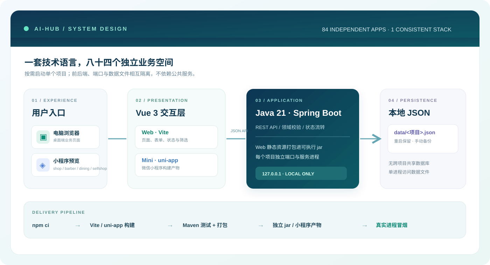

1. **Independent projects.** Each directory runs its own Java service on its own port and keeps its own local data; no shared gateway or database is required.
2. **Web delivery.** Vite builds the Vue frontend into Spring Boot static resources. The executable jar serves both the UI and same-origin `/api` endpoints.
3. **Mini-program builds.** shop, barber, dining and selfshop also build uni-app WeChat mini-program artifacts; the mini-program frontend is separate from the desktop UI where applicable.
4. **Local persistence.** Data lives in `data/<project>.json`. Stop the service before copying the JSON file for backup or moving it away to reset demo data. A damaged file prevents startup instead of silently replacing it.
5. **Validation, not production architecture.** Build, backend tests, jar checks and real-process smoke tests are available, but there is no claim of high availability or multi-user production safety.

## ✅ Validation and limits

```powershell
./test-all.ps1      # Windows: build/package/test 84 projects, including four mini-program builds
./smoke-test.ps1    # Windows: start 84 real services and check their pages/assets/APIs
```

On macOS/Linux, use `./test-all.sh`; to test just one backend, run `mvn -f <project>/backend/pom.xml test`. Screenshots live in each project's `screenshots/` directory.

**Last full local validation: October 2, 2026.** All 84 projects passed the build/backend/package checks and real-process smoke checks. Each of the newest 35 projects has four actual screenshots; the previous 16 also have four each. This validates the local demos, **not** their performance, security or regulatory compliance in production.

> [!IMPORTANT]
> These are runnable local examples for learning and further development, **not production-ready SaaS applications**. The default host is `127.0.0.1`. There is no shared authentication, formal permission isolation, payment integration, encryption, tamper-proof audit, database migrations or multi-instance concurrency guarantee. In particular, do not use sensitive real-world financial, medical, child, access-control or research data without a proper security, privacy, compliance and disaster-recovery design.

## 🌱 What's next?

"Software for every profession" is a vision, not a present-tense coverage claim. The 29 newer sector directories demonstrate local record management; they do not implement inventory accounting, manufacturing execution, logistics dispatch, room-conflict prevention, formal approvals, publication workflows, insurance payouts or verified civic identity. See the [business-system research map](./docs/business-map.md) (Chinese) for candidate domains and reference projects.

**Custom development:** Add QQ **3174667330** to discuss a specific workflow or bespoke software. Email: **3174667330@qq.com**. The Git commit email is configured only for this repository, not globally.
