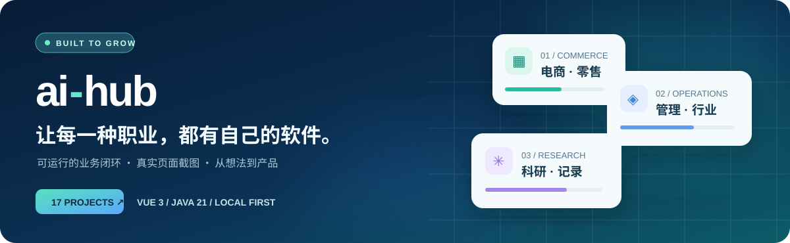

<div align="center">



**17 个可运行项目** · **4 个微信小程序构建** · **Vue 3 + Java 21** · **本机优先**

[立即体验](#-30-秒开始体验) · [浏览项目](#-项目宇宙) · [系统架构](#-系统架构) · [页面截图](#-真实页面) · [测试与边界](#-验证与使用边界)

</div>

> **只要你愿意提出需求，我们就把更多职业的想法做成看得见、跑得起来、能验证的产品。**
>
> ai-hub 是持续生长的业务软件合集，不是“已经覆盖所有职业”的承诺。每个列为已实现的项目都有独立的业务页面、Java API、运行脚本、测试与真实页面截图。

## ✨ 为什么是 ai-hub

| 真实业务场景 | 开箱可体验 | 自主实现、方便改造 |
| :--- | :--- | :--- |
| 从电商、管理到医疗、科研、家庭记录，覆盖 **17 个独立系统**；不是同一套空壳换标题。 | 前端构建后随 Java 服务提供页面；选择一个项目运行即可，无需同时启动 17 套服务。 | 统一使用 **Vue 3 + Java 21 / Spring Boot**；小程序采用 uni-app。每个项目独立目录、端口与数据文件。 |

## ⚡ 30 秒开始体验

> 需要 **Java 21、Maven、Node.js 20.19+/22.12+ 和 npm**；首次运行会联网下载依赖。以下命令会安装前端依赖、构建页面、运行后端测试、打包并启动服务。

<table>
<tr><th>Windows PowerShell</th><th>macOS / Linux</th></tr>
<tr><td><code>./shop/run.ps1</code></td><td><code>./shop/run.sh</code></td></tr>
<tr><td colspan="2">浏览器打开 <code>http://127.0.0.1:8081</code>。想体验其它项目？把 <code>shop</code> 换成下方项目名，并打开对应端口。按 <code>Ctrl+C</code> 停止。</td></tr>
</table>

也可以从 [科研实验记录](./labbook/README.md) 开始：运行 `./labbook/run.ps1`（Windows）或 `./labbook/run.sh`（macOS/Linux），打开 `http://127.0.0.1:8097`。**这些是本机单用户演示系统，不可直接部署到公网。**

## 🪐 项目宇宙

每个项目名称都可进入独立 README，了解功能、运行方式与完整截图。地址默认仅在当前电脑可访问。

| 场景 | 项目 | 已实现能力 | 本机端口 |
| :--- | :--- | :--- | :--- |
| **交易与服务** | [shop · 商城](./shop/README.md) | 电脑端与微信小程序、商品检索、详情、购物车、库存校验与下单 | `8081` |
| | [barber · 理发](./barber/README.md) | 小程序服务、设计师、时段预约与取消 | `8091` |
| | [dining · 点餐](./dining/README.md) | 小程序桌号、菜品、餐篮、备注与订单 | `8092` |
| | [selfshop · 自助购物](./selfshop/README.md) | 小程序搜索、扫码入口、库存、购物袋与结算 | `8093` |
| **企业运营** | [manage · 通用后台](./manage/README.md) | 若依式控制台、用户、角色、菜单、部门、日志与个人中心 | `8082` |
| | [crm · 客户关系](./crm/README.md) | 客户、商机、跟进和阶段流转 | `8083` |
| | [oa · 协同办公](./oa/README.md) | 请假/报销草稿、提交与审批 | `8084` |
| | [finance · 金融工作台](./finance/README.md) | 账户、流水、风险提醒与经营指标 | `8085` |
| **行业场景** | [health · 健康](./health/README.md) | 健康档案、随访预约与指标提醒 | `8086` |
| | [wellness · 养生](./wellness/README.md) | 会员、养生计划、课程和打卡 | `8087` |
| | [hospital · 医院](./hospital/README.md) | 患者、门诊预约、病区与医嘱工作台 | `8088` |
| | [school · 学校](./school/README.md) | 学生、课程、出勤与校园事务 | `8089` |
| | [access · 门禁](./access/README.md) | 门点、人员、访客与通行事件 | `8090` |
| **生活与研究** | [schedule · 日程](./schedule/README.md) | 日程、分类、完成状态与未来安排 | `8094` |
| | [carcare · 汽车养护](./carcare/README.md) | 车辆、里程、维修保养与费用记录 | `8095` |
| | [parenting · 养娃](./parenting/README.md) | 成长档案、日常与里程碑记录 | `8096` |
| | [labbook · 科研实验](./labbook/README.md) | 八个学科模板、实验、样本、修订历史与 JSON 导出 | `8097` |

## 🖼️ 真实页面

以下画面来自实际运行的项目，不是设计稿。点击图片进入对应项目的完整说明。

<table>
<tr><td width="50%" align="center"><a href="./shop/README.md"></a><br/><b>shop · 电脑端商城</b></td><td width="50%" align="center"><a href="./manage/README.md"></a><br/><b>manage · 通用管理后台</b></td></tr>
<tr><td width="50%" align="center"><a href="./labbook/README.md"></a><br/><b>labbook · 跨学科实验记录</b></td><td width="50%" align="center"><a href="./barber/README.md"></a><br/><b>barber · 预约小程序</b></td></tr>
</table>

<details>
<summary><b>展开全部 17 个项目的页面截图索引</b></summary>

| 项目 | 功能闭环 | 本机地址 | 页面截图 |
| :--- | :--- | :--- | :--- |
| [shop](./shop/README.md) | 京东式商品检索、详情、购物车、库存校验与下单；电脑端 + 微信小程序 | http://127.0.0.1:8081 | [电脑端首页](./shop/screenshots/desktop-home.png) · [商品列表](./shop/screenshots/desktop-catalog.png) · [商品详情](./shop/screenshots/desktop-detail.png) · [购物车](./shop/screenshots/desktop-cart.png) · [订单结算](./shop/screenshots/desktop-checkout.png) · [小程序首页](./shop/screenshots/miniprogram-home.png) · [小程序详情](./shop/screenshots/miniprogram-detail.png) · [小程序购物车](./shop/screenshots/miniprogram-cart.png) |
| [manage](./manage/README.md) | 若依式通用后台：控制台、用户、角色、菜单、部门、日志、个人中心 | http://127.0.0.1:8082 | [控制台](./manage/screenshots/dashboard.png) · [用户](./manage/screenshots/users.png) · [角色](./manage/screenshots/roles.png) · [菜单](./manage/screenshots/menus.png) · [部门](./manage/screenshots/departments.png) · [日志](./manage/screenshots/logs.png) · [个人中心](./manage/screenshots/profile.png) |
| [crm](./crm/README.md) | 客户、商机、跟进和阶段流转 | http://127.0.0.1:8083 | [销售漏斗](./crm/screenshots/pipeline.png) |
| [oa](./oa/README.md) | 请假/报销草稿、提交与审批 | http://127.0.0.1:8084 | [审批](./oa/screenshots/approvals.png) |
| [finance](./finance/README.md) | 金融账户、流水、风险提醒与经营指标 | http://127.0.0.1:8085 | [总览](./finance/screenshots/overview.png) · [账户](./finance/screenshots/primary.png) · [流水](./finance/screenshots/secondary.png) |
| [health](./health/README.md) | 健康档案、随访预约与指标提醒 | http://127.0.0.1:8086 | [总览](./health/screenshots/overview.png) · [档案](./health/screenshots/primary.png) · [预约](./health/screenshots/secondary.png) |
| [wellness](./wellness/README.md) | 养生计划、课程运营与会员打卡 | http://127.0.0.1:8087 | [总览](./wellness/screenshots/overview.png) · [计划](./wellness/screenshots/primary.png) · [打卡](./wellness/screenshots/secondary.png) |
| [hospital](./hospital/README.md) | 患者、门诊预约、病区和医嘱工作台 | http://127.0.0.1:8088 | [总览](./hospital/screenshots/overview.png) · [患者](./hospital/screenshots/primary.png) · [预约](./hospital/screenshots/secondary.png) |
| [school](./school/README.md) | 学生、课程、出勤与校园事务管理 | http://127.0.0.1:8089 | [总览](./school/screenshots/overview.png) · [学生](./school/screenshots/primary.png) · [课程](./school/screenshots/secondary.png) |
| [access](./access/README.md) | 门点、人员、访客与通行事件管理 | http://127.0.0.1:8090 | [总览](./access/screenshots/overview.png) · [门点](./access/screenshots/primary.png) · [通行](./access/screenshots/secondary.png) |
| [barber](./barber/README.md) | 理发服务、设计师、时段、预约与取消；微信小程序 | http://127.0.0.1:8091 | [预约首页](./barber/screenshots/overview.png) · [预约页](./barber/screenshots/primary.png) · [我的](./barber/screenshots/secondary.png) |
| [dining](./dining/README.md) | 桌号、菜品、餐篮、备注与点餐订单；微信小程序 | http://127.0.0.1:8092 | [点餐页](./dining/screenshots/overview.png) · [餐篮](./dining/screenshots/primary.png) · [订单](./dining/screenshots/secondary.png) |
| [selfshop](./selfshop/README.md) | 商品、搜索、扫码入口、库存、购物袋与自助结算；微信小程序 | http://127.0.0.1:8093 | [商品首页](./selfshop/screenshots/overview.png) · [购物袋](./selfshop/screenshots/primary.png) · [订单](./selfshop/screenshots/secondary.png) |
| [schedule](./schedule/README.md) | 日程、分类、完成状态与未来安排 | http://127.0.0.1:8094 | [总览](./schedule/screenshots/overview.png) · [日程清单](./schedule/screenshots/primary.png) · [未来安排](./schedule/screenshots/secondary.png) |
| [carcare](./carcare/README.md) | 车辆档案、保养维修、里程与费用记录 | http://127.0.0.1:8095 | [总览](./carcare/screenshots/overview.png) · [车辆](./carcare/screenshots/primary.png) · [维修记录](./carcare/screenshots/secondary.png) |
| [parenting](./parenting/README.md) | 成长档案、成长记录与分类检索 | http://127.0.0.1:8096 | [总览](./parenting/screenshots/overview.png) · [成长档案](./parenting/screenshots/primary.png) · [成长记录](./parenting/screenshots/secondary.png) |
| [labbook](./labbook/README.md) | 跨学科实验、样本、修订历史与 JSON 导出 | http://127.0.0.1:8097 | [总览](./labbook/screenshots/overview.png) · [实验](./labbook/screenshots/experiments.png) · [样本](./labbook/screenshots/samples.png) · [学科模板](./labbook/screenshots/templates.png) · [详情](./labbook/screenshots/detail.png) · [编辑](./labbook/screenshots/editor.png) |

</details>

## 🧭 系统架构


**关键设计：**

1. **项目独立：**17 个系统各自拥有目录、Java 服务、端口和本地数据文件；不需要先启动一个公共网关或数据库。
2. **Web 一体交付：**Vue 页面由 Vite 构建后放入 Spring Boot 的静态资源目录，随可执行 jar 一起提供；浏览器通过同源 `/api` 请求业务接口。
3. **小程序单独构建：**shop、barber、dining、selfshop 的 uni-app 构建微信小程序产物；小程序和电脑端的代码形态不同，但对应 Java API 保持独立。
4. **数据本机持久化：**业务数据位于各项目的 `data/<项目>.json`，重启仍保留。停服后复制 JSON 文件备份；停服后移走它可重置演示数据。文件损坏时服务拒绝启动，避免覆盖原数据。
5. **测试再交付：**前端构建、后端测试、jar 静态页检查和真实进程冒烟都纳入根目录脚本。架构图表达的是当前本机演示形态，**不是生产高可用架构**。

## ✅ 验证与使用边界

```powershell
./test-all.ps1      # Windows：17 项目构建、后端测试、jar 检查；包含 4 个微信小程序构建
./smoke-test.ps1    # Windows：启动 17 个真实服务，检查页面、JS 与 API
```

macOS / Linux 可运行 `./test-all.sh`；各项目也可单独运行 `mvn -f <项目>/backend/pom.xml test`。截图保存在各项目的 `screenshots/`；新项目只有具备页面、接口、测试和实际截图后才列入目录。

> [!IMPORTANT]
> **这是可直接在本机体验、学习和二次开发的样板，不是可直接上生产的 SaaS。** 默认绑定 `127.0.0.1`；没有统一登录鉴权、正式权限隔离、支付、加密、不可篡改审计、数据库迁移与多实例并发保障。金融、医疗、未成年人、门禁、科研等敏感场景尤其不能直接处理真实业务数据。正式部署前须完成安全、隐私、合规与灾备设计。

## 🌱 下一站

“让所有职业都能找到软件”是方向，而非当前覆盖范围。更多候选类型与参考项目见 [业务系统调研与建设清单](./docs/business-map.md)。欢迎从一个真实业务问题出发，提出下一款值得认真做的软件。

**联系：**3174667330@qq.com · Git 提交邮箱仅设置在此仓库，不修改全局配置。
