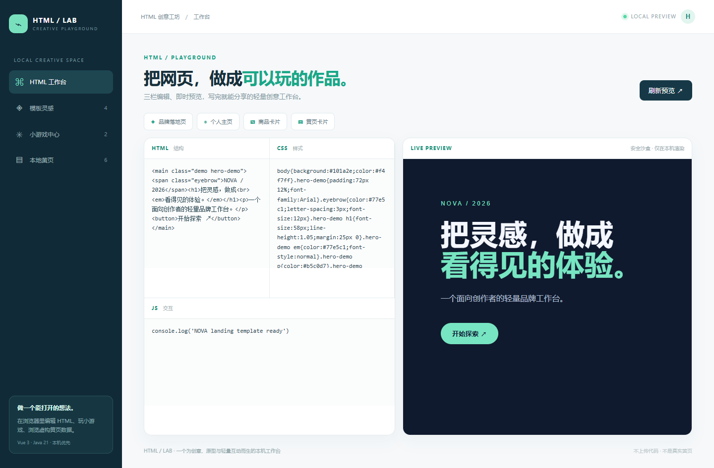

<div align="center">

<p align="center">
  
</p>

**49 个可运行项目** · **4 个微信小程序构建** · **Vue 3 + Java 21** · **本机优先**

[立即体验](#-快速开始) · [浏览项目](#-项目宇宙) · [系统架构](#-系统架构) · [页面截图](#-真实页面) · [测试与边界](#-验证与使用边界)

</div>

> **只要你愿意提出需求，我们就把更多职业的想法做成看得见、跑得起来、能验证的产品。**
>
> ai-hub 是持续生长的业务软件合集，不是“已经覆盖所有职业”的承诺。每个列为已实现的项目都有独立的业务页面、Java API、运行脚本、测试与真实页面截图。

<p align="center">
  
</p>

## ✨ 为什么是 ai-hub

| 真实业务场景 | 开箱可体验 | 自主实现、方便改造 |
| :--- | :--- | :--- |
| 从电商、管理到医疗、科研、家庭记录，覆盖 **49 个独立系统**；新增行业目录复用记录台模板，深度与完整产品不同。 | 前端构建后随 Java 服务提供页面；选择一个项目运行即可，无需同时启动 49 套服务。 | 统一使用 **Vue 3 + Java 21 / Spring Boot**；小程序采用 uni-app。每个项目独立目录、端口与数据文件。 |

## ⚡ 快速开始

> 需要 **Java 21、Maven、Node.js 20.19+/22.12+ 和 npm**；首次运行会联网下载依赖。以下命令会安装前端依赖、构建页面、运行后端测试、打包并启动服务。

<table>
<tr><th>Windows PowerShell</th><th>macOS / Linux</th></tr>
<tr><td><code>./shop/run.ps1</code></td><td><code>./shop/run.sh</code></td></tr>
<tr><td colspan="2">浏览器打开 <code>http://127.0.0.1:8081</code>。想体验其它项目？把 <code>shop</code> 换成下方项目名，并打开对应端口。按 <code>Ctrl+C</code> 停止。</td></tr>
</table>

也可以从 [科研实验记录](./labbook/README.md) 开始：运行 `./labbook/run.ps1`（Windows）或 `./labbook/run.sh`（macOS/Linux），打开 `http://127.0.0.1:8097`。**这些是本机单用户演示系统，不可直接部署到公网。**

## 🪐 项目宇宙

每个项目名称都可进入独立 README，了解功能、运行方式与完整截图。地址默认仅在当前电脑可访问。

| 场景 | 项目 | 已实现能力 | 本机端口 |
| :--- | :--- | :--- | :--- |
| **交易与服务** | [shop · 商城](./shop/README.md) | 电脑端与微信小程序、商品检索、详情、购物车、库存校验与下单 | `8081` |
| | [barber · 理发](./barber/README.md) | 小程序服务、设计师、时段预约与取消 | `8091` |
| | [dining · 点餐](./dining/README.md) | 小程序桌号、菜品、餐篮、备注与订单 | `8092` |
| | [selfshop · 自助购物](./selfshop/README.md) | 小程序搜索、扫码入口、库存、购物袋与结算 | `8093` |
| **企业运营** | [manage · 通用后台](./manage/README.md) | 若依式控制台、用户、角色、菜单、部门、日志与个人中心 | `8082` |
| | [crm · 客户关系](./crm/README.md) | 客户、商机、跟进和阶段流转 | `8083` |
| | [oa · 协同办公](./oa/README.md) | 请假/报销草稿、提交与审批 | `8084` |
| | [finance · 金融工作台](./finance/README.md) | 账户、流水、风险提醒与经营指标 | `8085` |
| **行业场景** | [health · 健康](./health/README.md) | 健康档案、随访预约与指标提醒 | `8086` |
| | [wellness · 养生](./wellness/README.md) | 会员、养生计划、课程和打卡 | `8087` |
| | [hospital · 医院](./hospital/README.md) | 患者、门诊预约、病区与医嘱工作台 | `8088` |
| | [school · 学校](./school/README.md) | 学生、课程、出勤与校园事务 | `8089` |
| | [access · 门禁](./access/README.md) | 门点、人员、访客与通行事件 | `8090` |
| **生活与研究** | [schedule · 日程](./schedule/README.md) | 日程、分类、完成状态与未来安排 | `8094` |
| | [carcare · 汽车养护](./carcare/README.md) | 车辆、里程、维修保养与费用记录 | `8095` |
| | [parenting · 养娃](./parenting/README.md) | 成长档案、日常与里程碑记录 | `8096` |
| | [labbook · 科研实验](./labbook/README.md) | 八个学科模板、实验、样本、修订历史与 JSON 导出 | `8097` |
| **AI 与创意** | [ai · AI 工作台](./ai/README.md) | CLI 工具箱、Skill 技能库、Prompt 工作台与安全命令预览 | `8098` |
| | [html · HTML 创意工坊](./html/README.md) | HTML/CSS/JS 实时预览、模板、小程序式小游戏与虚构黄页 | `8099` |
| | [crawler · 网页抓取](./crawler/README.md) | 公开网页单页抓取、摘要、链接与历史 | `8100` |
| **供应链与制造** | [erp · 进销存](./erp/README.md) | 商品档案、出入库流水、关联与检索 | `8101` |
| | [manufacturing · 制造](./manufacturing/README.md) | 物料档案、生产工单、进度记录 | `8102` |
| | [logistics · 物流](./logistics/README.md) | 车辆档案、运输运单和状态记录 | `8103` |
| **地产与农业** | [property · 物业房产](./property/README.md) | 房源档案、报修事项与处理记录 | `8104` |
| | [agriculture · 农业养殖](./agriculture/README.md) | 地块档案、农事活动记录 | `8105` |
| | [construction · 建筑工程](./construction/README.md) | 工程项目、现场施工日志 | `8106` |
| **服务行业** | [hospitality · 酒店旅游](./hospitality/README.md) | 客房档案、预订记录与房态 | `8107` |
| | [hrm · 人力资源](./hrm/README.md) | 员工档案、假勤申请与状态 | `8108` |
| | [service · 售后工单](./service/README.md) | 客户档案、服务工单与跟进 | `8109` |
| | [energy · 能源环保](./energy/README.md) | 监测设备、巡检读数与结论 | `8110` |
| | [legal · 法律服务](./legal/README.md) | 委托档案、案件进度与下一步行动 | `8111` |
| | [culture · 文化体育](./culture/README.md) | 场馆空间、活动安排与状态 | `8112` |
| | [community · 社区公益](./community/README.md) | 服务项目、需求登记与处理记录 | `8113` |
| **内容与交易** | [cms · 内容发布](./cms/README.md) | 内容栏目、稿件记录的本机记录样板 | `8114` |
|  | [wms · 仓储管理](./wms/README.md) | 仓库库位、作业记录的本机记录样板 | `8115` |
|  | [b2b · 批发采购](./b2b/README.md) | 供应商档案、采购订单的本机记录样板 | `8116` |
| **照护与服务** | [eldercare · 养老护理](./eldercare/README.md) | 长者档案、照护记录的本机记录样板 | `8117` |
|  | [pharmacy · 药店台账](./pharmacy/README.md) | 药品目录、批次记录的本机记录样板 | `8118` |
|  | [insurance · 保险服务](./insurance/README.md) | 保单档案、理赔进度的本机记录样板 | `8119` |
|  | [rental · 物品租赁](./rental/README.md) | 出租设备、租借记录的本机记录样板 | `8120` |
|  | [homeservice · 上门服务](./homeservice/README.md) | 客户档案、上门任务的本机记录样板 | `8121` |
| **资源与环境** | [water · 水务设施](./water/README.md) | 设施档案、巡检记录的本机记录样板 | `8122` |
|  | [sanitation · 城市环卫](./sanitation/README.md) | 作业线路、清运记录的本机记录样板 | `8123` |
|  | [mining · 矿山作业](./mining/README.md) | 作业区域、班次记录的本机记录样板 | `8124` |
|  | [forestry · 林地巡护](./forestry/README.md) | 林区档案、巡护记录的本机记录样板 | `8125` |
|  | [fishery · 水产养殖](./fishery/README.md) | 养殖池塘、投喂记录的本机记录样板 | `8126` |
| **基础设施与公共事务** | [telecom · 通信设施](./telecom/README.md) | 通信站点、维护任务的本机记录样板 | `8127` |
|  | [itops · IT 运维](./itops/README.md) | 设备资产、故障记录的本机记录样板 | `8128` |
|  | [civic · 公共服务](./civic/README.md) | 服务事项、办理登记的本机记录样板 | `8129` |

## 🆕 本轮新增 · 16 个行业记录台

> 从内容、采购到养老、环境和公共服务，每个入口都是**可在本机运行的独立样板**：两类关联记录、检索与编辑、Java API、本地 JSON 持久化及实际页面截图。先体验具体场景，再按真实业务需求扩展；**不等同于完整生产系统**。

| 方向 | 新增项目 | 从这里开始 |
| :--- | :--- | :--- |
| 内容与交易 | [cms 内容发布](./cms/README.md) · [wms 仓储管理](./wms/README.md) · [b2b 批发采购](./b2b/README.md) | 栏目/稿件、库位/作业、供应商/采购单 |
| 照护与服务 | [eldercare 养老护理](./eldercare/README.md) · [pharmacy 药店台账](./pharmacy/README.md) · [insurance 保险服务](./insurance/README.md) · [rental 物品租赁](./rental/README.md) · [homeservice 上门服务](./homeservice/README.md) | 档案与服务、批次、理赔进度、租借、上门任务 |
| 资源与环境 | [water 水务设施](./water/README.md) · [sanitation 城市环卫](./sanitation/README.md) · [mining 矿山作业](./mining/README.md) · [forestry 林地巡护](./forestry/README.md) · [fishery 水产养殖](./fishery/README.md) | 设施/巡检、清运、班次、巡护、投喂记录 |
| 基础设施与公共事务 | [telecom 通信设施](./telecom/README.md) · [itops IT 运维](./itops/README.md) · [civic 公共服务](./civic/README.md) | 站点/维护、资产/故障、事项/办理登记 |

<table>
<tr><td width="50%" align="center"><a href="./cms/README.md"></a><br/><b>内容发布 · cms</b></td><td width="50%" align="center"><a href="./wms/README.md"></a><br/><b>仓储管理 · wms</b></td></tr>
<tr><td width="50%" align="center"><a href="./eldercare/README.md"></a><br/><b>养老护理 · eldercare</b></td><td width="50%" align="center"><a href="./civic/README.md"></a><br/><b>公共服务 · civic</b></td></tr>
</table>

**如何体验新增项目？** 例如 Windows 运行 `./cms/run.ps1`，macOS/Linux 运行 `./cms/run.sh`，打开 `http://127.0.0.1:8114`；其他项目替换目录名并使用上表对应端口。每个项目 README 都有启动说明和四张截图（总览、两类列表、编辑表单）。

## 🖼️ 真实页面

以下画面来自实际运行的项目，不是设计稿。点击图片进入对应项目的完整说明。

<table>
<tr><td width="50%" align="center"><a href="./shop/README.md"></a><br/><b>shop · 电脑端商城</b></td><td width="50%" align="center"><a href="./manage/README.md"></a><br/><b>manage · 通用管理后台</b></td></tr>
<tr><td width="50%" align="center"><a href="./labbook/README.md"></a><br/><b>labbook · 跨学科实验记录</b></td><td width="50%" align="center"><a href="./barber/README.md"></a><br/><b>barber · 预约小程序</b></td></tr>
<tr><td width="50%" align="center"><a href="./ai/README.md"></a><br/><b>ai · 本机 AI 工作台</b></td><td width="50%" align="center"><a href="./html/README.md"></a><br/><b>html · HTML 创意工坊</b></td></tr>
</table>

<details>
<summary><b>展开全部 49 个项目的页面截图索引</b></summary>

| 项目 | 已演示能力 | 本机地址 | 页面截图 |
| :--- | :--- | :--- | :--- |
| [shop](./shop/README.md) | 京东式商品检索、详情、购物车、库存校验与下单；电脑端 + 微信小程序 | http://127.0.0.1:8081 | [电脑端首页](./shop/screenshots/desktop-home.png) · [商品列表](./shop/screenshots/desktop-catalog.png) · [商品详情](./shop/screenshots/desktop-detail.png) · [购物车](./shop/screenshots/desktop-cart.png) · [订单结算](./shop/screenshots/desktop-checkout.png) · [小程序首页](./shop/screenshots/miniprogram-home.png) · [小程序详情](./shop/screenshots/miniprogram-detail.png) · [小程序购物车](./shop/screenshots/miniprogram-cart.png) |
| [manage](./manage/README.md) | 若依式通用后台：控制台、用户、角色、菜单、部门、日志、个人中心 | http://127.0.0.1:8082 | [控制台](./manage/screenshots/dashboard.png) · [用户](./manage/screenshots/users.png) · [角色](./manage/screenshots/roles.png) · [菜单](./manage/screenshots/menus.png) · [部门](./manage/screenshots/departments.png) · [日志](./manage/screenshots/logs.png) · [个人中心](./manage/screenshots/profile.png) |
| [crm](./crm/README.md) | 客户、商机、跟进和阶段流转 | http://127.0.0.1:8083 | [销售漏斗](./crm/screenshots/pipeline.png) |
| [oa](./oa/README.md) | 请假/报销草稿、提交与审批 | http://127.0.0.1:8084 | [审批](./oa/screenshots/approvals.png) |
| [finance](./finance/README.md) | 金融账户、流水、风险提醒与经营指标 | http://127.0.0.1:8085 | [总览](./finance/screenshots/overview.png) · [账户](./finance/screenshots/primary.png) · [流水](./finance/screenshots/secondary.png) |
| [health](./health/README.md) | 健康档案、随访预约与指标提醒 | http://127.0.0.1:8086 | [总览](./health/screenshots/overview.png) · [档案](./health/screenshots/primary.png) · [预约](./health/screenshots/secondary.png) |
| [wellness](./wellness/README.md) | 养生计划、课程运营与会员打卡 | http://127.0.0.1:8087 | [总览](./wellness/screenshots/overview.png) · [计划](./wellness/screenshots/primary.png) · [打卡](./wellness/screenshots/secondary.png) |
| [hospital](./hospital/README.md) | 患者、门诊预约、病区和医嘱工作台 | http://127.0.0.1:8088 | [总览](./hospital/screenshots/overview.png) · [患者](./hospital/screenshots/primary.png) · [预约](./hospital/screenshots/secondary.png) |
| [school](./school/README.md) | 学生、课程、出勤与校园事务管理 | http://127.0.0.1:8089 | [总览](./school/screenshots/overview.png) · [学生](./school/screenshots/primary.png) · [课程](./school/screenshots/secondary.png) |
| [access](./access/README.md) | 门点、人员、访客与通行事件管理 | http://127.0.0.1:8090 | [总览](./access/screenshots/overview.png) · [门点](./access/screenshots/primary.png) · [通行](./access/screenshots/secondary.png) |
| [barber](./barber/README.md) | 理发服务、设计师、时段、预约与取消；微信小程序 | http://127.0.0.1:8091 | [预约首页](./barber/screenshots/overview.png) · [预约页](./barber/screenshots/primary.png) · [我的](./barber/screenshots/secondary.png) |
| [dining](./dining/README.md) | 桌号、菜品、餐篮、备注与点餐订单；微信小程序 | http://127.0.0.1:8092 | [点餐页](./dining/screenshots/overview.png) · [餐篮](./dining/screenshots/primary.png) · [订单](./dining/screenshots/secondary.png) |
| [selfshop](./selfshop/README.md) | 商品、搜索、扫码入口、库存、购物袋与自助结算；微信小程序 | http://127.0.0.1:8093 | [商品首页](./selfshop/screenshots/overview.png) · [购物袋](./selfshop/screenshots/primary.png) · [订单](./selfshop/screenshots/secondary.png) |
| [schedule](./schedule/README.md) | 日程、分类、完成状态与未来安排 | http://127.0.0.1:8094 | [总览](./schedule/screenshots/overview.png) · [日程清单](./schedule/screenshots/primary.png) · [未来安排](./schedule/screenshots/secondary.png) |
| [carcare](./carcare/README.md) | 车辆档案、保养维修、里程与费用记录 | http://127.0.0.1:8095 | [总览](./carcare/screenshots/overview.png) · [车辆](./carcare/screenshots/primary.png) · [维修记录](./carcare/screenshots/secondary.png) |
| [parenting](./parenting/README.md) | 成长档案、成长记录与分类检索 | http://127.0.0.1:8096 | [总览](./parenting/screenshots/overview.png) · [成长档案](./parenting/screenshots/primary.png) · [成长记录](./parenting/screenshots/secondary.png) |
| [labbook](./labbook/README.md) | 跨学科实验、样本、修订历史与 JSON 导出 | http://127.0.0.1:8097 | [总览](./labbook/screenshots/overview.png) · [实验](./labbook/screenshots/experiments.png) · [样本](./labbook/screenshots/samples.png) · [学科模板](./labbook/screenshots/templates.png) · [详情](./labbook/screenshots/detail.png) · [编辑](./labbook/screenshots/editor.png) |
| [ai](./ai/README.md) | CLI 工具箱、Skill 技能库、Prompt 工作台 | http://127.0.0.1:8098 | [总览](./ai/screenshots/overview.png) · [CLI](./ai/screenshots/cli.png) · [技能库](./ai/screenshots/skills.png) · [Prompt](./ai/screenshots/prompt.png) · [技能详情](./ai/screenshots/skill-detail.png) |
| [html](./html/README.md) | HTML/CSS/JS 工作台、模板、小游戏与黄页目录 | http://127.0.0.1:8099 | [工作台](./html/screenshots/studio.png) · [模板](./html/screenshots/templates.png) · [小游戏](./html/screenshots/games.png) · [黄页](./html/screenshots/directory.png) · [黄页详情](./html/screenshots/directory-detail.png) |
| [crawler](./crawler/README.md) | 公开网页单页抓取、结构化摘要、链接提取与抓取历史 | http://127.0.0.1:8100 | [总览](./crawler/screenshots/overview.png) · [抓取结果](./crawler/screenshots/crawl.png) · [抓取历史](./crawler/screenshots/history.png) |
| [erp](./erp/README.md) | 商品与出入库，本机演示样板 | http://127.0.0.1:8101 | [总览](./erp/screenshots/overview.png) · [商品档案](./erp/screenshots/primary.png) · [出入库流水](./erp/screenshots/secondary.png) · [编辑表单](./erp/screenshots/editor.png) |
| [manufacturing](./manufacturing/README.md) | 物料与生产工单，本机演示样板 | http://127.0.0.1:8102 | [总览](./manufacturing/screenshots/overview.png) · [物料档案](./manufacturing/screenshots/primary.png) · [生产工单](./manufacturing/screenshots/secondary.png) · [编辑表单](./manufacturing/screenshots/editor.png) |
| [logistics](./logistics/README.md) | 车辆与运单，本机演示样板 | http://127.0.0.1:8103 | [总览](./logistics/screenshots/overview.png) · [运输车辆](./logistics/screenshots/primary.png) · [运输运单](./logistics/screenshots/secondary.png) · [编辑表单](./logistics/screenshots/editor.png) |
| [property](./property/README.md) | 房源档案与报修工单，本机演示样板 | http://127.0.0.1:8104 | [总览](./property/screenshots/overview.png) · [房源档案](./property/screenshots/primary.png) · [报修工单](./property/screenshots/secondary.png) · [编辑表单](./property/screenshots/editor.png) |
| [agriculture](./agriculture/README.md) | 地块档案与农事记录，本机演示样板 | http://127.0.0.1:8105 | [总览](./agriculture/screenshots/overview.png) · [地块档案](./agriculture/screenshots/primary.png) · [农事记录](./agriculture/screenshots/secondary.png) · [编辑表单](./agriculture/screenshots/editor.png) |
| [construction](./construction/README.md) | 工程项目与施工日志，本机演示样板 | http://127.0.0.1:8106 | [总览](./construction/screenshots/overview.png) · [工程项目](./construction/screenshots/primary.png) · [施工日志](./construction/screenshots/secondary.png) · [编辑表单](./construction/screenshots/editor.png) |
| [hospitality](./hospitality/README.md) | 客房档案与预订记录，本机演示样板 | http://127.0.0.1:8107 | [总览](./hospitality/screenshots/overview.png) · [客房档案](./hospitality/screenshots/primary.png) · [预订记录](./hospitality/screenshots/secondary.png) · [编辑表单](./hospitality/screenshots/editor.png) |
| [hrm](./hrm/README.md) | 员工档案与假勤申请，本机演示样板 | http://127.0.0.1:8108 | [总览](./hrm/screenshots/overview.png) · [员工档案](./hrm/screenshots/primary.png) · [假勤申请](./hrm/screenshots/secondary.png) · [编辑表单](./hrm/screenshots/editor.png) |
| [service](./service/README.md) | 客户档案与服务工单，本机演示样板 | http://127.0.0.1:8109 | [总览](./service/screenshots/overview.png) · [客户档案](./service/screenshots/primary.png) · [服务工单](./service/screenshots/secondary.png) · [编辑表单](./service/screenshots/editor.png) |
| [energy](./energy/README.md) | 监测设备与巡检记录，本机演示样板 | http://127.0.0.1:8110 | [总览](./energy/screenshots/overview.png) · [监测设备](./energy/screenshots/primary.png) · [巡检记录](./energy/screenshots/secondary.png) · [编辑表单](./energy/screenshots/editor.png) |
| [legal](./legal/README.md) | 委托人档案与案件进度，本机演示样板 | http://127.0.0.1:8111 | [总览](./legal/screenshots/overview.png) · [委托人档案](./legal/screenshots/primary.png) · [案件进度](./legal/screenshots/secondary.png) · [编辑表单](./legal/screenshots/editor.png) |
| [culture](./culture/README.md) | 场馆空间与活动安排，本机演示样板 | http://127.0.0.1:8112 | [总览](./culture/screenshots/overview.png) · [场馆空间](./culture/screenshots/primary.png) · [活动安排](./culture/screenshots/secondary.png) · [编辑表单](./culture/screenshots/editor.png) |
| [community](./community/README.md) | 服务项目与服务需求，本机演示样板 | http://127.0.0.1:8113 | [总览](./community/screenshots/overview.png) · [服务项目](./community/screenshots/primary.png) · [服务需求](./community/screenshots/secondary.png) · [编辑表单](./community/screenshots/editor.png) |

| [cms](./cms/README.md) | 内容栏目与稿件记录的本机演示 | http://127.0.0.1:8114 | [总览](./cms/screenshots/overview.png) · [内容栏目](./cms/screenshots/primary.png) · [稿件记录](./cms/screenshots/secondary.png) · [编辑表单](./cms/screenshots/editor.png) |
| [wms](./wms/README.md) | 仓库库位与作业记录的本机演示 | http://127.0.0.1:8115 | [总览](./wms/screenshots/overview.png) · [仓库库位](./wms/screenshots/primary.png) · [作业记录](./wms/screenshots/secondary.png) · [编辑表单](./wms/screenshots/editor.png) |
| [b2b](./b2b/README.md) | 供应商档案与采购订单的本机演示 | http://127.0.0.1:8116 | [总览](./b2b/screenshots/overview.png) · [供应商档案](./b2b/screenshots/primary.png) · [采购订单](./b2b/screenshots/secondary.png) · [编辑表单](./b2b/screenshots/editor.png) |
| [eldercare](./eldercare/README.md) | 长者档案与照护记录的本机演示 | http://127.0.0.1:8117 | [总览](./eldercare/screenshots/overview.png) · [长者档案](./eldercare/screenshots/primary.png) · [照护记录](./eldercare/screenshots/secondary.png) · [编辑表单](./eldercare/screenshots/editor.png) |
| [pharmacy](./pharmacy/README.md) | 药品目录与批次记录的本机演示 | http://127.0.0.1:8118 | [总览](./pharmacy/screenshots/overview.png) · [药品目录](./pharmacy/screenshots/primary.png) · [批次记录](./pharmacy/screenshots/secondary.png) · [编辑表单](./pharmacy/screenshots/editor.png) |
| [insurance](./insurance/README.md) | 保单档案与理赔进度的本机演示 | http://127.0.0.1:8119 | [总览](./insurance/screenshots/overview.png) · [保单档案](./insurance/screenshots/primary.png) · [理赔进度](./insurance/screenshots/secondary.png) · [编辑表单](./insurance/screenshots/editor.png) |
| [rental](./rental/README.md) | 出租设备与租借记录的本机演示 | http://127.0.0.1:8120 | [总览](./rental/screenshots/overview.png) · [出租设备](./rental/screenshots/primary.png) · [租借记录](./rental/screenshots/secondary.png) · [编辑表单](./rental/screenshots/editor.png) |
| [homeservice](./homeservice/README.md) | 客户档案与上门任务的本机演示 | http://127.0.0.1:8121 | [总览](./homeservice/screenshots/overview.png) · [客户档案](./homeservice/screenshots/primary.png) · [上门任务](./homeservice/screenshots/secondary.png) · [编辑表单](./homeservice/screenshots/editor.png) |
| [water](./water/README.md) | 设施档案与巡检记录的本机演示 | http://127.0.0.1:8122 | [总览](./water/screenshots/overview.png) · [设施档案](./water/screenshots/primary.png) · [巡检记录](./water/screenshots/secondary.png) · [编辑表单](./water/screenshots/editor.png) |
| [sanitation](./sanitation/README.md) | 作业线路与清运记录的本机演示 | http://127.0.0.1:8123 | [总览](./sanitation/screenshots/overview.png) · [作业线路](./sanitation/screenshots/primary.png) · [清运记录](./sanitation/screenshots/secondary.png) · [编辑表单](./sanitation/screenshots/editor.png) |
| [mining](./mining/README.md) | 作业区域与班次记录的本机演示 | http://127.0.0.1:8124 | [总览](./mining/screenshots/overview.png) · [作业区域](./mining/screenshots/primary.png) · [班次记录](./mining/screenshots/secondary.png) · [编辑表单](./mining/screenshots/editor.png) |
| [forestry](./forestry/README.md) | 林区档案与巡护记录的本机演示 | http://127.0.0.1:8125 | [总览](./forestry/screenshots/overview.png) · [林区档案](./forestry/screenshots/primary.png) · [巡护记录](./forestry/screenshots/secondary.png) · [编辑表单](./forestry/screenshots/editor.png) |
| [fishery](./fishery/README.md) | 养殖池塘与投喂记录的本机演示 | http://127.0.0.1:8126 | [总览](./fishery/screenshots/overview.png) · [养殖池塘](./fishery/screenshots/primary.png) · [投喂记录](./fishery/screenshots/secondary.png) · [编辑表单](./fishery/screenshots/editor.png) |
| [telecom](./telecom/README.md) | 通信站点与维护任务的本机演示 | http://127.0.0.1:8127 | [总览](./telecom/screenshots/overview.png) · [通信站点](./telecom/screenshots/primary.png) · [维护任务](./telecom/screenshots/secondary.png) · [编辑表单](./telecom/screenshots/editor.png) |
| [itops](./itops/README.md) | 设备资产与故障记录的本机演示 | http://127.0.0.1:8128 | [总览](./itops/screenshots/overview.png) · [设备资产](./itops/screenshots/primary.png) · [故障记录](./itops/screenshots/secondary.png) · [编辑表单](./itops/screenshots/editor.png) |
| [civic](./civic/README.md) | 服务事项与办理登记的本机演示 | http://127.0.0.1:8129 | [总览](./civic/screenshots/overview.png) · [服务事项](./civic/screenshots/primary.png) · [办理登记](./civic/screenshots/secondary.png) · [编辑表单](./civic/screenshots/editor.png) |

</details>

## 🧭 系统架构


**关键设计：**

1. **项目独立：**49 个系统各自拥有目录、Java 服务、端口和本地数据文件；不需要先启动一个公共网关或数据库。
2. **Web 一体交付：**Vue 页面由 Vite 构建后放入 Spring Boot 的静态资源目录，随可执行 jar 一起提供；浏览器通过同源 `/api` 请求业务接口。
3. **小程序单独构建：**shop、barber、dining、selfshop 的 uni-app 构建微信小程序产物；小程序和电脑端的代码形态不同，但对应 Java API 保持独立。
4. **数据本机持久化：**业务数据位于各项目的 `data/<项目>.json`，重启仍保留。停服后复制 JSON 文件备份；停服后移走它可重置演示数据。文件损坏时服务拒绝启动，避免覆盖原数据。
5. **测试再交付：**前端构建、后端测试、jar 静态页检查和真实进程冒烟都纳入根目录脚本。架构图表达的是当前本机演示形态，**不是生产高可用架构**。

## ✅ 验证与使用边界

```powershell
./test-all.ps1      # Windows：49 项目构建、后端测试、jar 检查；包含 4 个微信小程序构建
./smoke-test.ps1    # Windows：启动 49 个真实服务，检查页面、JS 与 API
```

**最近一次全量验收（2026-10-02）：**49 个项目完成前端构建、后端测试和打包检查；49 个真实 Java 进程的页面/API 冒烟通过。新增 16 个项目各有 4 张真实截图，根目录截图索引链接已检查。测试覆盖本机演示流程，不代表生产环境的性能、安全或行业合规认证。

macOS / Linux 可运行 `./test-all.sh`；各项目也可单独运行 `mvn -f <项目>/backend/pom.xml test`。截图保存在各项目的 `screenshots/`；新项目只有具备页面、接口、测试和实际截图后才列入目录。

> [!IMPORTANT]
> **这是可直接在本机体验、学习和二次开发的样板，不是可直接上生产的 SaaS。** 默认绑定 `127.0.0.1`；没有统一登录鉴权、正式权限隔离、支付、加密、不可篡改审计、数据库迁移与多实例并发保障。金融、医疗、未成年人、门禁、科研等敏感场景尤其不能直接处理真实业务数据。正式部署前须完成安全、隐私、合规与灾备设计。

## 🌱 下一站

“让所有职业都能找到软件”是方向，而非当前覆盖范围。新增 29 个行业目录是**可运行的档案／记录演示**，并非已经实现 ERP 自动库存结转、生产 MES、物流调度、酒店房态冲突控制、正式审批等完整行业系统。CMS、仓储、采购、照护、公共服务等新增目录同样仅覆盖本机档案/记录功能，不具备出版审核、真实仓储结转、保险理赔或政务身份校验等完整流程。更多候选类型与参考项目见 [业务系统调研与建设清单](./docs/business-map.md)。欢迎从一个真实业务问题出发，提出下一款值得认真做的软件。

**联系：**3174667330@qq.com · Git 提交邮箱仅设置在此仓库，不修改全局配置。
