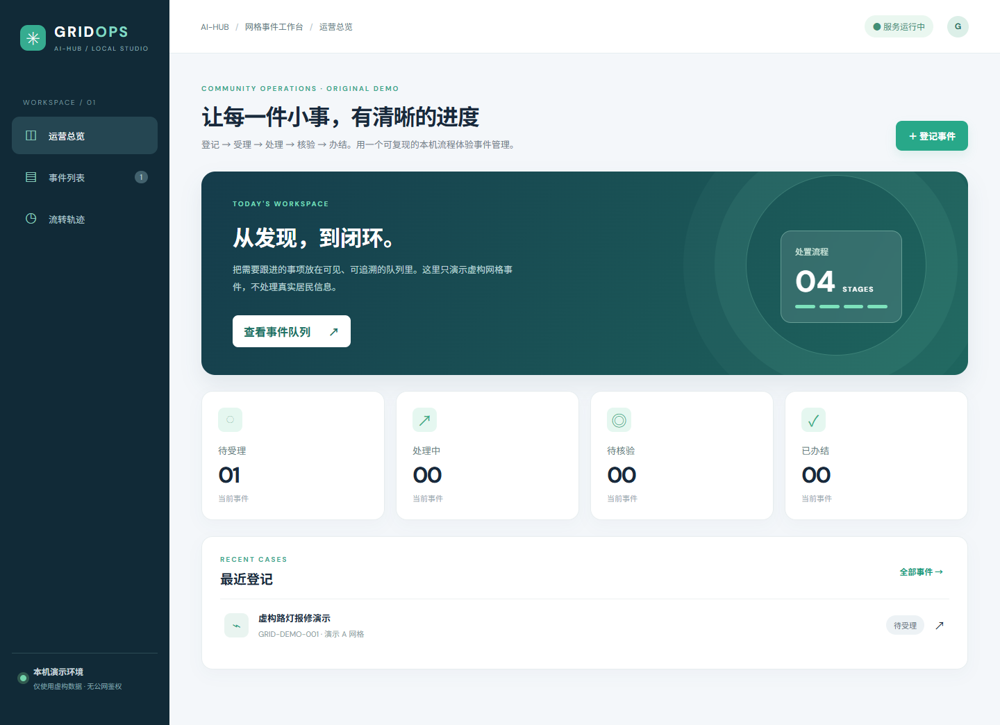
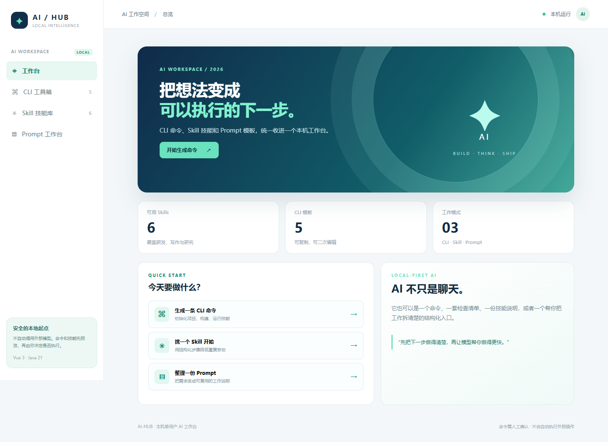

<div align="center">

**[简体中文](./README.md) · [English](./README.en.md)**


### 把每一种真实需求，变成看得见的软件。

**101 个独立可运行项目** &nbsp;·&nbsp; **4 个微信小程序构建** &nbsp;·&nbsp; **Vue 3 + Java 21** &nbsp;·&nbsp; **本机优先**

[探索生态矩阵](#-ai-hub-生态矩阵) · [一键体验](#-快速开始) · [全部项目](#-按业务找项目) · [页面截图](#-页面预览) · [架构与边界](#-架构与交付边界)

</div>

> **ai-hub 是持续生长的业务软件合集。** 从有完整交互流程的精选项目，到覆盖更多职业的轻量记录样板，再到小程序和创意工具：选一个目录，运行、查看页面、验证功能，然后按自己的业务继续改造。**“让每种职业都有软件”是愿景，不是已经覆盖所有行业流程的承诺。**

## ✨ 从这里进入

<table>
<tr>
<td width="25%" align="center"><a href="./shop/README.md"></a><br/><b>01 · 交易体验</b><br/><sub>shop · 商品 / 购物车 / 订单</sub></td>
<td width="25%" align="center"><a href="./manage/README.md"></a><br/><b>02 · 企业运营</b><br/><sub>manage · 控制台 / 用户 / 角色</sub></td>
<td width="25%" align="center"><a href="./labbook/README.md"></a><br/><b>03 · 科研记录</b><br/><sub>labbook · 实验 / 修订 / 导出</sub></td>
<td width="25%" align="center"><a href="./scenic/README.md"></a><br/><b>04 · 行业样板</b><br/><sub>scenic · 景点 / 游客记录</sub></td>
</tr>
</table>

<div align="center"><sub>以上均为实际运行页面，而非效果图。点击图片查看项目说明与更多截图。</sub></div>

## 🧩 ai-hub 生态矩阵


| 生态层 | 代表项目 / 入口 | 你能体验到什么 | 当前边界 |
| :--- | :--- | :--- | :--- |
| **业务流程应用** | [商城](./shop/README.md) · [管理后台](./manage/README.md) · [实验记录](./labbook/README.md) | 商城购买链路、管理控制台、实验记录等各有侧重的独立体验 | 功能深度不一致；不等于生产级全功能产品 |
| **移动端触点** | [商城](./shop/README.md) · [理发预约](./barber/README.md) · [点餐](./dining/README.md) · [自助购物](./selfshop/README.md) | 四个项目的微信小程序构建，连接各自的后端接口 | **4 个构建目标包含在 101 个项目内**，不是额外四套系统 |
| **行业记录样板** | [景区管理](./scenic/README.md) · [房产管理](./realestate/README.md) · [健康管理](./health/README.md) · [企业资源管理](./erp/README.md) · [更多行业 ↓](#-按业务找项目) | 行业档案、关联记录、搜索和表单；用来讨论具体业务需求 | 多数为本机单用户记录演示，不含真实票务、诊断、交易或监管流程 |
| **创意与效率工具** | [智能工具](./ai/README.md) · [网页创意](./html/README.md) · [网页采集](./crawler/README.md) | 命令行与技能工作台、网页小游戏与黄页样板、公开页面抓取 | 本机工具与演示，不是托管式智能平台或大规模爬虫服务 |

**共同的交付方式，不是共享单体服务：**各项目独立目录、独立端口；需保存记录的业务项目使用各自的本机数据文件；网页经构建后由各自的后端服务提供，配有测试脚本和实际截图。[看完整架构](#-架构与交付边界) · [看使用边界](#-测试证据与安全边界)

<details>
<summary><b>展开 ai-hub 业务星图动效</b></summary>
<br/>

</details>

> 💬 **你的行业还缺合适的软件？** 可加 QQ **3174667330** 讨论定制开发：告诉我们业务场景、使用人数与期待的流程。现有项目是可以运行和验证的起点，正式上线需要进一步设计、开发与验收。

## ⚡ 快速开始

准备 **Java 21、Maven、Node.js 20.19+/22.12+、npm**。在仓库根目录执行；首次安装依赖需联网：

| Windows PowerShell | macOS / Linux |
| :--- | :--- |
| `./shop/run.ps1` | `./shop/run.sh` |

浏览器打开 `http://127.0.0.1:8081`；按 `Ctrl+C` 停止。换一个项目时，将命令中的 `shop` 换成对应目录，再按[分类目录](./docs/project-catalog.md)打开相应端口。**仅小程序**的理发、点餐、自助购物项目通过对应 Java API 和微信开发工具体验界面，不能把小程序构建产物当成电脑端页面。

## 🗂️ 按业务找项目

**101 项 · 12 个互斥主分类。** 不再按“本轮新增／上一轮新增”排列；新增时间不是行业分类。小程序是**跨分类的交付形态**，不另计 4 个项目；精选业务体验与行业记录样板的深度不同，请看每项的 README 和[测试矩阵](./docs/project-validation-2026-10-03.md)。

| 主分类 | 项目数 | 推荐入口 | 完整目录 |
| :--- | ---: | :--- | :--- |
| 零售餐饮与生活服务 | 13 | [商城](./shop/README.md) · [理发预约](./barber/README.md) · [点餐](./dining/README.md) | [查看全部](./docs/project-catalog.md#commerce) |
| 企业经营与专业服务 | 13 | [管理后台](./manage/README.md) · [客户关系](./crm/README.md) · [审计](./auditfirm/README.md) | [查看全部](./docs/project-catalog.md#enterprise) |
| 供应链、制造与质量 | 14 | [进销存](./erp/README.md) · [仓储](./wms/README.md) · [食品批次](./foodsafety/README.md) | [查看全部](./docs/project-catalog.md#supply) |
| 医疗健康与养老 | 10 | [医院](./hospital/README.md) · [健康](./health/README.md) · [养老](./eldercare/README.md) | [查看全部](./docs/project-catalog.md#care) |
| 宠物服务 | 4 | [宠物照护](./petcare/README.md) · [宠物诊所](./veterinary/README.md) | [查看全部](./docs/project-catalog.md#pets) |
| 教育、科研与文化 | 11 | [学校](./school/README.md) · [实验记录](./labbook/README.md) · [博物馆](./museum/README.md) | [查看全部](./docs/project-catalog.md#education) |
| 出行、文旅与活动 | 10 | [景区](./scenic/README.md) · [公交地铁](./transit/README.md) · [汽车销售](./autosales/README.md) | [查看全部](./docs/project-catalog.md#mobility) |
| 地产、园区与工程 | 4 | [房产交易](./realestate/README.md) · [物业](./property/README.md) · [工程](./construction/README.md) | [查看全部](./docs/project-catalog.md#places) |
| 农林渔矿、能源与环境 | 7 | [农业](./agriculture/README.md) · [能源](./energy/README.md) · [水务](./water/README.md) | [查看全部](./docs/project-catalog.md#resources) |
| 公共服务与设施安全 | 6 | [网格事件](./gridops/README.md) · [门禁](./access/README.md) · [公共服务](./civic/README.md) | [查看全部](./docs/project-catalog.md#public) |
| 研发协作与数字工具 | 7 | [测试管理](./testops/README.md) · [内部工单](./ticketops/README.md) · [智能工具](./ai/README.md) | [查看全部](./docs/project-catalog.md#digital) |
| 家庭与日程 | 2 | [日程](./schedule/README.md) · [养娃](./parenting/README.md) | [查看全部](./docs/project-catalog.md#personal) |

> **本轮新增：**[快递驿站](./parcelstation/README.md)、[再生资源回收](./recycling/README.md)、[托育机构](./childcare/README.md)。三项专项验证与边界见[记录](./docs/priority-three-validation-2026-10-04.md)；历史 98 项验证快照不代表新项目已接受全量测试。

> **找不到你的职业？** 先从相近场景的档案、表单和记录流程出发；“所有职业都能找到软件”是长期愿景，并非当前已实现所有行业流程。完整的 101 项逐一列出功能、运行端口和截图：[项目分类目录](./docs/project-catalog.md)。

## 🖼️ 页面预览

以下链接是实际运行页面的仓库截图，不是效果图；图片只是入口，不代表所有页面的完整验收。

<table>
<tr><td width="50%" align="center"><a href="./barber/README.md"></a><br/><b>理发预约 · 小程序</b></td><td width="50%" align="center"><a href="./gridops/README.md"></a><br/><b>网格事件 · 公共服务</b></td></tr>
<tr><td width="50%" align="center"><a href="./ai/README.md"></a><br/><b>智能工具 · 数字创作</b></td><td width="50%" align="center"><a href="./realestate/README.md"></a><br/><b>房产交易 · 地产服务</b></td></tr>
</table>

**全部页面：**[101 项截图索引](./docs/screenshots.md) · [各项目独立 README](./docs/project-catalog.md)。

## 🧭 架构与交付边界


- **独立项目，不是一个单体平台：**每个目录有自己的 Java 21/Spring Boot 服务和端口，前端使用 Vue 3；Web 前端构建后由对应 jar 提供静态页面与同源 `/api`。
- **双端形态不重复计数：**商城包含电脑端和微信小程序；理发、点餐、自助购物目前仅有小程序。四个小程序构建目标均包含在 101 个项目中。
- **本机数据：**记录类项目以各自本地 JSON 文件保存演示数据；停服备份/重置方式及特殊项目请以对应 README 为准。默认 `127.0.0.1`，**不可直接对公网开放**。

## ✅ 测试证据与安全边界

```powershell
./test-all.ps1     # Windows：全量前端/小程序构建、后端测试与打包检查
./smoke-test.ps1   # Windows：启动服务后的页面、静态资源、API 冒烟
```

macOS/Linux 可运行 `./test-all.sh`；单项目运行 `mvn -f <项目>/backend/pom.xml test`。截至 **2026-10-04** 的已记录证据：第 4 轮全量 98/98 构建、139 个 Maven 测试和远端 99/99 job 成功；此前 98 项服务冒烟、80 个行业记录样板浏览器流程检查见[逐项目记录](./docs/project-validation-2026-10-03.md)。第 5 轮仅修复了清单预检并跑 9 项脚本测试，**没有重跑全部 98 项业务测试**。[100 轮自查账本](./docs/quality-loop.md)记录每轮范围与遗留。

> [!IMPORTANT]
> 这些是本机体验与二次开发起点，**不是可直接用于真实业务的生产系统**。未统一实现登录鉴权、权限隔离、真实支付、加密、审计、数据库迁移和并发保障。医疗、金融、未成年人、门禁及科研等敏感数据不要直接录入；小程序构建不等于微信真机验收。正式上线需单独完成安全、隐私、合规、备份与业务验收。

## 📚 文档导航与定制

[完整分类](./docs/project-catalog.md) · [全部截图](./docs/screenshots.md) · [架构说明](./docs/README.md) · [验证矩阵](./docs/project-validation-2026-10-03.md) · [建设调研](./docs/business-map.md)

你愿意讲清楚业务场景、用户规模和关键流程，我们就能从现有项目出发讨论定制开发。**QQ 3174667330 · 3174667330@qq.com**。
