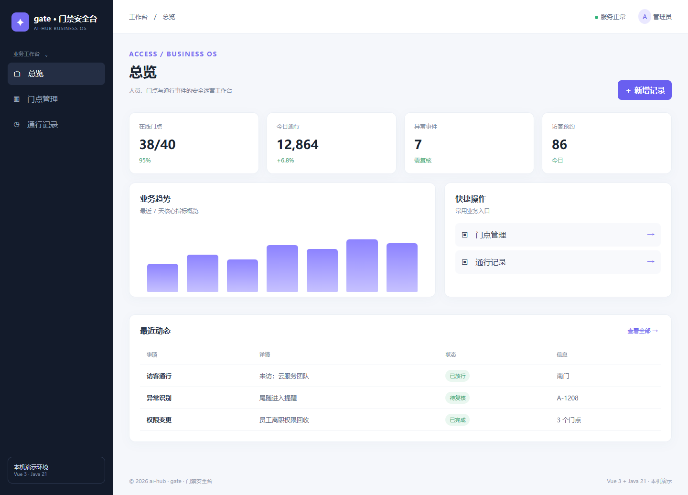
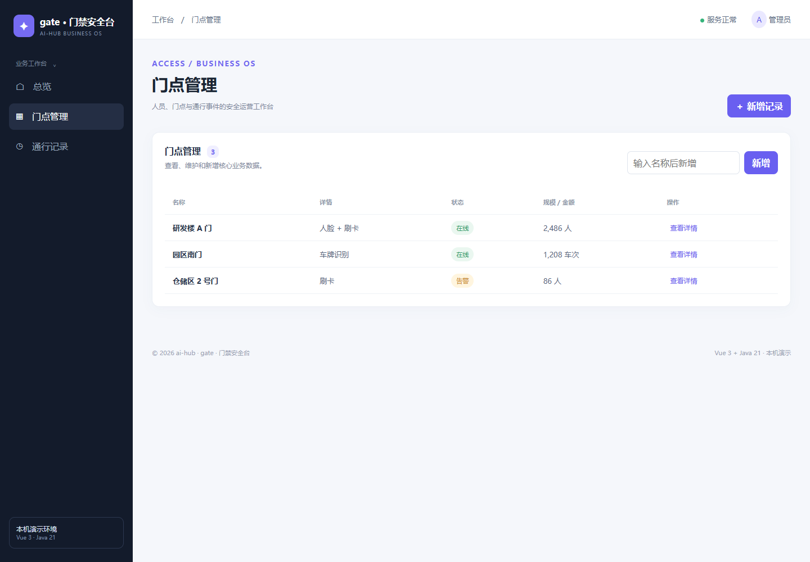
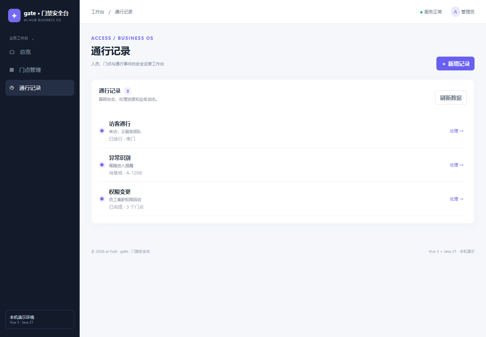

# access · gate · 门禁安全台

> 人员、门点与通行事件的安全运营工作台。这是 ai-hub 的业务系统样板，统一采用 Vue 3 + Java 21/Spring Boot，自主实现，不复制第三方源码。

## 页面

- 总览：核心指标、趋势图、快捷操作和动态
- 门点管理：查看、新增和状态展示
- 通行记录：状态跟踪、处理和刷新

## 页面截图







## 运行

```powershell
npm --prefix frontend ci
npm --prefix frontend run build -- --outDir ../backend/src/main/resources/static --emptyOutDir
mvn -f backend/pom.xml package
java -jar backend/target/access-api-0.1.0.jar
```

访问 http://127.0.0.1:8090。API：`GET /api/metrics`、`GET /api/doors`、`POST /api/doors`、`GET /api/events`。

当前为本机演示版本，数据保存在进程内存；正式使用前应接入数据库、登录鉴权、审计和业务合规流程。金融、健康、医院、学校和门禁场景涉及敏感数据，未经安全评审不得直接用于真实生产。
