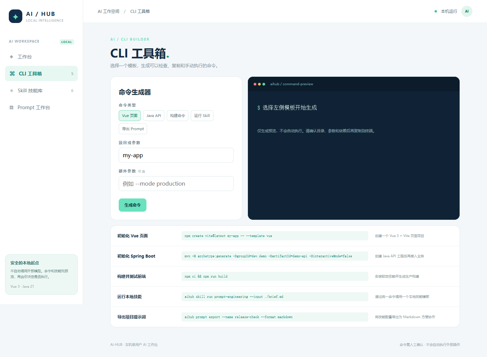
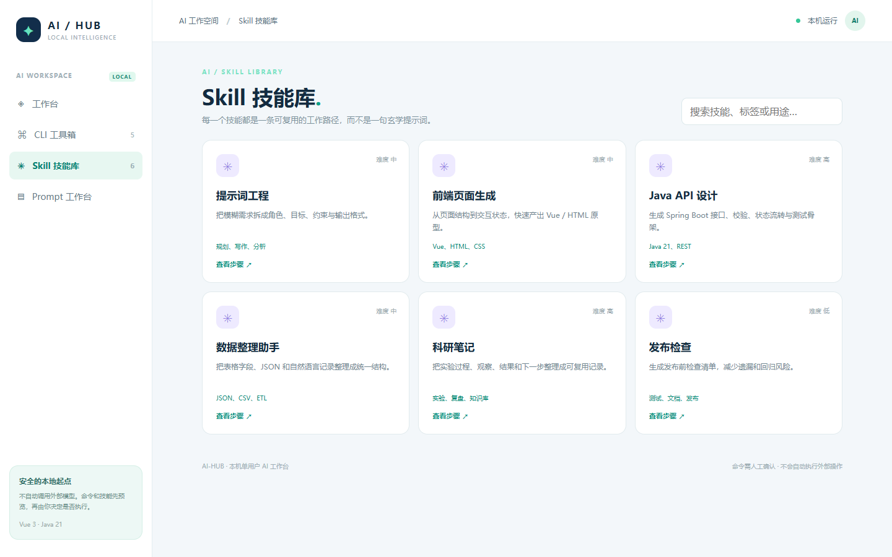
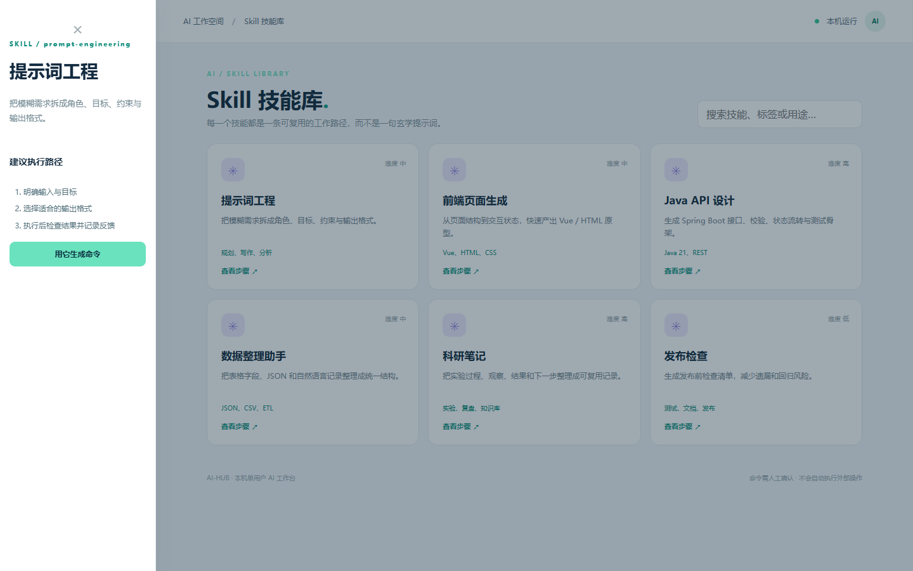
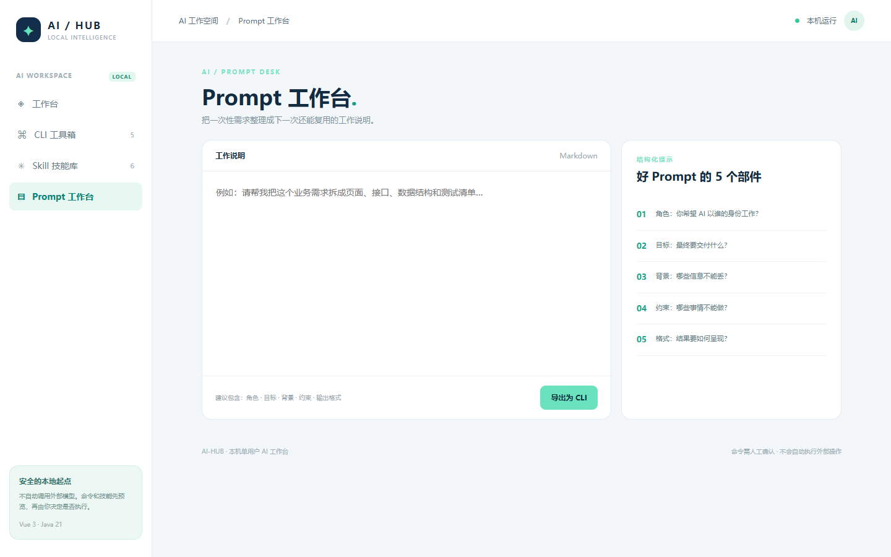

# ai · 本机 AI 工作台

> 把 CLI、Skill、Prompt 变成可以检查、复制、复用的下一步。

**端口：`8098`** · **Vue 3 + Vite** · **Java 21 + Spring Boot** · **本机优先**

## 产品定位

`ai` 不是默认连接云端模型的聊天壳，而是一套可以立即使用的本机 AI 工作流入口：把常见研发、写作、数据整理、科研和发布动作整理成 CLI 模板、Skill 步骤和 Prompt 草稿。你可以把它作为个人工作台，也可以继续接入自己的模型网关。

- **CLI 工具箱**：选择 Vue、Java、构建、Skill 或 Prompt 类型，生成可复制命令。
- **Skill 技能库**：六个可读、可审查的结构化技能模板，包含目标、标签、步骤和适用等级。
- **Prompt 工作台**：把自然语言需求整理成角色、目标、约束、上下文和验收标准。
- **安全边界**：后端只预览命令，不自动执行命令；不默认上传内容、不内置 API Key、不虚构已接入模型。

## 运行

### Windows

```powershell
./run.ps1
```

### macOS / Linux

```bash
chmod +x run.sh
./run.sh
```

打开 `http://127.0.0.1:8098`。

## API

| 方法 | 路径 | 作用 |
|---|---|---|
| GET | `/api/overview` | 获取工作台统计和运行边界 |
| GET | `/api/skills` | 获取 Skill 列表 |
| GET | `/api/commands` | 获取 CLI 模板 |
| POST | `/api/commands/preview` | 根据参数生成安全预览命令 |

> `/api/commands/preview` 对参数做白名单校验，只返回字符串，不启动 shell，不读写用户目录。

## 页面截图

### 工作台总览


### CLI 工具箱



### Skill 技能库



### Skill 详情



### Prompt 工作台



## 测试

```powershell
mvn -f backend/pom.xml test
npm --prefix frontend ci
npm --prefix frontend run build -- --outDir ../backend/src/main/resources/static --emptyOutDir
mvn -f backend/pom.xml package
```

测试覆盖 Spring Boot 上下文、Skills/Commands 接口和命令预览的关键行为；构建产物会被打入可执行 jar。

## 二次开发建议

- 接入模型时，将模型调用放到独立 Provider 层，并增加超时、脱敏、配额、审计和失败重试。
- CLI 执行必须放在明确的沙箱中，禁止把用户输入直接拼进宿主机 shell。
- 真实团队部署需要登录、权限、密钥托管、审计和数据隔离；当前版本定位是可运行的本机单用户样板。
