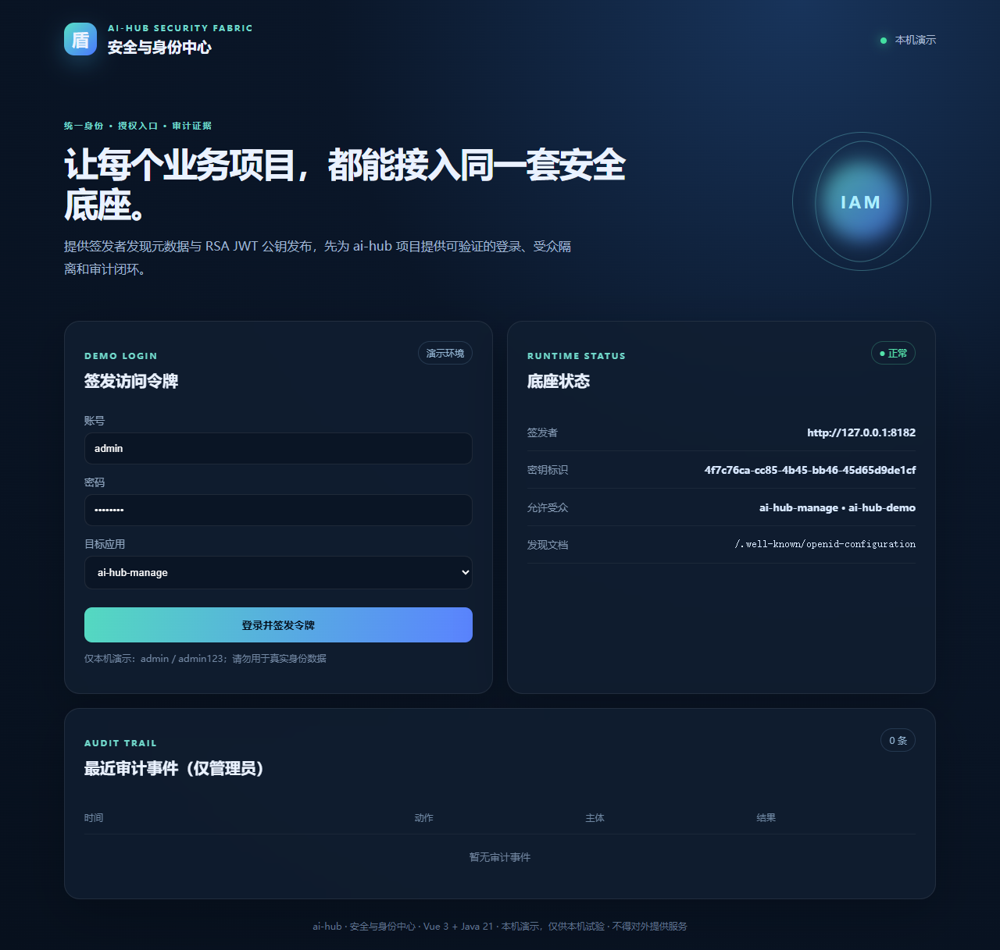
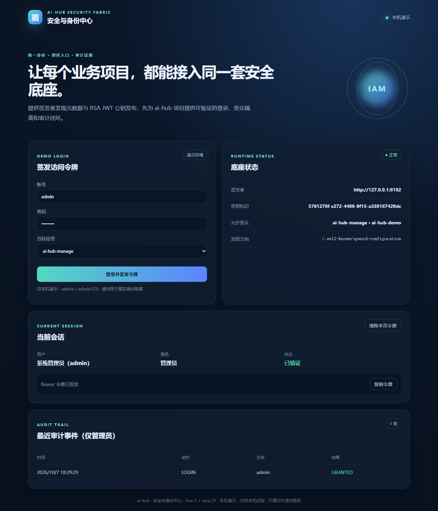

# authcenter · Security and identity center

> A runnable security-foundation pilot for ai-hub: configurable issuer, RSA JWT signing, public-key discovery, audience isolation, login and audit APIs. It is an integration starting point, not a commercial identity cloud or a security certification.

## Included

- Login and RSA `RS256` Bearer token issuance.
- Signed-token verification for the current-user endpoint.
- Issuer discovery metadata and JWKS endpoints for Spring Resource Server `issuer-uri` integration.
- Allow-listed audiences (`ai-hub-manage`, `ai-hub-demo` by default).
- In-memory, admin-only audit events and a Vue 3 operations console. Discovery metadata is for resource-server public-key lookup only; this is **not** a complete OIDC provider.

## Run

From the repository root, use `./authcenter/run.ps1` on Windows or `./authcenter/run.sh` on macOS/Linux. The script installs, builds, tests and starts the service. Alternatively:

```powershell
cd authcenter
npm --prefix frontend ci
npm --prefix frontend run build -- --outDir ../backend/src/main/resources/static --emptyOutDir
mvn -f backend/pom.xml spring-boot:run
```

Open `http://127.0.0.1:8182`. Demo accounts: `admin / admin123` and `operator / operator123`. The RSA key is generated in memory at startup, so restart invalidates old tokens.

For `manage`, configure `aihub.auth.issuer-uri=http://127.0.0.1:8182` and `aihub.auth.audience=ai-hub-manage`, then send the issued token as a Bearer token. The manage browser page intentionally explains that a full authorization-code + PKCE flow is not included yet.

## Actual page screenshot





## Boundaries

Users, audits and keys are in memory. `/api/auth/logout` records a client-clear event, but does not revoke the signed JWT. MFA, password recovery, authorization-code + PKCE, key rotation, revocation, device trust, HTTPS, rate limiting and production retention remain required before production use.
