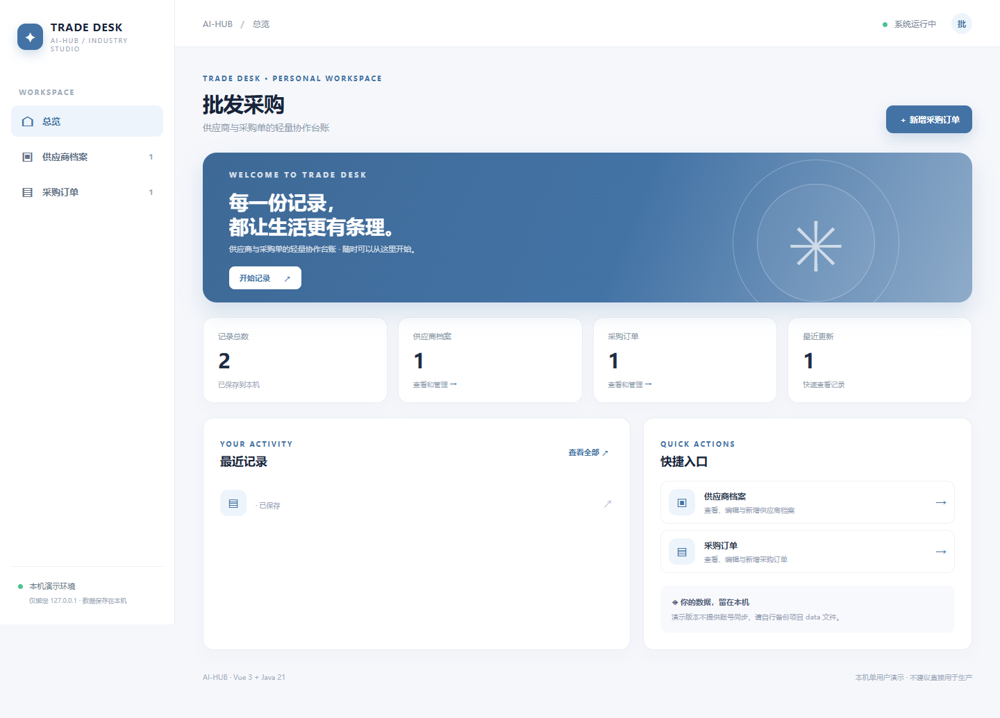
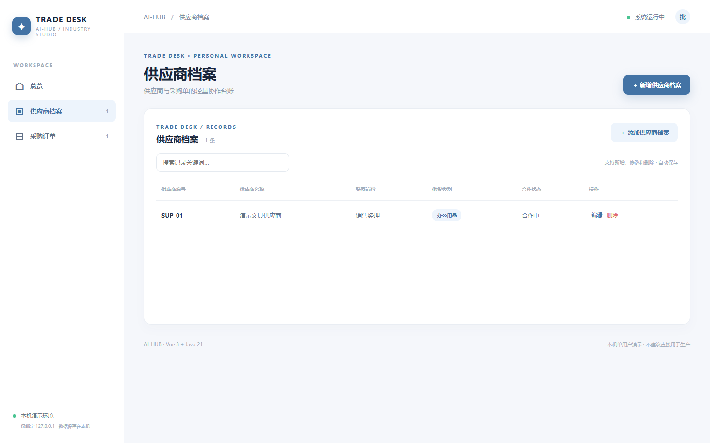
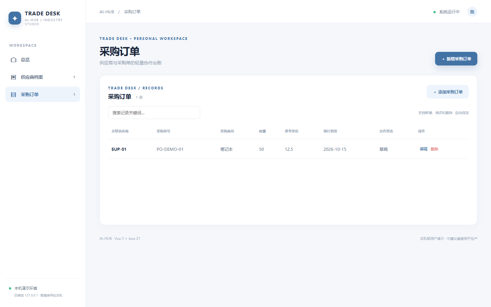
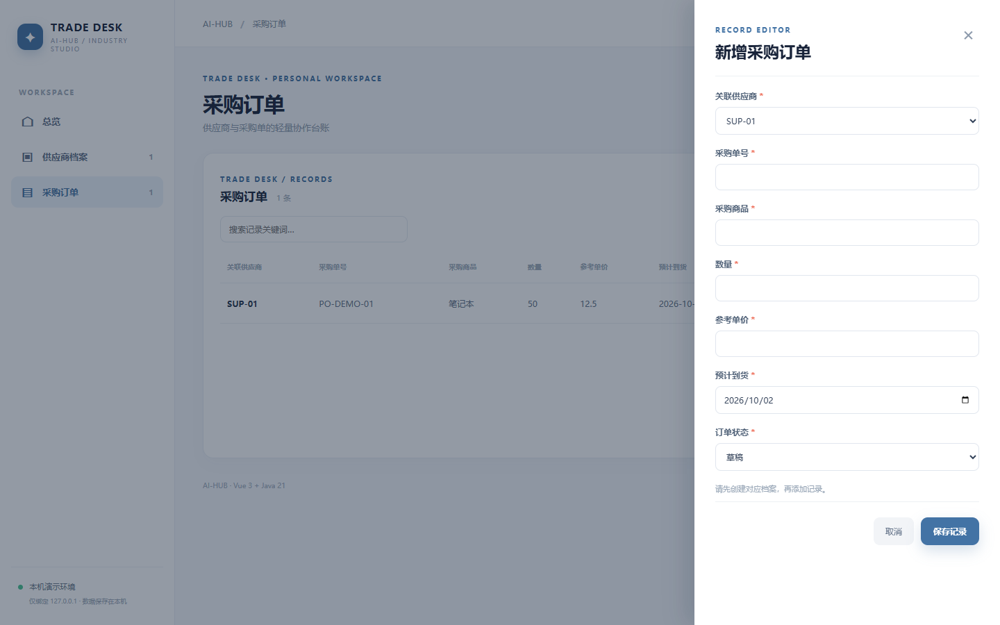

# 批发采购 · b2b

供应商与采购单的轻量协作台账。Vue 3 + Java 21 / Spring Boot 独立本机单用户演示，提供 供应商档案 和 采购订单 两个关联的业务页面，支持检索、新增、修改、删除和本地 JSON 持久化。首次载入虚构数据，后续存储在 `data/b2b.json`。

## 直接体验

准备 Java 21、Maven、Node.js 20.19+/22.12+、npm。在仓库根目录运行 `./b2b/run.ps1`（Windows）或 `./b2b/run.sh`（macOS/Linux），打开 http://127.0.0.1:8116。首次构建会联网下载依赖，Ctrl+C 停止。

## API 与测试

`GET /api/{resource}`、`POST /api/{resource}`、`PUT /api/{resource}/{id}`、`DELETE /api/{resource}/{id}`。字段、必填、类别、数字、日期、关联关系均在服务端校验。无效输入 400、不存在 404、删除被引用档案 409。执行 `mvn -f b2b/backend/pom.xml test`，或根目录运行 `./test-all.ps1`。

## 真实页面截图

## 使用边界

本机单用户档案/记录样板，字段状态由用户手动维护，不提供生产级事务或流程引擎。不含正式鉴权、权限隔离、数据库、并发写入、外部设备、真实资金或生产流程控制；状态由用户手动维护。请勿录入敏感或真实业务数据，也不要直接部署到公网。
