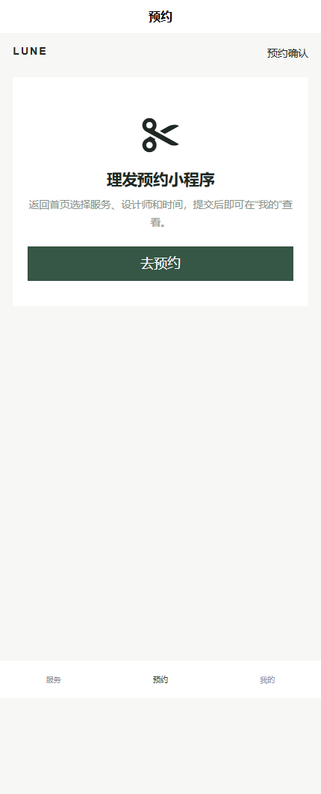
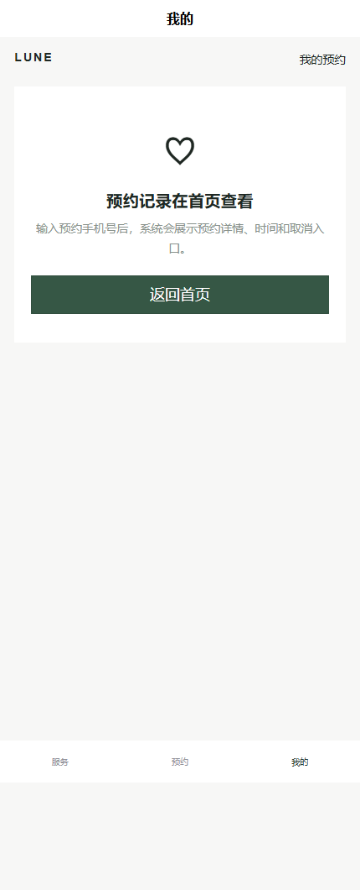

# barber · 理发预约小程序

> 面向微信小程序的理发预约演示，采用 Vue 3 + uni-app + Java 21/Spring Boot。页面设计为轻量门店预约流：服务、设计师、日期、时段、顾客信息和预约记录。

## 页面

- **服务**：选择剪发、造型、染烫服务与设计师，查询未来可预约时段并提交预约。
- **预约**：说明当前预约能力，便于小程序底部导航进入记录。
- **我的**：当前版本的使用说明与演示边界。

## 页面截图






## API

- `GET /api/services` 服务项目
- `GET /api/barbers` 设计师
- `GET /api/slots?barberId=1&date=2026-10-02` 可预约时段
- `GET /api/bookings?phone=13800138000` 查询预约
- `POST /api/bookings` 创建预约
- `POST /api/bookings/{id}/cancel?phone=13800138000` 取消预约

## 本地运行

```powershell
./run.ps1
```

也可以分步执行：

```powershell
npm --prefix miniprogram ci
npm --prefix miniprogram run build:mp-weixin
mvn -f backend/pom.xml test
mvn -f backend/pom.xml package
java -jar backend/target/barber-api-0.1.0.jar
```

将 `miniprogram/dist/build/mp-weixin` 导入微信开发者工具；真机调试时把 `miniprogram/src/services/api.js` 的 API 地址替换为备案 HTTPS 域名。`manifest.json` 中的 `mp-weixin.appid` 也需要替换为真实 AppID。

## 边界

这是可运行的预约演示，不包含真实门店排班、会员、收银、支付、退款、短信通知或多门店运营。订单数据默认写入 `data/barber.json`，适合单机演示，不适合多实例生产部署。
