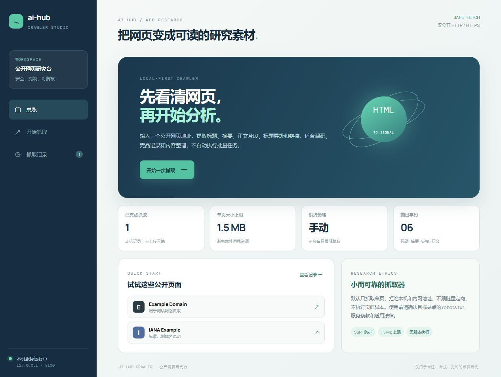
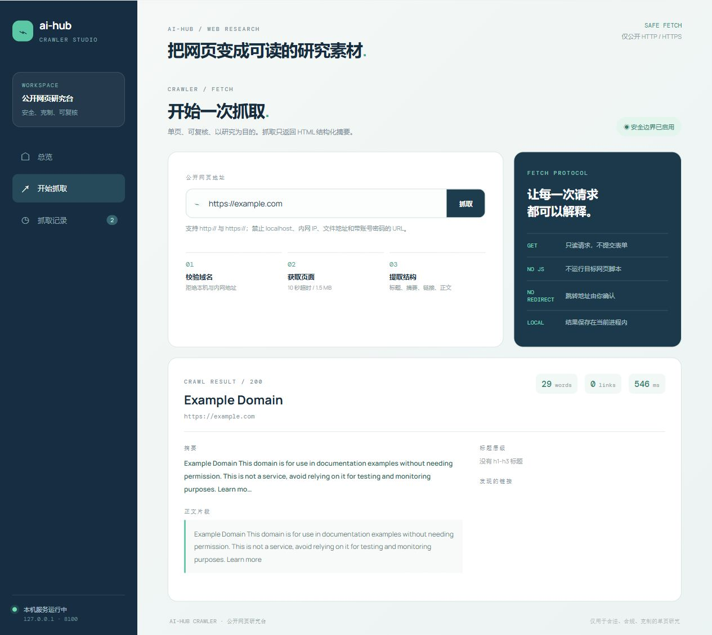
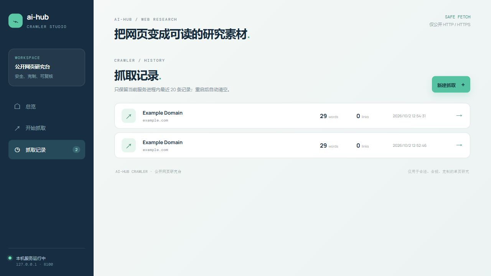

# crawler · 公开网页研究台

> 把一个公开网页变成可读、可复核、可继续分析的结构化素材。

**端口：`8100`** · **Vue 3 + Vite** · **Java 21 + Spring Boot** · **本机优先**

## 产品定位

`crawler` 是 ai-hub 的单页网页研究工具：输入一个公开 `http://` 或 `https://` 地址，抓取器会返回页面标题、摘要、正文片段、标题层级和链接清单。它适合竞品观察、资料整理、页面结构检查和科研调研的第一步。

它不是无限制的批量采集平台，也不会运行目标页面的 JavaScript。默认只抓一页、不跟随重定向、不提交表单，结果只保留在当前服务进程的最近 20 条记录中。

## 能做什么

- **单页抓取**：10 秒超时，响应体上限 1.5 MB。
- **结构化提取**：标题、meta description、正文片段、h1-h3 标题、前 20 个链接。
- **抓取记录**：查看当前进程最近 20 次结果，可回看完整结构化结果。
- **安全校验**：只允许公开 HTTP / HTTPS；拒绝 localhost、回环地址、内网地址、多播地址、文件协议和带账号密码的 URL。
- **克制策略**：不运行脚本、不自动登录、不跟随重定向、不绕过验证码或访问控制。

## 运行

### Windows

```powershell
./run.ps1
```

### macOS / Linux

```bash
chmod +x run.sh
./run.sh
```

打开 `http://127.0.0.1:8100`。

## API

| 方法 | 路径 | 作用 |
|---|---|---|
| GET | `/api/overview` | 获取抓取限制与记录统计 |
| GET | `/api/jobs` | 获取当前进程内的抓取记录 |
| POST | `/api/crawl` | 抓取并解析一个公开 HTML 页面 |

请求示例：

```json
{"url":"https://example.com"}
```

返回结果包含 `title`、`description`、`excerpt`、`headings`、`links`、`words`、`durationMs` 等字段。

## 合规与生产边界

使用前请确认目标站点的 `robots.txt`、服务条款、版权约束和适用法律；请控制请求频率并尊重站点负载。本项目没有实现 robots 规则自动解析、代理池、验证码绕过、登录态采集或大规模任务队列，因此不要把它直接用于生产爬取、个人信息采集或绕过访问控制。

默认绑定 `127.0.0.1`，结果保存在内存中；正式部署前需要补充登录鉴权、审计、限流、robots 解析、持久化、任务隔离、敏感数据脱敏与合规评估。

## 页面截图

### 网页研究台总览



### 抓取页面与结构化结果



### 抓取历史



## 测试

```powershell
mvn -f backend/pom.xml test
npm --prefix frontend ci
npm --prefix frontend run build -- --outDir ../backend/src/main/resources/static --emptyOutDir
mvn -f backend/pom.xml package
```

测试覆盖 Spring Boot 上下文、总览接口和 SSRF 防护；根目录构建脚本还会检查前端静态资源是否进入可执行 jar。
