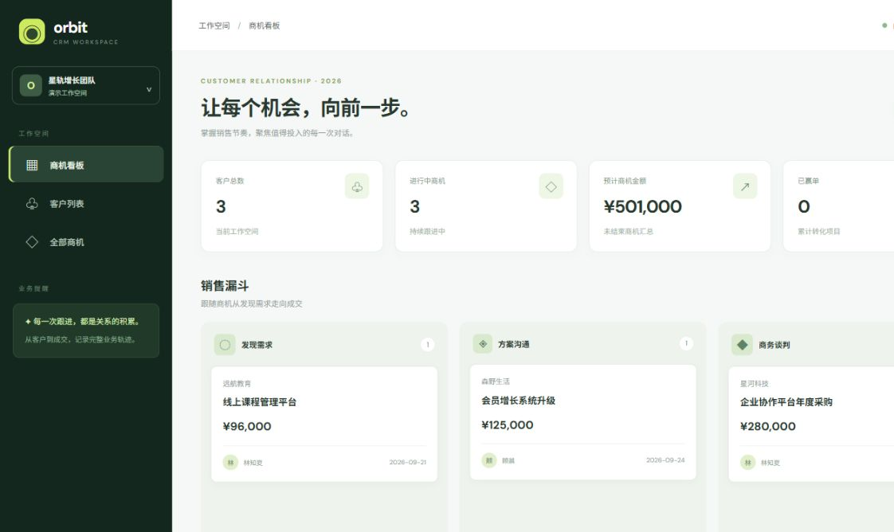

# CRM · orbit 客户关系样板



独立的 Vue 3 + Java 21/Spring Boot 客户关系演示。**客户建档 → 创建商机 → 记录跟进 → 逐阶段推进 → 赢单/流失**，页面含销售漏斗、客户列表、商机详情和统计。商机只能从“发现需求 → 方案沟通 → 商务谈判 → 已赢单”逐步推进，也可在活动阶段标记流失；结束后不可再跟进。

## 运行

需要 Java 21、Maven、Node.js 20.19+/22.12+ 和 npm。分别打开两个终端：

```bash
cd crm/backend && mvn spring-boot:run     # http://localhost:8083
cd crm/frontend && npm ci && npm run dev  # http://127.0.0.1:5175
```

前端代理 `/api` 到 8083。运行 `cd crm/backend && mvn test` 和 `cd crm/frontend && npm run build` 验证。

## API

- `GET/POST /api/customers`：客户列表/新增。
- `GET/POST /api/opportunities`：商机列表/新增；客户 ID 必须存在，金额须大于零。
- `PATCH /api/opportunities/{id}/stage`：合法阶段推进，非法转换返回 409。
- `GET/POST /api/opportunities/{id}/activities`：查看/新增跟进；结束后新增返回 409。
- `GET /api/stats`：客户、进行中商机、赢单和预计金额。

**边界：**数据保存在服务进程内存，重启重置；示例负责人只是文本字段，无身份认证、权限、持久化、审计与并发业务保证。不要直接用于生产或公网服务。页面截图来自实际本地运行，而非设计稿。
