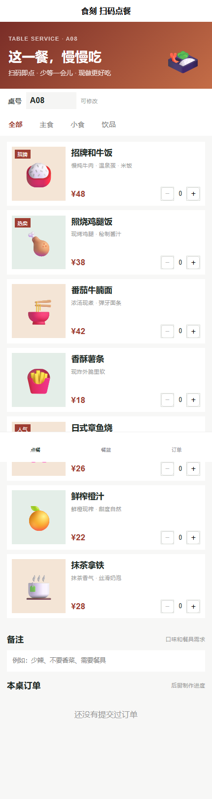
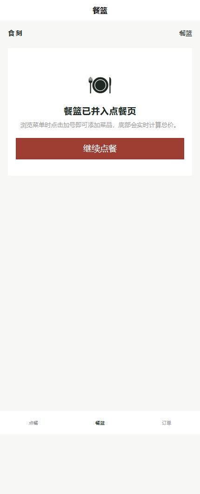
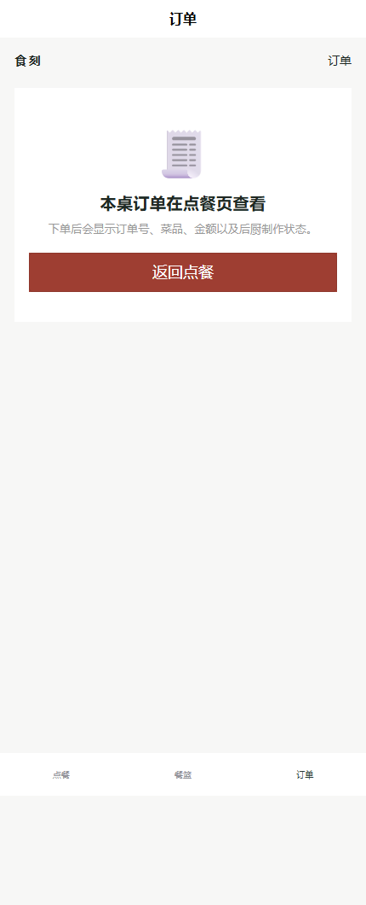

# dining · 扫码点餐小程序

> 面向微信小程序的桌号点餐演示，采用 Vue 3 + uni-app + Java 21/Spring Boot。顾客进入桌号后选择菜品、提交备注并查看订单状态。

## 页面

- **点餐**：桌号、分类筛选、菜品卡片、数量调整、餐篮金额和备注。
- **餐篮**：查看当前已选菜品和提交提示。
- **订单**：查看该桌号的历史订单与后厨状态。

## 页面截图







## API

- `GET /api/dishes` 菜品列表
- `GET /api/orders?tableNo=A08` 查询桌号订单
- `POST /api/orders` 创建订单，服务端重新合并数量并计算金额

## 本地运行

```powershell
./run.ps1
```

分步运行：

```powershell
npm --prefix miniprogram ci
npm --prefix miniprogram run build:mp-weixin
mvn -f backend/pom.xml test
mvn -f backend/pom.xml package
java -jar backend/target/dining-api-0.1.0.jar
```

将 `miniprogram/dist/build/mp-weixin` 导入微信开发者工具。真机或发布环境必须将 `miniprogram/src/services/api.js` 的 API 地址换成备案 HTTPS 域名，并配置微信合法请求域名。

## 边界

这是桌号点餐演示，不包含真实后厨打印、桌台系统、支付、退款、菜品库存、优惠券、会员或外卖履约。订单数据默认写入 `data/dining.json`，仅适合单机演示。
