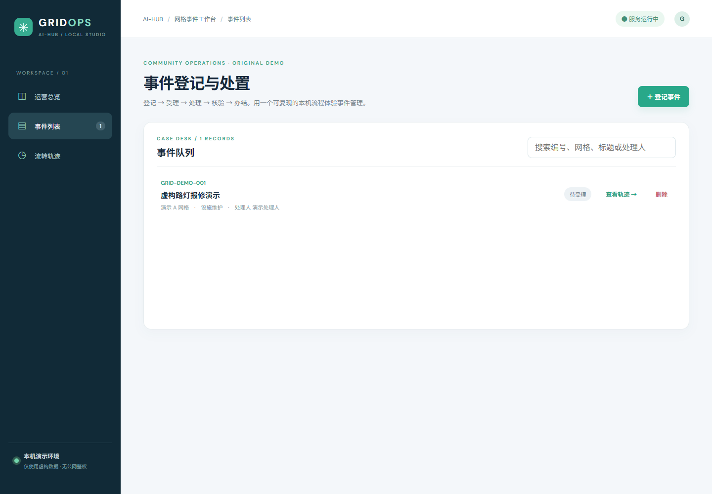
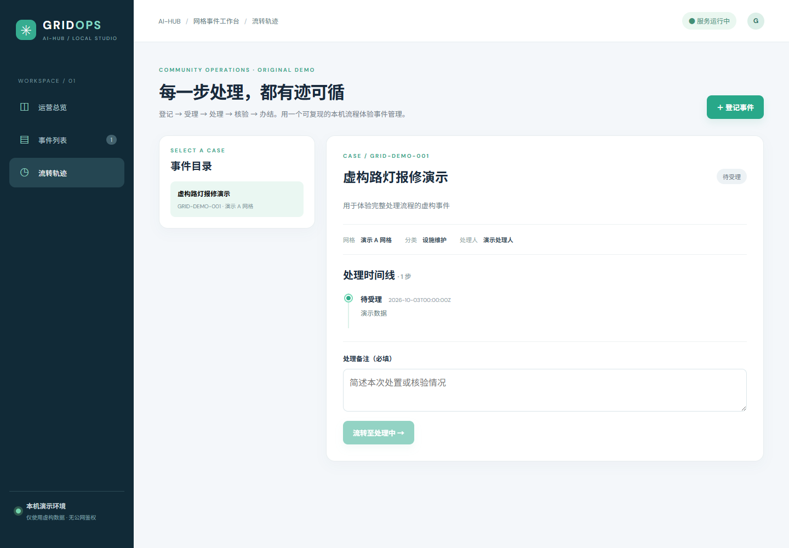
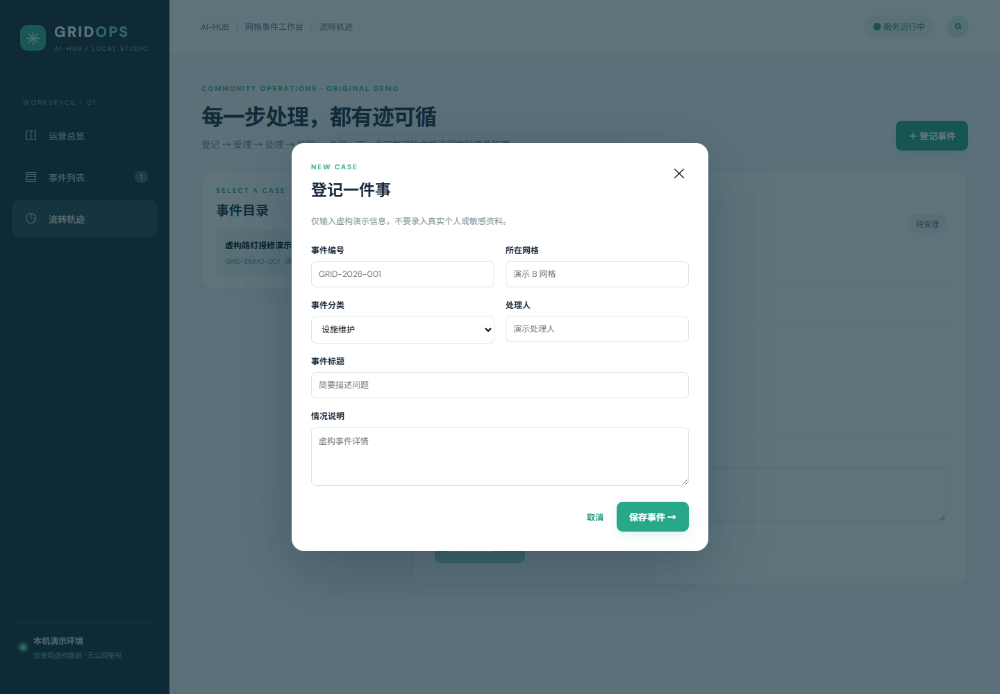

# gridops · 网格事件工作台

> ai-hub 原创本机演示。参考公开的社会治理／网格化管理**业务方向**，并非安徽兴博远实的软件副本，不使用其源码、页面、图像、商标、客户数据或私有接口。调研及差距见 [公开方向与实施状态](../docs/company-research.md)。

<table><tr>
<td><br/>总览</td>
<td><br/>事件列表</td>
</tr><tr>
<td><br/>流转轨迹</td>
<td><br/>登记表单</td>
</tr></table>

| 页面 | 实际运行截图 | 能做什么 |
| --- | --- | --- |
| 总览 | [overview.png](./screenshots/overview.png) | 四状态数量、最近事件 |
| 事件列表 | [cases.png](./screenshots/cases.png) | 搜索、查看轨迹、删除尚未受理事件 |
| 流转轨迹 | [timeline.png](./screenshots/timeline.png) | 选择事件、查看历史和带备注的流转 |
| 登记表单 | [editor.png](./screenshots/editor.png) | 浏览器必填检查、创建新事件 |

## 本机启动

需要 Java 21、Maven、Node.js 20.19+/22.12+、npm；首次安装依赖需联网。从仓库根目录运行：

```powershell
./gridops/run.ps1
```

macOS/Linux：`./gridops/run.sh`。打开 http://127.0.0.1:8168 ，按 Ctrl+C 停止。默认仅监听 `127.0.0.1`；首次启动显示一条虚构演示事件。数据保存在 **运行时工作目录**的 `data/gridops.json`（脚本在 gridops 目录下运行，即 `gridops/data/gridops.json`）。请备份该文件后再升级或删除；不要把真实居民或敏感资料输入本演示。此目录已被 Git 忽略。

## 功能与接口

- 创建必填编号、网格、分类、标题、描述、处理人；编号大小写不敏感去重，长度限制在服务端检查。
- 状态：`待受理 → 处理中 → 待核验 → 已办结`，核验不通过可退回 `处理中`；每一步保留时间和必填备注。已流转事件不可删除。
- `GET /api/cases`、`GET /api/cases/{id}`、`POST /api/cases`、`PUT /api/cases/{id}/transition`、`DELETE /api/cases/{id}`；JSON 请求体。错误返回 400/404/409。
- JSON 文件单进程写入（临时文件后替换），服务重启后保留记录。不支持并发多实例写同一文件。

## 验证与边界

`npm --prefix gridops/frontend ci`、`npm --prefix gridops/frontend run build -- --outDir ../backend/src/main/resources/static --emptyOutDir`、`mvn -f gridops/backend/pom.xml package` 分别构建页面、打包并运行后端测试。浏览器已验证四个页面、搜索、创建、三步流转、刷新持久化和无运行时错误；以上截图为真实运行页面，不是设计图。

**不是生产级社会治理平台**：无登录／RBAC、跨部门派单、GIS、消息、移动端、督查考核、监管对接、审计防篡改和真实用户隐私保障。仅供虚构数据下的本机学习和业务原型讨论；生产使用需要身份权限、数据库、备份、加密、合规评估和完整验收。
