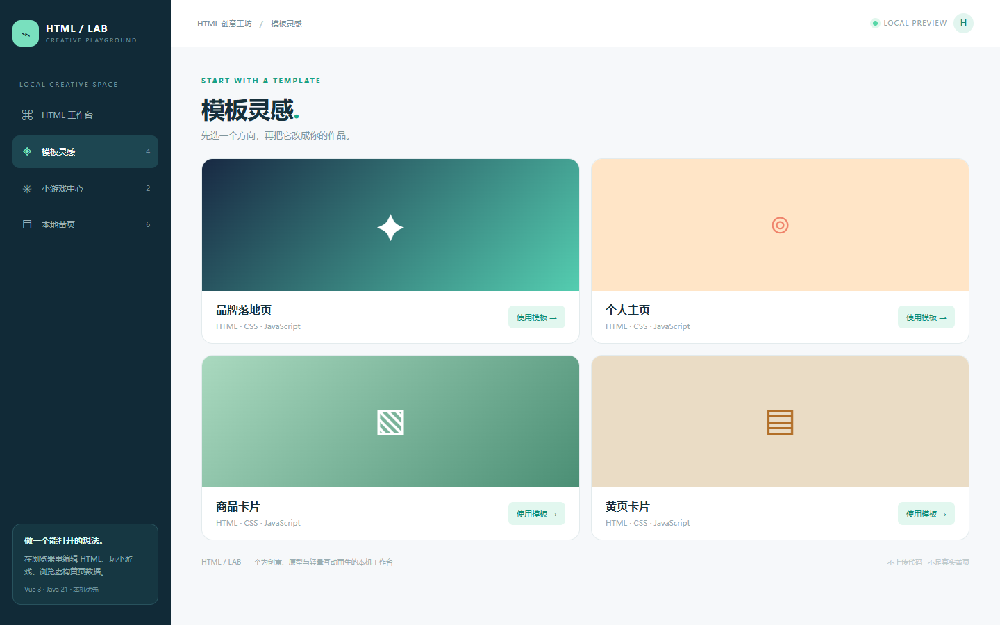
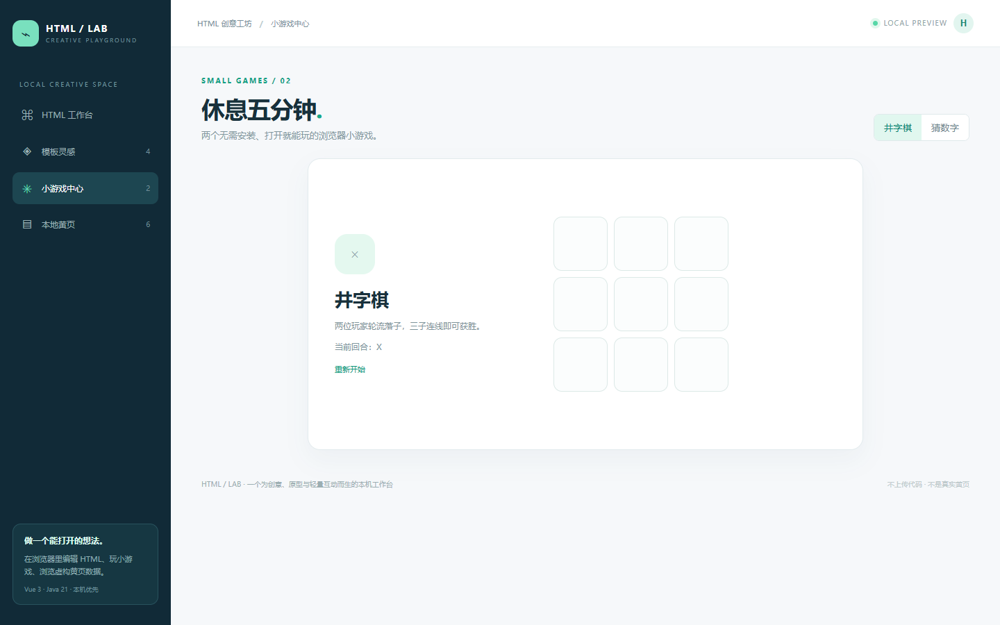
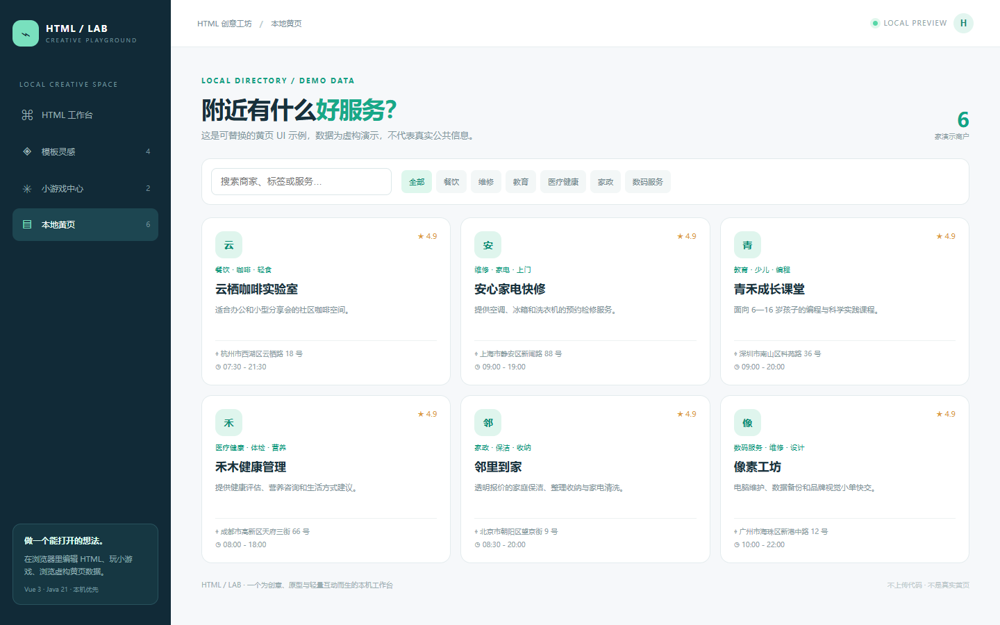
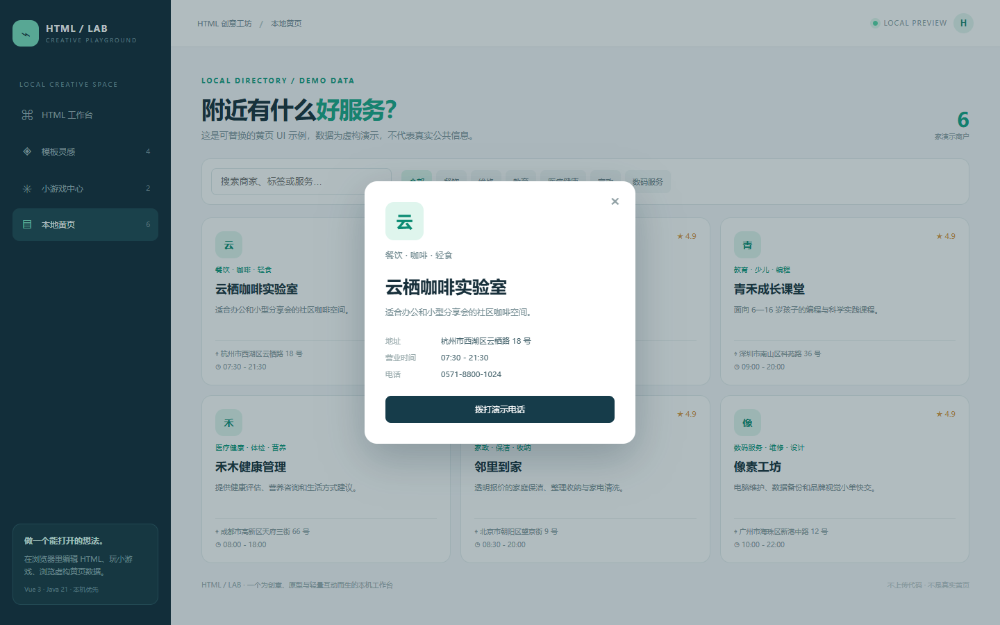

# html · HTML 创意工坊

> 写 HTML、玩小游戏、做一个黄页卡片——打开浏览器就能看到结果。

**端口：`8099`** · **Vue 3 + Vite** · **Java 21 + Spring Boot** · **本机优先**

## 产品定位

`html` 是一个面向设计师、产品经理、前端开发者和内容创作者的轻量 HTML Playground。它把“写一段页面”变成可见、可玩的体验：左侧编辑 HTML/CSS/JS，右侧实时预览；没有想法时从模板开始；需要放松时玩井字棋和猜数字；需要做目录原型时查看虚构黄页数据。

## 功能

- **HTML 工作台**：HTML/CSS/JS 三栏编辑，iframe 安全沙盒实时预览。
- **模板灵感**：品牌落地页、个人主页、商品卡片、黄页卡片四套可编辑模板。
- **小游戏中心**：真实可玩的井字棋、猜数字，不是静态占位页面。
- **本地黄页**：搜索、分类、详情抽屉、演示电话按钮；数据是虚构演示，不是真实公共黄页。
- **安全边界**：用户代码只在当前浏览器 iframe 中预览，后端不执行用户提交的 JavaScript。

## 运行

### Windows

```powershell
./run.ps1
```

### macOS / Linux

```bash
chmod +x run.sh
./run.sh
```

打开 `http://127.0.0.1:8099`。

## API

| 方法 | 路径 | 作用 |
|---|---|---|
| GET | `/api/overview` | 获取模板、小游戏、黄页数量 |
| GET | `/api/categories` | 获取黄页分类 |
| GET | `/api/directory` | 获取虚构黄页演示数据 |

## 页面截图

### HTML 工作台


### 模板灵感



### 小游戏中心



### 黄页目录



### 黄页详情



## 测试

```powershell
mvn -f backend/pom.xml test
npm --prefix frontend ci
npm --prefix frontend run build -- --outDir ../backend/src/main/resources/static --emptyOutDir
mvn -f backend/pom.xml package
```

后端测试验证目录、分类和总览接口；真实页面验证应至少覆盖模板切换、iframe 预览、井字棋落子、猜数字提交、黄页搜索和详情抽屉。

## 使用边界

黄页数据中的商户、电话、地址、营业时间和评分均为**虚构演示数据**，不可用于导航、交易、医疗、招聘或任何真实决策。若扩展为真实平台，应增加数据来源标注、商户认证、隐私保护、内容审核和投诉机制。
