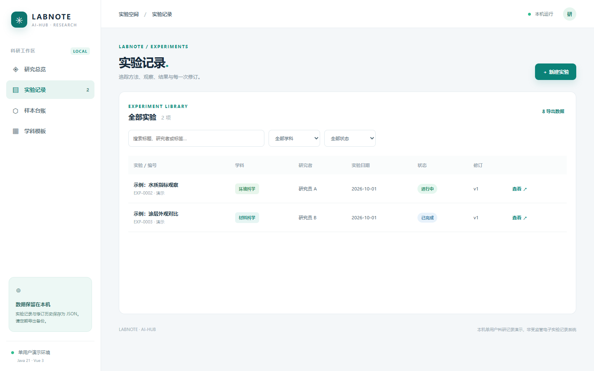
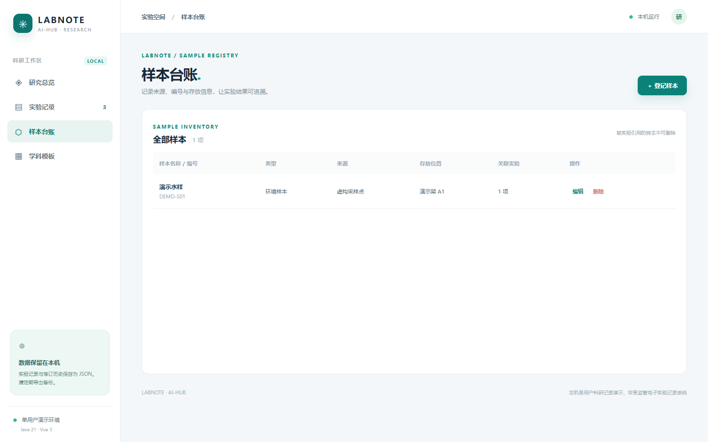
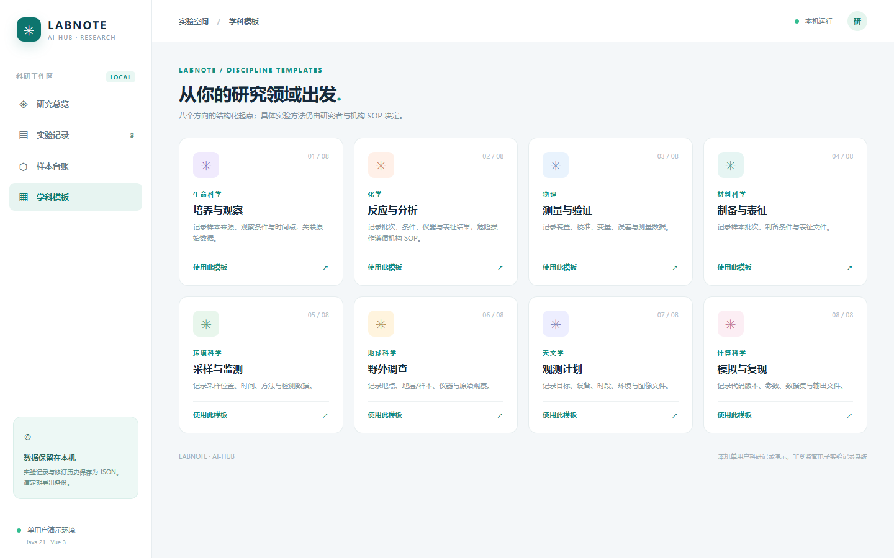
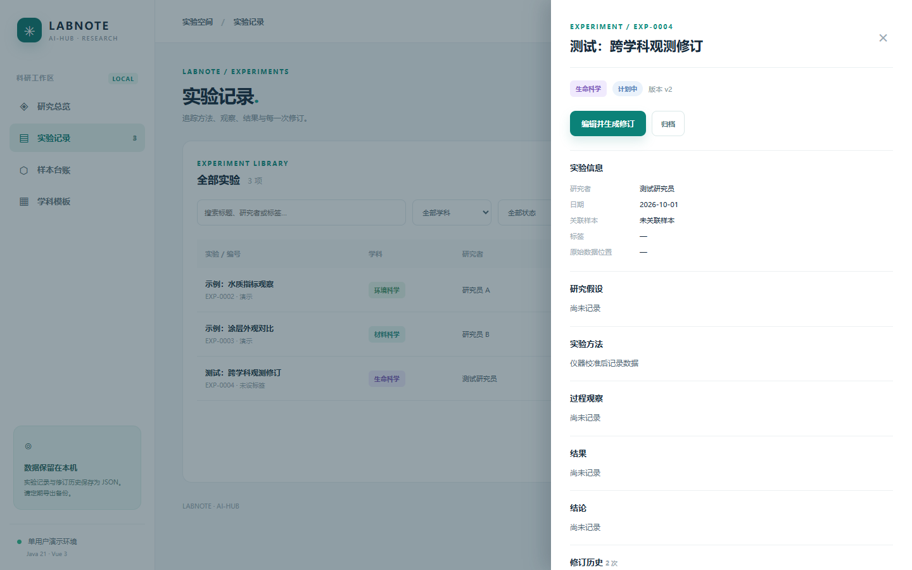
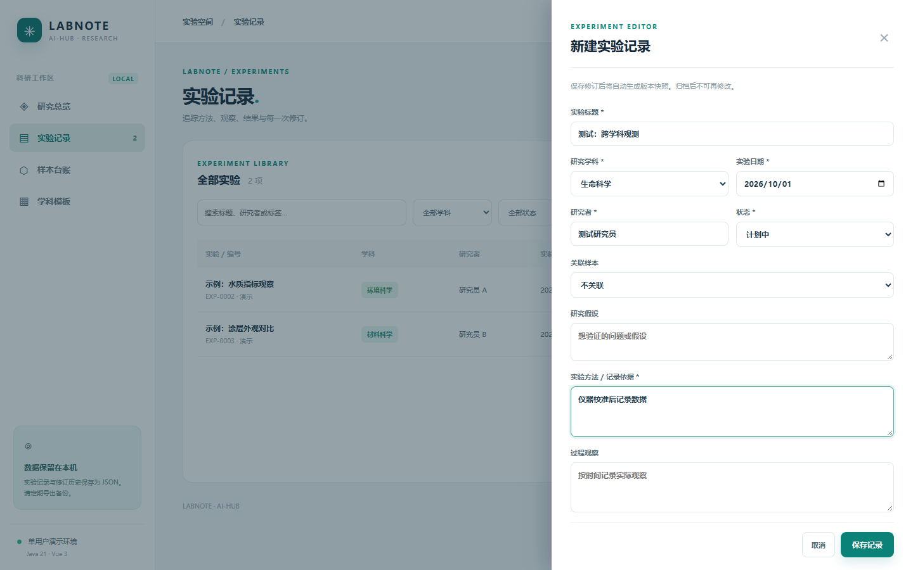

# labbook · 跨学科实验记录

面向生命科学、化学、物理、材料科学、环境科学、地球科学、天文学、计算科学研究者的**本机单用户**实验记录演示。统一 Vue 3 + Java 21/Spring Boot；八种学科模板提供记录提示，实际实验方法仍以研究机构 SOP 为准。演示数据完全虚构。

## 运行

准备 Java 21、Maven、Node.js 20.19+/22.12+ 和 npm；在仓库根目录执行 `./labbook/run.ps1`（Windows）或 `./labbook/run.sh`（macOS/Linux），访问 `http://127.0.0.1:8097`。首次构建需联网获取依赖；构建后浏览器使用无需外部字体或 API。服务仅绑定 `127.0.0.1`，按 Ctrl+C 退出。

实验包含标题、学科、研究者、日期、状态、研究假设、方法、观察、结果、结论、原始数据位置、标签、关联样本；可按标题/研究者/标签/学科/状态检索。完成与归档需要结果和结论；归档后界面/API 不再允许修改。每次创建或修订保存快照，可在详情查看历史。样本记录唯一编号、来源、类型、位置；被实验引用时不能删除。全量 JSON 导出包含实验、样本和修订历史。

数据写入 `labbook/data/labbook.json`（Git 忽略），重启仍保留；请停服后复制文件备份。要恢复虚构种子数据，停服后移走数据文件再启动。损坏数据会阻止启动而非覆盖。仅允许单个进程使用同一数据文件。

## 页面截图（真实运行的 jar）

| 页面 | 截图 |
| --- | --- |
| 研究总览 |  |
| 实验记录 |  |
| 样本台账 |  |
| 学科模板 |  |
| 实验详情与修订历史 |  |
| 新建/编辑抽屉 |  |

## API 与验证

`GET /api/templates`、`GET/POST /api/experiments`、`GET/PUT /api/experiments/{id}`、`GET /api/experiments/{id}/history`、`GET/POST /api/samples`、`PUT/DELETE /api/samples/{id}`、`GET /api/export`。

`mvn -f labbook/backend/pom.xml test` 覆盖新建、修订、归档、样本关联、校验、导出、持久化重读及写失败回滚；`npm --prefix labbook/frontend run build` 检查页面构建。根目录 `test-all.ps1` 与 `smoke-test.ps1` 分别执行全仓测试及真实进程冒烟。浏览器实测新建/编辑实验、登记样本、四页面、八模板和导出。

**边界：**本项目无登录、权限、加密、电子签名、正式不可篡改审计、自动仪器采集、原始文件上传及多用户协作；本地 JSON 可被手工改动，**不能**作为受监管实验记录或临床试验正式系统。危险化学、生物及其它高风险实验必须遵守机构 SOP、伦理与安全审批；这里不提供实验操作指导。记录结构受到 FAIR 对元数据可发现与可复用的启发，但**不宣称符合 FAIR**。联系：3174667330@qq.com。
