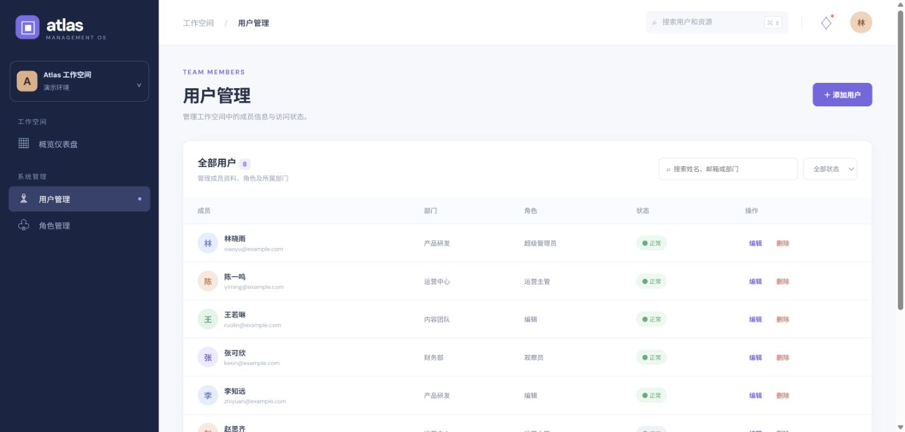
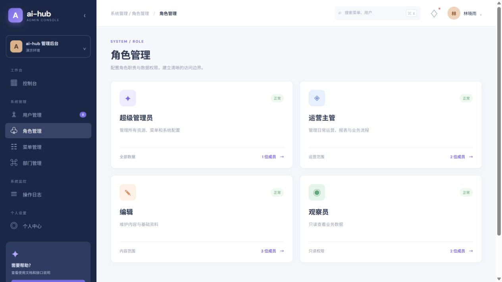
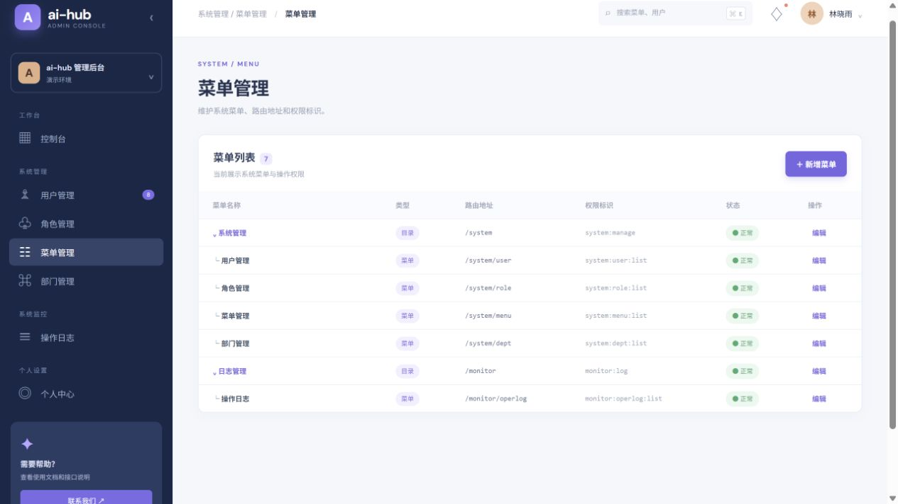
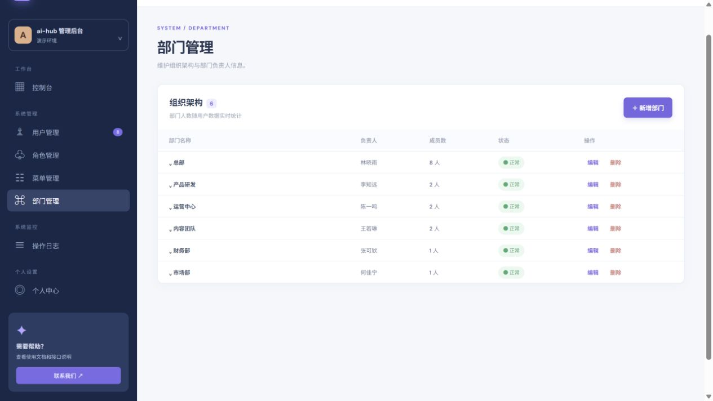
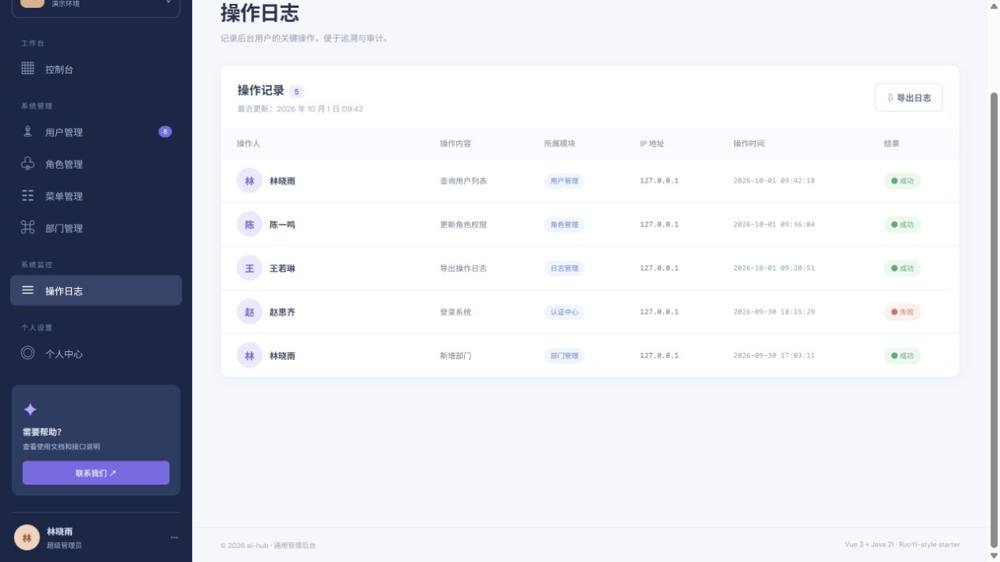
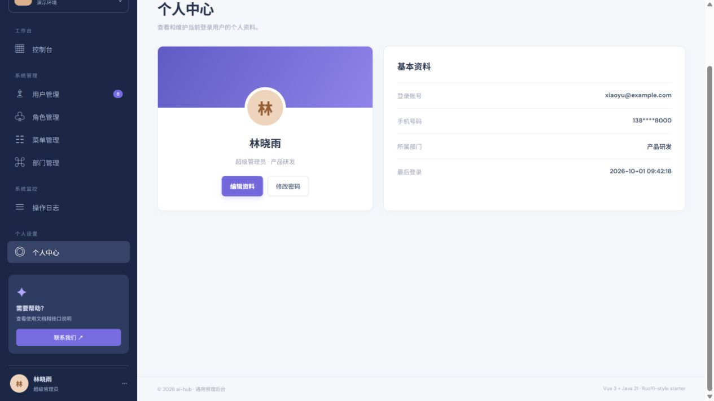

# manage · RuoYi-style 通用管理后台

> `manage` 是 ai-hub 的通用后台管理样板，参考 Gitee 上 RuoYi-Vue、RuoYi-Vue-Plus 等成熟后台的信息架构重新实现。代码为本项目自写，不复制第三方源码、Logo 或品牌资产；技术栈统一为 Vue 3 + Java 21/Spring Boot。

## 页面与业务能力

- **控制台**：用户数、角色数、菜单数、部门数、访问趋势和快捷操作。
- **用户管理**：关键词搜索、状态筛选、新增、编辑、删除、角色和部门展示。
- **角色管理**：角色编码、成员数、权限范围和状态卡片。
- **菜单管理**：目录、菜单、按钮层级，以及权限标识展示。
- **部门管理**：组织架构、负责人、成员数和部门状态。
- **操作日志**：操作人、模块、动作、IP、结果展示，支持 CSV 导出。
- **个人中心**：账号资料、部门、角色、权限范围和安全提示。
- **通用后台交互**：左侧动态导航、折叠侧栏、顶部面包屑、通知入口、用户菜单和移动端基础适配。

## 页面截图

以下截图均来自本项目本地实际启动后的页面，而不是设计稿：














## 参考范围

调研重点是 Gitee 上常见的通用后台能力，而不是照搬某个仓库：

- [RuoYi-Vue](https://gitee.com/y_project/RuoYi-Vue)：用户、角色、菜单、部门、日志、个人中心等后台信息架构。
- [RuoYi-Vue-Plus](https://gitee.com/dromara/RuoYi-Vue-Plus)：更完整的权限、组织架构和后台模块组织方式。

本项目只借鉴成熟的业务分区、导航方式和交互范式。`manage` 当前是**可本机直接使用的演示样板**，不是官方若依，也不声称具备若依完整生产能力。

## API

后端默认提供以下 JSON API：

| 方法 | 路径 | 用途 |
| --- | --- | --- |
| GET | `/api/metrics` | 控制台指标 |
| GET | `/api/users` | 用户列表 |
| POST | `/api/users` | 新增用户 |
| PUT | `/api/users/{id}` | 编辑用户 |
| DELETE | `/api/users/{id}` | 删除用户 |
| GET | `/api/roles` | 角色列表 |
| GET | `/api/menus` | 菜单列表 |
| GET | `/api/departments` | 部门列表 |
| GET | `/api/logs` | 操作日志（用户增删改会追加本地持久化记录） |
| GET | `/api/profile` | 当前演示用户资料 |

## 一键运行

需要 Java 21、Maven、Node.js 20.19+/22.12+ 和 npm；在本目录执行：

```powershell
./run.ps1           # Windows PowerShell
```

```sh
./run.sh            # macOS / Linux
```

脚本会构建 Vue 前端、运行 Java 后端测试、打包单个 jar 并启动服务。浏览器打开 **http://127.0.0.1:8082**，前后端同一端口，无需另开 Vite 开发服务器。按 Ctrl+C 停止。

## 测试与构建

```sh
mvn -f backend/pom.xml test
npm --prefix frontend ci
npm --prefix frontend run build
mvn -f backend/pom.xml package
```

在仓库根目录执行 `./test-all.ps1`（Windows）或 `./test-all.sh`（macOS / Linux）会验证全部 33 个项目，并检查 jar 是否包含最新前端静态资源。

## 本地数据与使用边界

- 用户增删改查数据保存在 `data/manage.json`，采用本地 JSON 原子写入，重启后仍保留。
- 首次启动会加载默认演示数据；删除数据文件后重启可以恢复默认数据。
- 数据文件损坏时服务会拒绝启动，不会静默清空；不要让多个进程同时写入同一文件。
- 用户增删改会写入本地 JSON 操作记录，写盘失败时不会把未落盘的操作或审计记录留在内存中；当前操作者固定为“演示管理员”，并非真实登录审计。
- 当前版本没有登录、会话、服务端 RBAC 鉴权、数据库迁移、多实例并发和正式通知能力。
- 趋势图和部分统计为演示数据；服务默认仅监听 `127.0.0.1`，可用于本机体验、演示和二次开发，不应未经安全改造直接部署到公网或生产环境。

联系邮箱：`3174667330@qq.com`。本仓库的 Git 签名只配置在当前仓库，不修改全局 Git 配置。