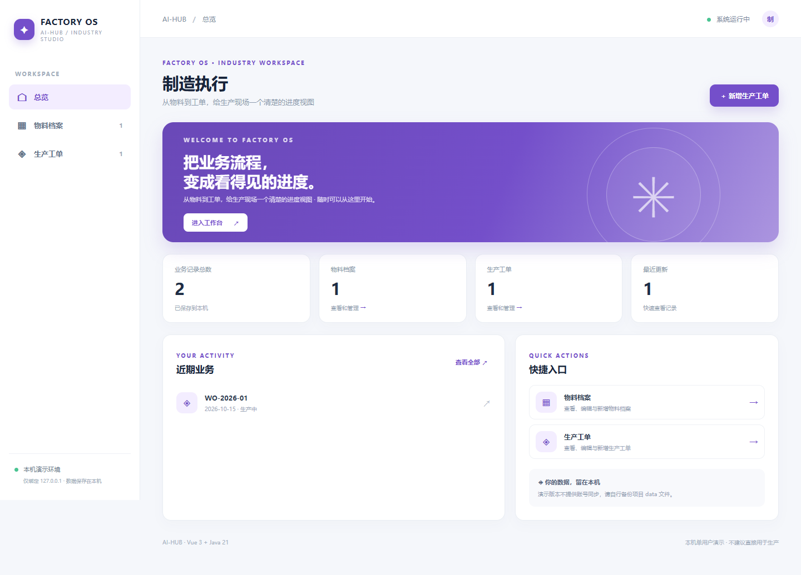
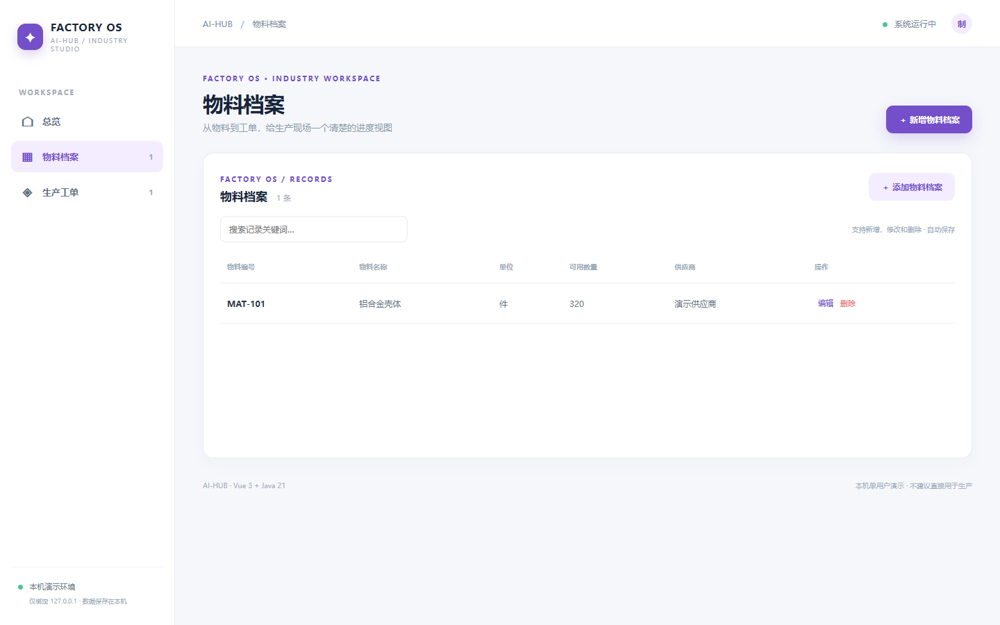
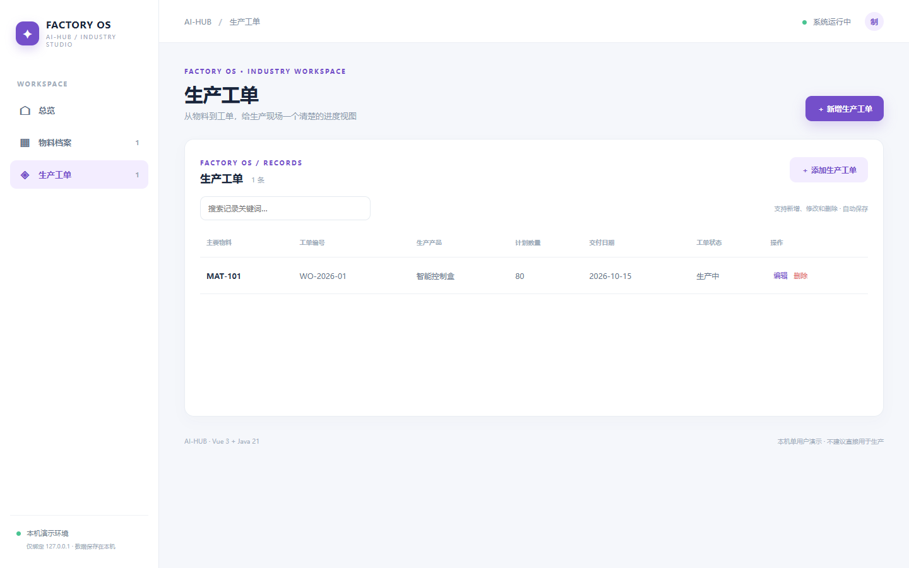
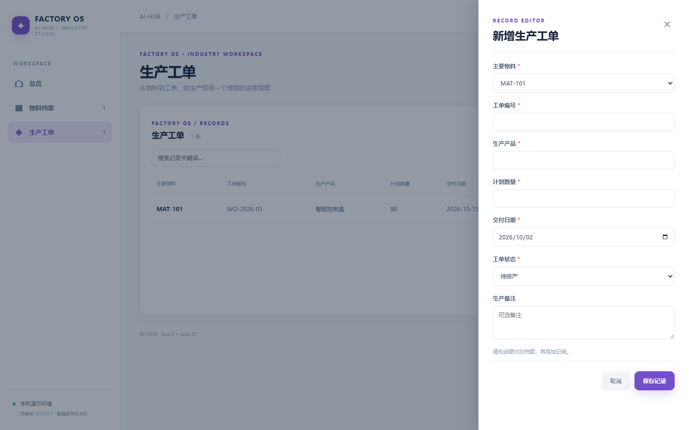
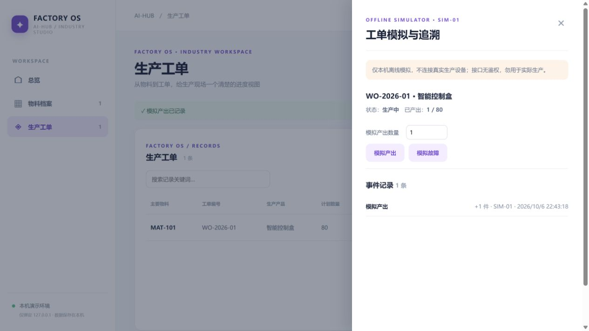

# 制造执行 · manufacturing

从物料到工单，给生产现场一个清楚的进度视图。Vue 3 + Java 21 / Spring Boot 独立本机单用户演示，提供 物料档案 和 生产工单 两个关联的业务页面，支持检索、新增、修改、删除和本地 JSON 持久化。首次载入虚构数据，后续存储在 `data/manufacturing.json`。

## 直接体验

准备 Java 21、Maven、Node.js 20.19+/22.12+、npm。在仓库根目录运行 `./manufacturing/run.ps1`（Windows）或 `./manufacturing/run.sh`（macOS/Linux），打开 http://127.0.0.1:8102。首次构建会联网下载依赖，Ctrl+C 停止。

## 离线设备模拟：第一条可验证工业流程

打开「生产工单」→「模拟设备」。新建工单选择「待排产」，依次点击 **开始生产 → 模拟产出 →（可选）模拟故障/恢复生产 → 提交质检 → 质检完成**。设备编号固定为 `SIM-01`，服务端记录事件编号、产量和服务器时间；已处理的事件编号重复提交只返回原事件，不会重复增加产量。产出不得超过计划量；未完成计划量不能送质检；停机时不能产出。事件随原有 JSON 文件持久化，旧文件首次读取时按空事件列表兼容。

| 接口 | 用途 |
| :--- | :--- |
| `GET /api/workorders/{id}/trace` | 返回工单、累计产出和按写入顺序排列的模拟事件 |
| `POST /api/workorders/{id}/simulate` | 提交 `{"eventId":"唯一编号","kind":"START/OUTPUT/FAULT/RESUME/QC/FINISH","quantity":0}`；只有 `OUTPUT` 填正整数 |

非法请求 400、状态或产量冲突 409、未知工单 404。有事件的工单不能删除、不能通过普通编辑绕过状态与计划数量；备注仍可编辑。没有事件的历史工单原有手工状态编辑能力仍保留。**事件是本机模拟，并非来自实际设备，普通编辑和本机数据文件仍不具备防篡改保障。**

## API 与测试

`GET /api/{resource}`、`POST /api/{resource}`、`PUT /api/{resource}/{id}`、`DELETE /api/{resource}/{id}`。字段、必填、类别、数字、日期、关联关系均在服务端校验。无效输入 400、不存在 404、删除被引用档案 409。执行 `mvn -f manufacturing/backend/pom.xml test`，或根目录运行 `./test-all.ps1`。

## 真实页面截图

## 使用边界

本机单用户样板，不含正式鉴权、权限隔离、数据库、并发写入、外部设备、真实资金或生产流程控制；普通记录仍可手动维护状态；模拟事件有受检状态转换，但不具备真实设备、硬件在环、过程控制和防篡改能力。请勿录入敏感或真实业务数据，也不要直接部署到公网。
