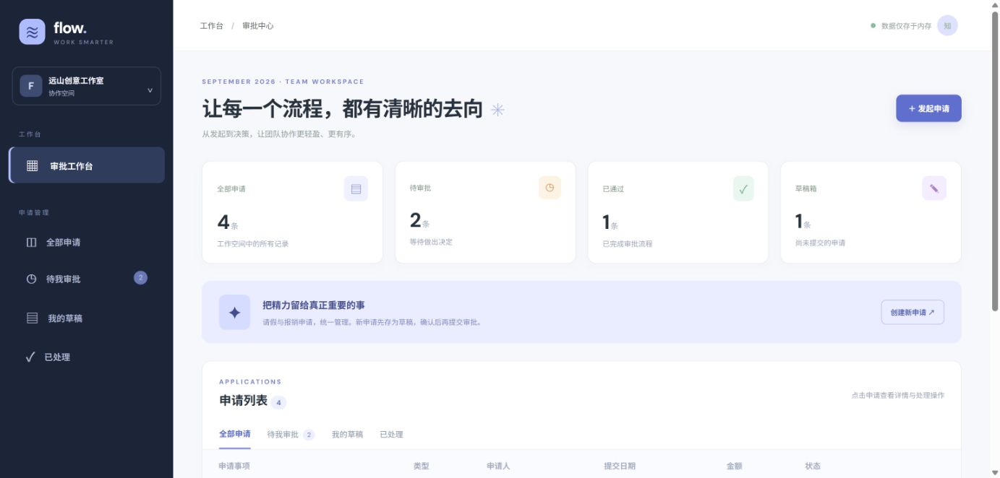
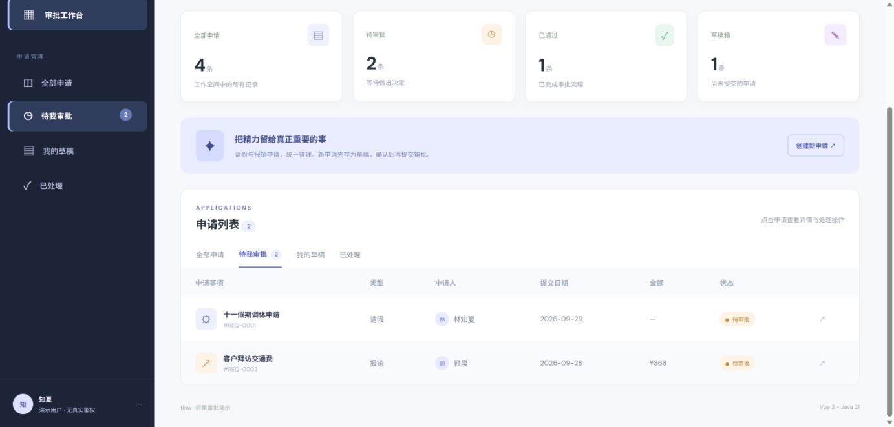

# OA · flow 轻量审批样板




独立的 Vue 3 + Java 21/Spring Boot 请假/报销审批演示。**创建草稿 → 提交待审批 → 同意/驳回**。申请类型、金额和必填字段在服务端校验；驳回必须填写原因，终态不可再次审批。

## 运行

需要 Java 21、Maven、Node.js 20.19+/22.12+ 和 npm。分别打开两个终端：

```bash
cd oa/backend && mvn spring-boot:run     # http://localhost:8084
cd oa/frontend && npm ci && npm run dev  # http://127.0.0.1:5176
```

前端代理 `/api` 到 8084。运行 `cd oa/backend && mvn test` 和 `cd oa/frontend && npm run build` 验证。

## API

- `GET/POST /api/requests`：申请列表/新增草稿。只接受请假或报销；请假金额为零。
- `POST /api/requests/{id}/submit`：草稿提交，非法状态返回 409。
- `POST /api/requests/{id}/review`：`decision` 为 `已通过` 或 `已驳回`，后者须有 `note`；非法状态返回 409。
- `GET /api/stats`：总数、草稿、待审批、已通过统计。

**边界：**单人界面仅演示状态流转，**不验证审批人身份**；无正式工作流引擎、审批权限、通知、附件、持久化或审计。数据保存在内存，重启重置，不能直接用于真实请假/报销审批或公网服务。截图来自实际本地运行。
