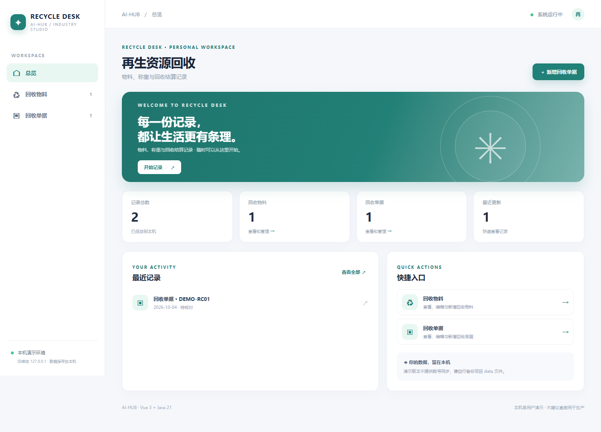
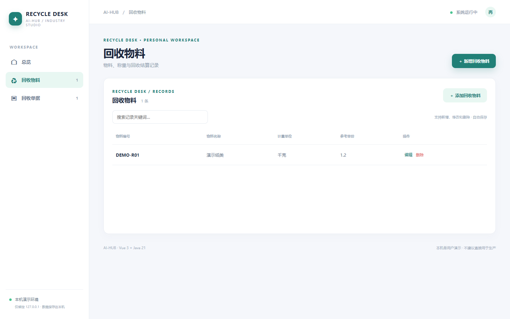
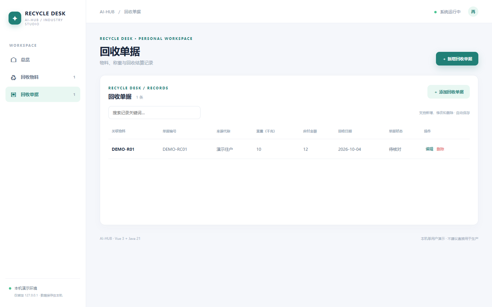
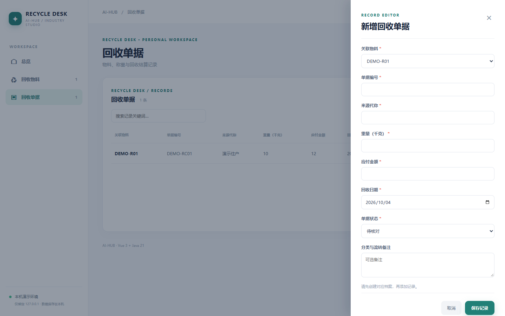

# 再生资源回收 · recycling

物料、称重与回收结算记录。Vue 3 + Java 21 / Spring Boot 独立本机单用户演示，提供 回收物料 和 回收单据 两个关联的业务页面，支持检索、新增、修改、删除和本地 JSON 持久化。首次载入虚构数据，后续存储在 `data/recycling.json`。

## 直接体验

准备 Java 21、Maven、Node.js 20.19+/22.12+、npm。在仓库根目录运行 `./recycling/run.ps1`（Windows）或 `./recycling/run.sh`（macOS/Linux），打开 http://127.0.0.1:8180。首次构建会联网下载依赖，Ctrl+C 停止。

## 核心流程与限制

先维护回收物料，再手工录入重量、应付金额与来源代称；单据从「待核对」转为「已结算」或「已作废」，终态不可回退。重量和金额必须大于零，单据编号不可重复。**金额是人工填写的演示记录，不自动计价，也不发起付款**。

## API 与测试

`GET /api/{resource}`、`POST /api/{resource}`、`PUT /api/{resource}/{id}`、`DELETE /api/{resource}/{id}`。字段、必填、类别、数字、日期、关联关系均在服务端校验。无效输入 400、不存在 404、编号冲突/非法状态跳转或删除被引用档案 409。执行 `mvn -f recycling/backend/pom.xml test`，或根目录运行 `./test-all.ps1`。真实浏览器/API/重启验证见[三项目验证记录](../docs/priority-three-validation-2026-10-04.md)。

## 真实页面截图

## 使用边界

本机单用户样板，不含正式鉴权、权限隔离、数据库、并发写入、外部设备、真实资金或生产流程控制；状态由用户手动维护。请勿录入敏感或真实业务数据，也不要直接部署到公网。
