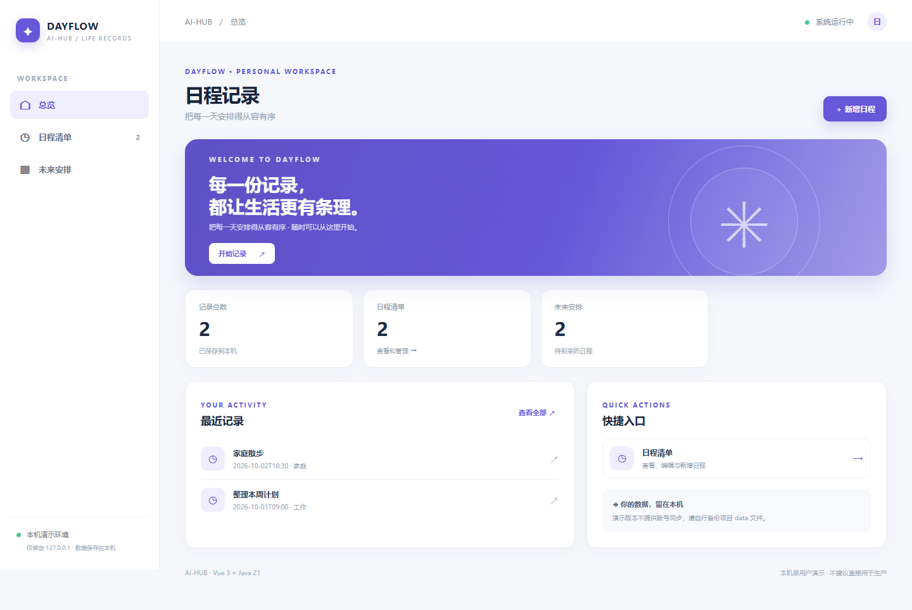
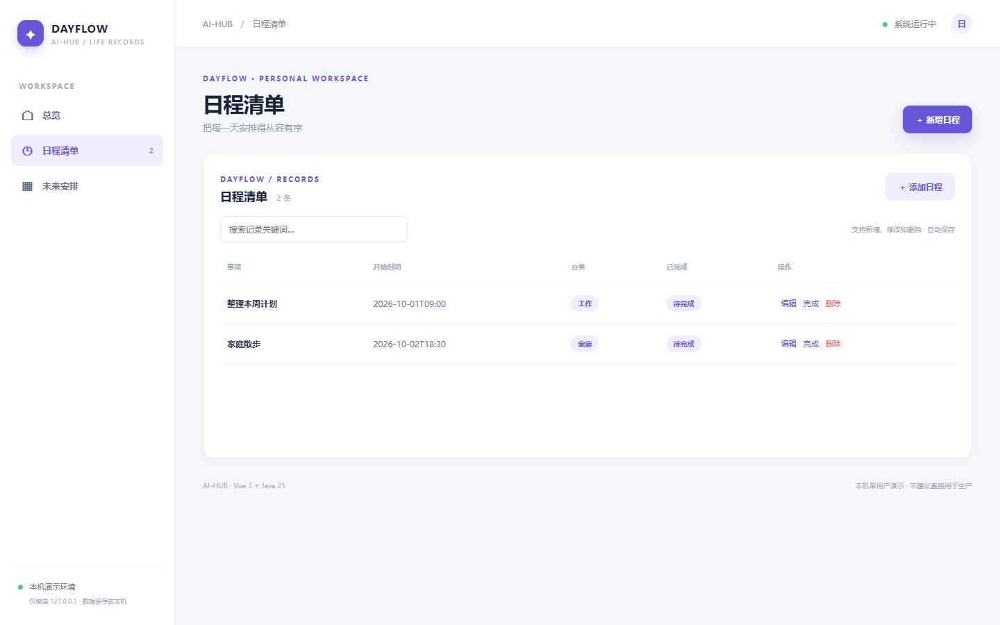
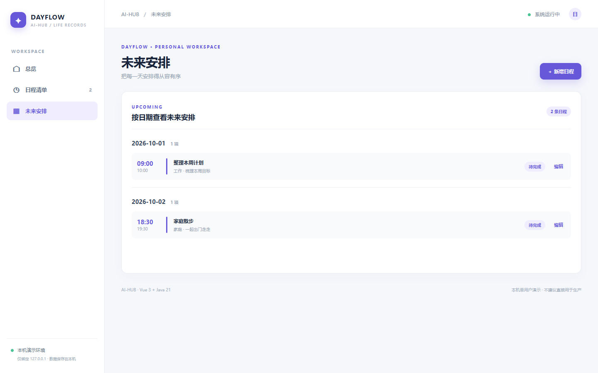

# 日程记录 · schedule

Vue 3 + Java 21 / Spring Boot 的本机单用户记录工具。安排开始/结束时间、分类、备注与完成状态；未来安排按日期分组。页面提供总览、列表/搜索、新增、编辑和删除；档案关联记录先删除子记录才能删除档案。演示数据均为虚构，首次启动自动载入，后续保存到本项目 `data/schedule.json`，重启保留。注意备份，删除 JSON 并重启可重置演示数据。

## 直接运行

安装 Java 21、Maven、Node.js 20.19+/22.12+ 和 npm，在仓库根目录运行 `./schedule/run.ps1`（Windows）或 `./schedule/run.sh`（macOS/Linux），打开 http://127.0.0.1:8094 。首次构建需联网。Ctrl+C 停止。本机默认只监听 127.0.0.1。

## API 与测试

`GET /api/{resource}`、`POST /api/{resource}`、`PUT /api/{resource}/{id}`、`DELETE /api/{resource}/{id}`；资源和字段：events：事项、开始/结束时间、分类、备注、是否完成。非法输入返回 400，不存在返回 404，删除被引用档案返回 409。测试：`mvn -f schedule/backend/pom.xml test`，或从仓库根目录执行 `./test-all.ps1`、`./smoke-test.ps1`。前端使用 `npm --prefix schedule/frontend ci` 与 `npm --prefix schedule/frontend run build`。

## 页面截图

## 使用边界

不含日历同步、推送提醒或多用户协作。本项目仅为本机单用户演示，数据存本地 JSON；没有身份认证、数据库、并发写入保障或加密备份。正式业务使用前需要补充鉴权、审计、备份与安全/合规评审。
