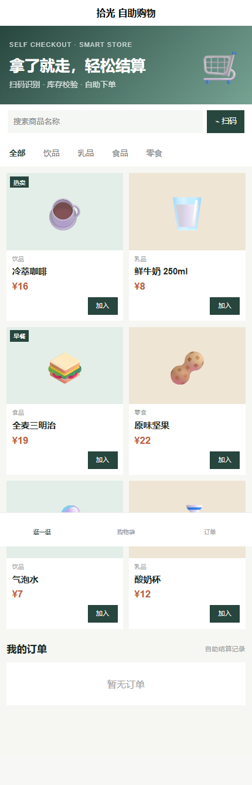
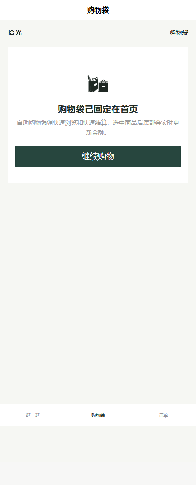
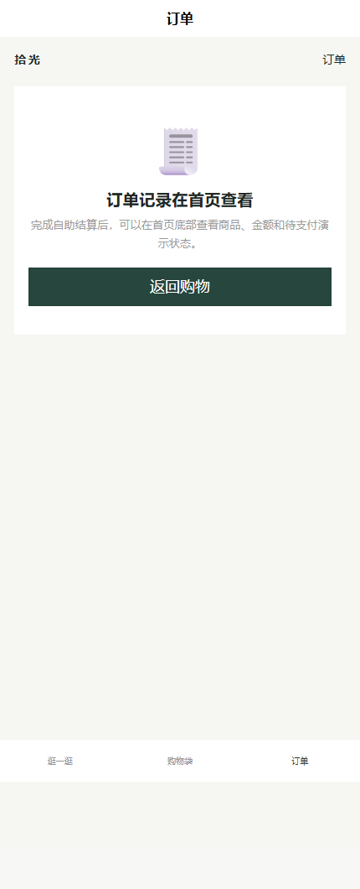

# selfshop · 自助购物小程序

> 面向微信小程序的门店自助购物演示，采用 Vue 3 + uni-app + Java 21/Spring Boot。支持商品浏览、搜索、条码查询入口、购物袋、库存校验和演示结算。

## 页面

- **商品**：分类筛选、搜索、库存展示与加入购物袋；支持 `uni.scanCode` 扫码入口。
- **购物袋**：调整数量、查看合计并发起自助结算。
- **订单**：查看当前演示购物码的订单记录。

## 页面截图







## API

- `GET /api/products` 商品列表和库存
- `GET /api/products/barcode/{barcode}` 按条码查找商品
- `GET /api/orders?shopper=demo-01` 查询购物码订单
- `POST /api/orders` 自助结算，服务端校验库存并扣减

## 本地运行

```powershell
./run.ps1
```

分步运行：

```powershell
npm --prefix miniprogram ci
npm --prefix miniprogram run build:mp-weixin
mvn -f backend/pom.xml test
mvn -f backend/pom.xml package
java -jar backend/target/selfshop-api-0.1.0.jar
```

将 `miniprogram/dist/build/mp-weixin` 导入微信开发者工具。真机和发布环境必须把 API 地址替换为备案 HTTPS 域名；`manifest.json` 的 `mp-weixin.appid` 需要换成真实 AppID。

## 边界

当前支持商品、扫码接口、库存校验和演示结算，不包含真实支付、电子小票、防损设备、硬件扫码枪、会员、优惠券、门店库存中心或退款。订单和扣减数据默认写入 `data/selfshop.json`，仅适合单机演示。
