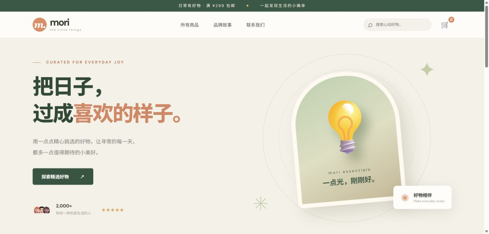
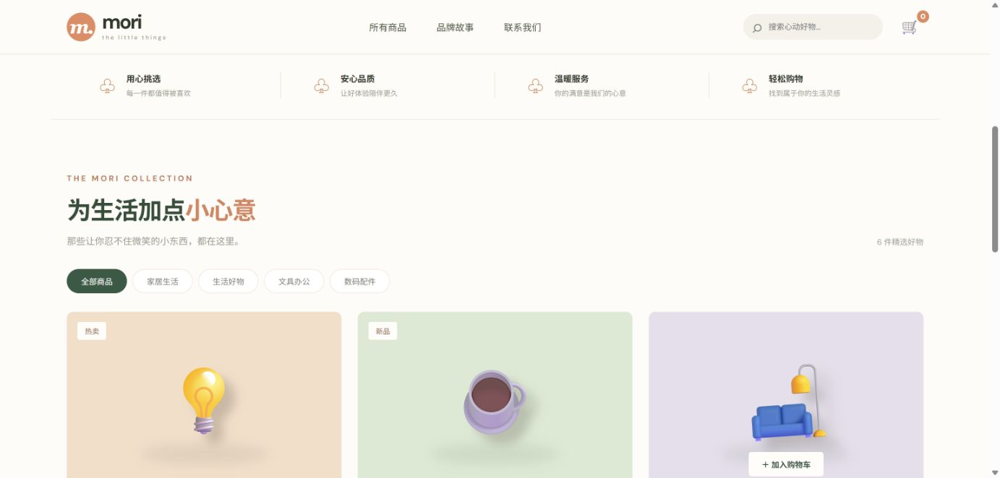

# shop · 精选生活好物商城

Vue 3 + Java 21 Spring Boot 的电商最小业务闭环。页面截图：[商城首页](./screenshots/storefront.png)、[商品列表](./screenshots/catalog.png)。

## 运行

1. Java 21 环境：`cd backend && mvn spring-boot:run`，API 在 `http://localhost:8081/api/products`。
2. Node.js 20.19+/22.12+：`cd frontend && npm install && npm run dev`，访问 `http://127.0.0.1:5173`。
3. 后端测试：`cd backend && mvn test`；前端构建：`cd frontend && npm run build`。

## 功能与边界

- 分类/搜索商品，购物车增减数量，填写联系人与邮箱提交演示订单。
- 服务端合并重复商品并校验库存，成功下单后扣减库存；内存存储，重启重置。
- 没有登录、持久化、支付、配送、营销和并发分布式库存；**不能生产使用**。
