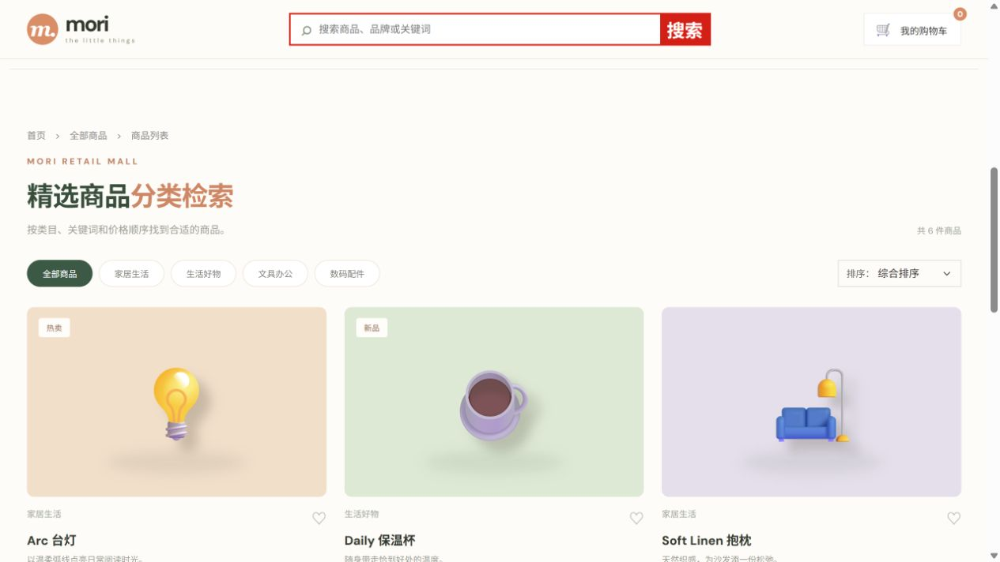
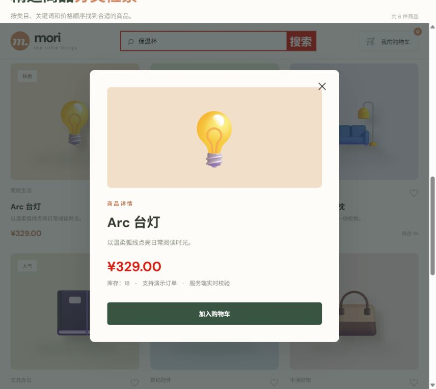
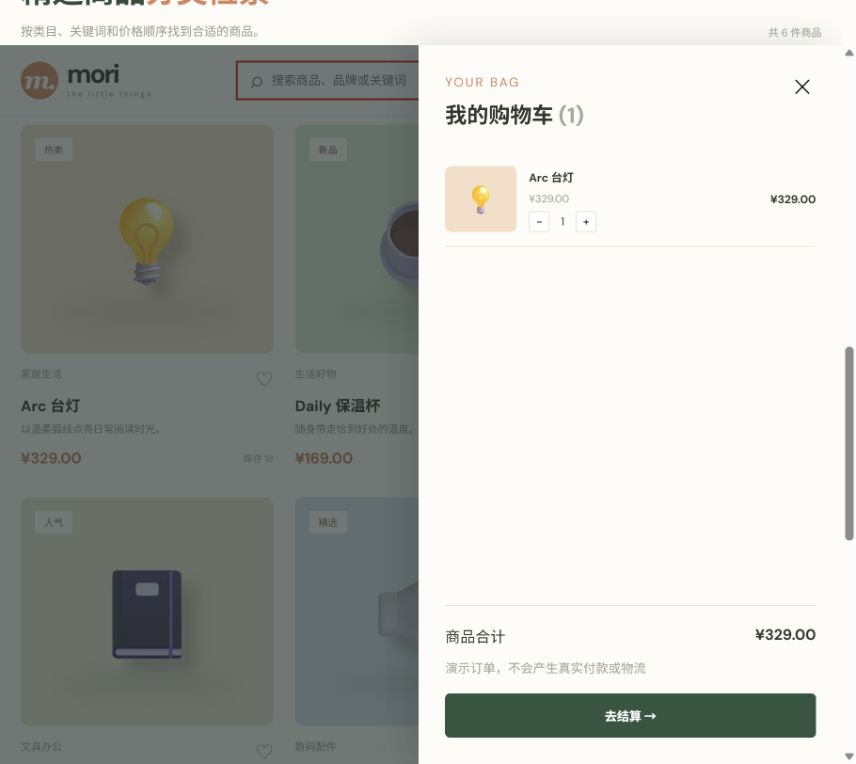
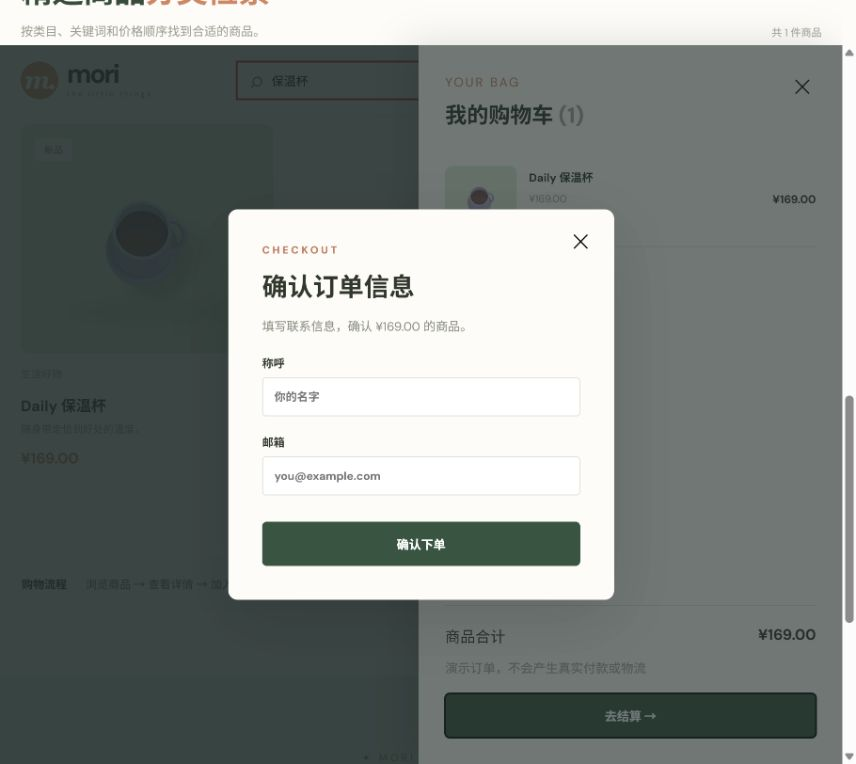
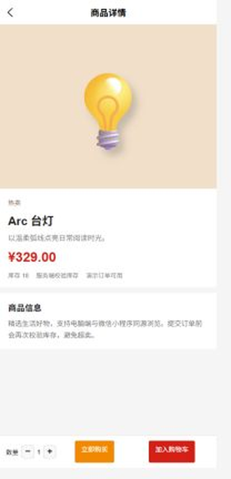
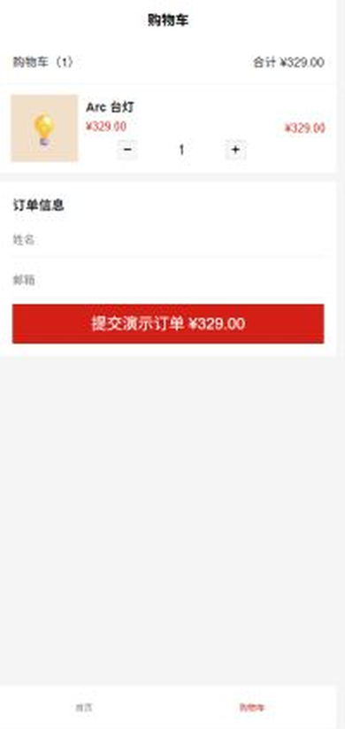

# shop · 精选生活好物商城

## 页面截图

截图均来自本项目实际运行页面；小程序部分使用 uni-app H5 运行截图，页面与微信小程序源码共用。

### 电脑端










### 微信小程序（uni-app H5 运行截图）






京东式零售基础闭环：顶部服务栏、关键词搜索、类目筛选、排序、商品详情、购物车、结算、服务端库存校验；订单与库存重启后仍保留。电脑端 Vue 3 + Java 21/Spring Boot，微信小程序端使用 Vue 3 + uni-app 复用同一 API。页面截图来自本地实际运行。

## 一键运行

需要 Java 21、Maven、Node.js 20.19+/22.12+ 和 npm；在本目录执行：

```powershell
./run.ps1           # Windows PowerShell
```

```sh
./run.sh            # macOS / Linux
```

首次执行会下载依赖、构建电脑端前端、运行后端测试并启动单个 jar。微信小程序单独执行下面的构建命令；`miniprogram/index.html` 用于生成 H5 运行截图，微信开发者工具仍导入 `dist/build/mp-weixin/`。浏览器打开 **http://127.0.0.1:8081**，前后端同一端口，无需另开终端。按 Ctrl+C 停止。Windows 如有旧 Vite 开发服务占用 `frontend/node_modules`，请先关闭再运行。

数据保存在本项目 `data/shop.json`，停止服务后可复制备份；如需恢复默认演示数据，停止后删除该文件并重启。文件损坏时启动会报错，不会自动清空。不要多个进程共用此文件。

## 微信小程序

目录为 `miniprogram/`，支持首页商品搜索/分类/排序、商品详情、加入购物车、数量调整和提交演示订单，与电脑端共用 `shop/backend` 接口。

```powershell
./run-miniprogram.ps1
```

```sh
./run-miniprogram.sh
```

构建产物在 `miniprogram/dist/build/mp-weixin/`，使用微信开发者工具导入该目录；开发工具本地调试可使用 `src/services/api.js` 中的 `http://127.0.0.1:8081`，真机和发布环境需改为已备案的 HTTPS API 域名并在微信公众平台配置合法域名。`manifest.json` 中的 `mp-weixin.appid` 需要替换为你自己的小程序 AppID。

电脑端和小程序遵循同一套零售信息结构：搜索、类目、排序、详情、库存、购物车和订单；“京东标准”在本项目中指常见电商信息架构和可用性约定，不复制京东商标、页面源码或视觉资产。

## 测试

```sh
mvn -f backend/pom.xml test
npm --prefix frontend ci
npm --prefix frontend run build
```

在仓库根目录执行 `./test-all.ps1`（Windows）或 `./test-all.sh`（macOS / Linux）会验证全部四个项目及 jar 中的页面资源。前端截图参见上方。

**使用边界：**无真实支付、配送、账号体系或分布式库存；仅为演示商城。 默认只监听本机 `127.0.0.1`；这是可本地直接使用的样板，**不适合未经改造部署到公网或生产环境**。

> 截图说明：电脑端截图按页面状态分别取视口；小程序截图来自 uni-app H5 实际运行页面，并裁去浏览器右侧空白后保存，便于在 Markdown 中阅读；不是微信开发者工具或真机截图。

