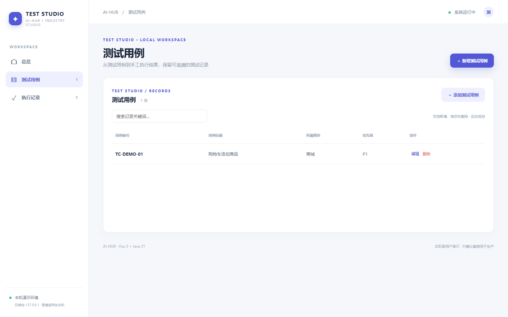
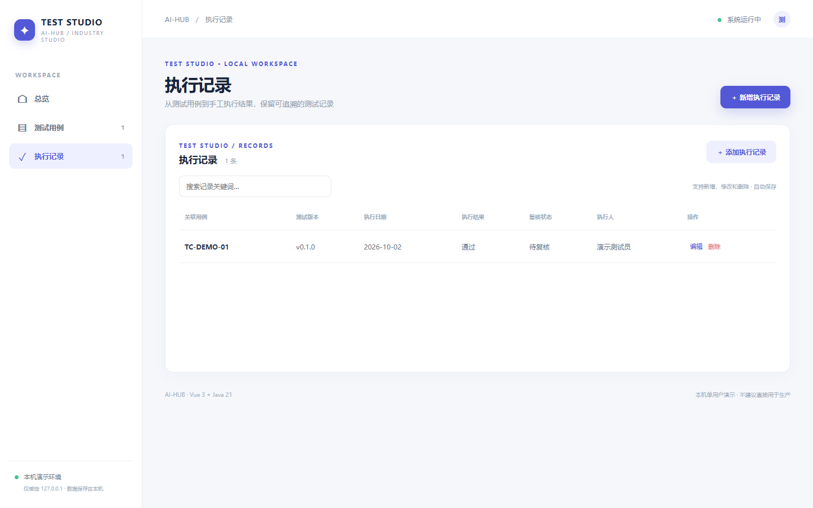
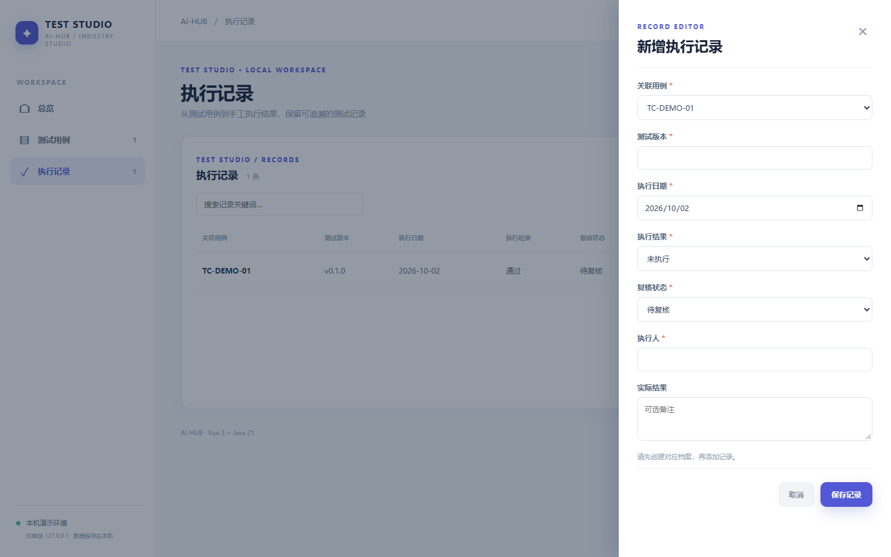

# 测试管理平台 · testops

从测试用例到手工执行结果，保留可追溯的测试记录。Vue 3 + Java 21 / Spring Boot 独立本机单用户演示，提供 测试用例 和 执行记录 两个关联的业务页面，支持检索、新增、修改、删除和本地 JSON 持久化。首次载入虚构数据，后续存储在 `data/testops.json`。

## 直接体验

准备 Java 21、Maven、Node.js 20.19+/22.12+、npm。在仓库根目录运行 `./testops/run.ps1`（Windows）或 `./testops/run.sh`（macOS/Linux），打开 http://127.0.0.1:8165。首次构建会联网下载依赖，Ctrl+C 停止。

## 使用路径

先在「测试用例」写明编号、模块、步骤和预期；再在「执行记录」选择用例，填写版本、日期、测试人、结果与实际现象。同一用例可添加多条手工执行记录，便于比较不同版本。**平台不运行测试脚本，也不会根据结果自动创建缺陷。**

## API 与测试

`GET /api/{resource}`、`POST /api/{resource}`、`PUT /api/{resource}/{id}`、`DELETE /api/{resource}/{id}`。字段、必填、类别、数字、日期、关联关系均在服务端校验。无效输入 400、不存在 404、删除被引用档案或编号重复 409；测试用例编号全局唯一（忽略大小写，首尾空格自动去除），编辑自身不冲突。执行 `mvn -f testops/backend/pom.xml test`，或根目录运行 `./test-all.ps1`。

## 真实页面截图

## 使用边界

本机单用户样板，不含正式鉴权、权限隔离、数据库、并发写入、外部设备、真实资金或生产流程控制；状态由用户手动维护。请勿录入敏感或真实业务数据，也不要直接部署到公网。
