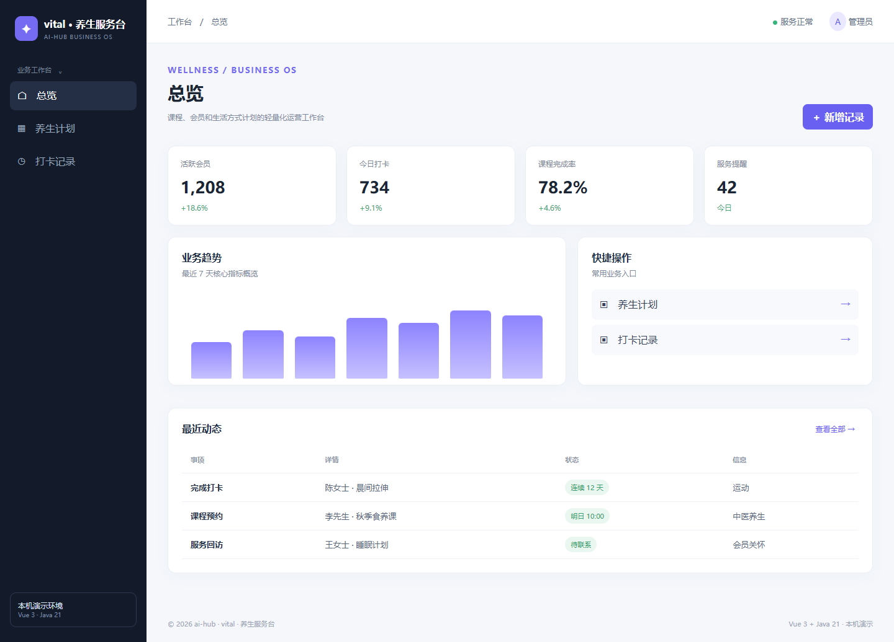
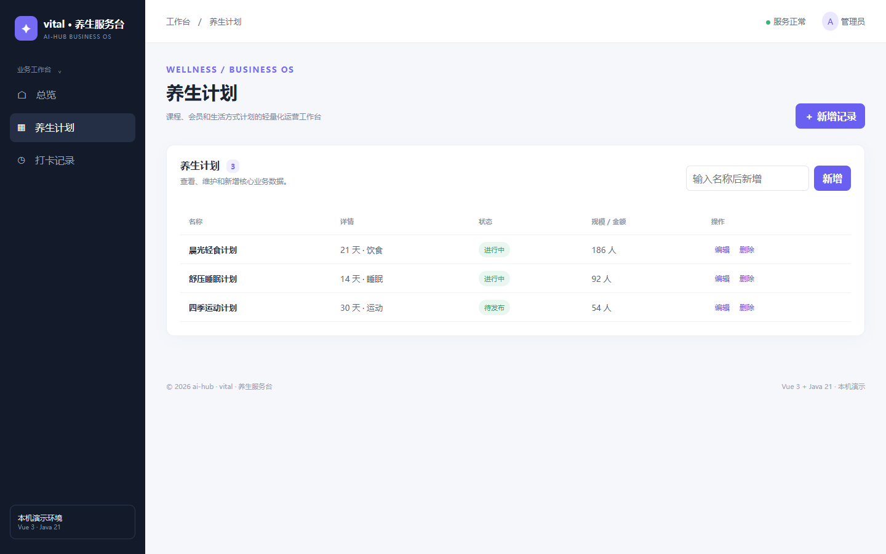
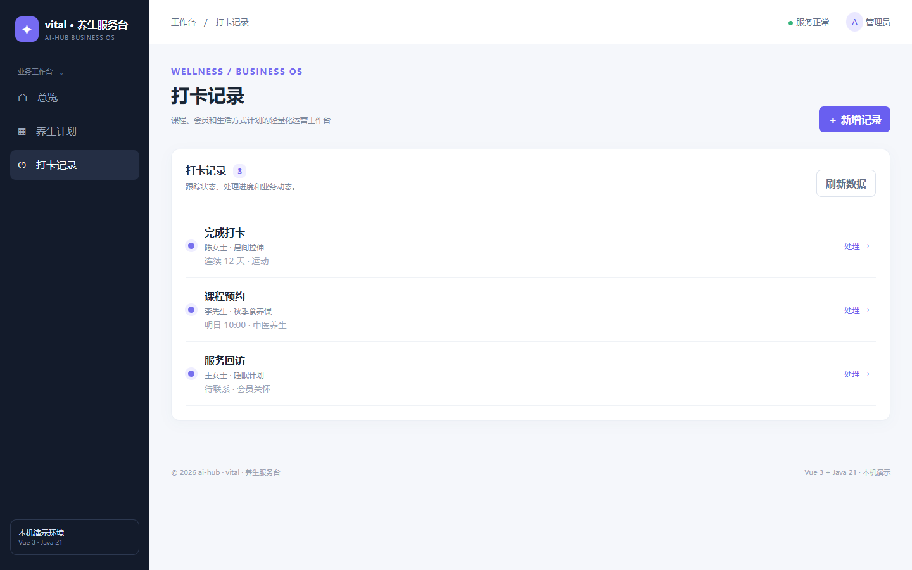

# wellness · vital · 养生服务台

> 课程、会员和生活方式计划的轻量化运营工作台。这是 ai-hub 的业务系统样板，统一采用 Vue 3 + Java 21/Spring Boot，自主实现，不复制第三方源码。

## 页面

- 总览：核心指标、趋势图、快捷操作和动态
- 养生计划：查看、新增、编辑、删除和状态展示
- 打卡记录：状态查看与手动刷新（“处理”按钮仅演示提示，不修改后台状态）

## 页面截图







## 运行

```powershell
npm --prefix frontend ci
npm --prefix frontend run build -- --outDir ../backend/src/main/resources/static --emptyOutDir
mvn -f backend/pom.xml package
java -jar backend/target/wellness-api-0.1.0.jar
```

访问 http://127.0.0.1:8087。API：`GET /api/metrics`、`GET /api/plans`、`POST /api/plans`、`GET /api/checkins`。

当前为本机单用户演示版本，新增、修改和删除的数据保存在 `data/wellness.json`，重启仍保留。停服后可复制该文件备份；数据文件损坏时服务拒绝启动，避免静默覆盖。服务只监听 127.0.0.1，不提供登录、权限隔离、并发写入、审计或行业合规流程。正式使用前必须按实际业务补齐安全与法规要求。金融、健康、医院、学校和门禁场景涉及敏感数据，未经安全评审不得直接用于真实生产。


## 回归验证

`mvn -f backend/pom.xml test` 覆盖输入拒绝、伪造 ID、增删改、重启持久化、损坏文件拒绝启动及写入失败回滚。根目录 `./test-all.ps1` 构建所有项目；`./smoke-test.ps1` 检查真实服务页面和 API。页面新增、编辑、删除可在上方列表操作；主资源另提供 `PUT /api/<resource>/<id>`、`DELETE /api/<resource>/<id>`，服务端分配 ID。
